# 🧠 System Design Intelligence

> **Visionary AI-Age System Architectures for Modern Organizations**

A comprehensive collection of production-ready system designs featuring **agentic AI integration**, **cloud-native patterns**, and **scalability at 2GW+ data center scale**.

---

## 🏢 Industry Architectures

| Industry | Company | Architecture | Focus |
|----------|---------|--------------|-------|
| 🏦 Finance | [**TrustCoin**](./finance-trustcoin/) | AI-Native Digital Bank | Zero-friction banking with autonomous fraud detection |
| 📡 Telecom | [**TelBits**](./telecom-telbits/) | Next-Gen Telecom | Self-healing networks with AI operations |
| 🛒 Retail | [**ShopSphere**](./retail-shopsphere/) | Autonomous Commerce | Predictive inventory & personalized experiences |
| 🏥 Healthcare | [**MedMesh**](./healthcare-medmesh/) | Connected Health Platform | Patient-centric AI-assisted care |
| 🚚 Logistics | [**FlowHive**](./logistics-flowhive/) | Smart Supply Chain | Real-time adaptive logistics |
| ⚡ Energy | [**GridMind**](./energy-gridmind/) | Intelligent Grid | AI-optimized sustainable energy |
| 🎬 Media | [**StreamPulse**](./media-streampulse/) | Content Platform | Intelligent content delivery |
| 🏭 Manufacturing | [**ForgeAI**](./manufacturing-forgeai/) | Smart Factory | Self-optimizing production |

---

## 🤖 Agentic AI Integration

Each architecture incorporates modern AI agents for organizational efficiency:

```mermaid
graph TB
    subgraph "Agentic AI Layer"
        A[🎯 Task Automation Agents]
        B[🧠 Decision Support Agents]
        C[👁️ Monitoring Agents]
        D[💬 Customer Agents]
        E[📊 Data Processing Agents]
    end
    
    subgraph "AI Orchestration"
        O[CrewAI / AutoGen]
        L[LangChain / LlamaIndex]
        S[Semantic Kernel]
    end
    
    subgraph "Foundation Models"
        F1[Claude 3.5]
        F2[GPT-4o]
        F3[Gemini Ultra]
        F4[Llama 3.3]
    end
    
    A & B & C & D & E --> O & L & S
    O & L & S --> F1 & F2 & F3 & F4
```

### Tools & Platforms

| Category | Tools |
|----------|-------|
| **Development** | GitHub Copilot, Cursor, Claude Code, Windsurf |
| **AI Agents** | CrewAI, AutoGen, MetaGPT, Semantic Kernel |
| **Data/RAG** | LangChain, LlamaIndex, Pinecone, Weaviate |
| **Monitoring** | LangSmith, Datadog AI, Arize, Weights & Biases |
| **Customer AI** | Intercom Fin, Ada, Zendesk AI |
| **Security** | Snyk AI, SentinelOne, CrowdStrike Falcon |

---

## 🏗️ Architecture Principles

### 1. **Simplicity at Scale**
- Minimal moving parts
- Clear separation of concerns
- Event-driven by default

### 2. **AI-Native Design**
- Vector stores alongside traditional DBs
- Agent-ready APIs
- Semantic layers for LLM access

### 3. **Observable Everything**
- Distributed tracing
- Real-time metrics
- AI-powered anomaly detection

### 4. **Security First**
- Zero-trust architecture
- Encryption everywhere
- AI-powered threat detection

---

## 📚 Shared Resources

- [Agentic AI Patterns](./shared/agentic-ai-patterns.md) - Common agent design patterns
- [Technology Stack Guide](./shared/tech-stack-guide.md) - Recommended technologies

---

## 🚀 Quick Start

Each industry folder contains:
- `README.md` - Complete architecture with diagrams
- System overview, data flows, and tech stack
- Agentic AI integration patterns
- Scalability and security considerations

---

## 📖 Usage

1. **Browse** the industry that matches your use case
2. **Study** the architecture diagrams and patterns
3. **Adapt** the designs to your specific requirements
4. **Implement** using the recommended technology stack

---

*Built for the Agentic AI Age • 2026*
