# 🌱 TerraMind - Autonomous Farm-to-Table Platform

> **AI-Orchestrated Agriculture from Seed to Consumer**

TerraMind is a next-generation agricultural technology company that automates the entire lifecycle of food production—from precision planting and AI-managed growing to autonomous harvesting and direct-to-consumer delivery. We eliminate middlemen, reduce waste, and deliver farm-fresh produce within 24 hours.

---

## 📚 Documentation

- **[Data Platform Architecture](./data-platform-architecture.md)** - End-to-end IT infrastructure with IoT ingestion, ML models, and analytics
- **[Smart Farm Equipment Guide](./smart-farm-equipment.md)** - Complete equipment inventory for 1000-acre autonomous farm

---

## 🎯 Vision

- **Zero-Touch Farming**: 95% autonomous operations with AI oversight
- **Seed-to-Table Traceability**: Every product tracked from planting to plate
- **24-Hour Fresh**: Harvest-to-delivery in under 24 hours
- **50% Less Waste**: AI-optimized yield prediction and demand matching
- **Carbon Negative**: Regenerative practices + renewable energy

---

## 🏗️ System Architecture

```mermaid
graph TB
    subgraph Farm["🌾 SMART FARM LAYER"]
        subgraph Sensors["📡 IoT Sensor Network"]
            SOIL[Soil Sensors<br>NPK, Moisture, pH]
            WEATHER[Weather Stations<br>Temp, Wind, Rain]
            DRONE[Drone Fleet<br>Imaging, Spraying]
            SAT[Satellite Feed<br>NDVI, Thermal]
        end
        
        subgraph Equipment["🚜 Autonomous Equipment"]
            TRACTOR[AI Tractors<br>John Deere, CNH]
            HARVESTER[Smart Harvesters<br>Crop-specific]
            IRRIGATE[Precision Irrigation<br>Drip, Pivot]
            ROBOT[Field Robots<br>Weeding, Scouting]
        end
    end

    subgraph Core["🧠 TERRAMIND CORE"]
        INGEST[Data Ingestion<br>Kafka + IoT Hub]
        PROCESS[Stream Processing<br>Apache Flink]
        AI[AI Decision Engine<br>Claude + Custom ML]
        COMMAND[Command Center<br>Operations Hub]
    end

    subgraph Supply["📦 SUPPLY CHAIN"]
        PACK[Packing House<br>Automated Sorting]
        COLD[Cold Storage<br>Climate Controlled]
        LOGISTICS[Logistics Hub<br>Route Optimization]
        TRACE[Traceability<br>Blockchain Ledger]
    end

    subgraph Sales["🛒 SALES CHANNELS"]
        D2C[D2C Platform<br>Web + Mobile App]
        GROCERY[Grocery Partners<br>Whole Foods, Kroger]
        RESTO[Restaurant B2B<br>Direct Supply]
        MARKET[Farmers Markets<br>Pop-up Stands]
    end

    subgraph Consumer["👥 CONSUMER"]
        APP[Mobile App<br>Orders, Subscriptions]
        DELIVER[Last-Mile Delivery<br>Same-day, Scheduled]
        LOYALTY[Loyalty Program<br>Farm Tokens]
    end

    Farm --> Core
    Core --> Supply
    Supply --> Sales
    Sales --> Consumer
```

---

## 🌾 Farm Operations Overview

### 1000-Acre Multi-Crop Farm Layout

```mermaid
graph TB
    subgraph North["🌽 NORTH ZONE - 300 Acres"]
        N1[Corn - 150 acres<br>Spring-Fall]
        N2[Soybeans - 150 acres<br>Rotation]
    end

    subgraph East["🍅 EAST ZONE - 200 Acres"]
        E1[Tomatoes - 80 acres<br>Greenhouse + Field]
        E2[Peppers - 60 acres<br>Mixed Varieties]
        E3[Leafy Greens - 60 acres<br>Year-round Hydroponics]
    end

    subgraph South["🌾 SOUTH ZONE - 250 Acres"]
        S1[Wheat - 125 acres<br>Winter Wheat]
        S2[Barley - 125 acres<br>Spring Barley]
    end

    subgraph West["🥬 WEST ZONE - 200 Acres"]
        W1[Vegetables - 100 acres<br>Seasonal Rotation]
        W2[Orchard - 50 acres<br>Apples, Peaches]
        W3[Berries - 50 acres<br>Strawberries, Blueberries]
    end

    subgraph Infrastructure["🏗️ CENTRAL INFRASTRUCTURE - 50 Acres"]
        HQ[Command Center]
        PACK[Packing Facility]
        COLD[Cold Storage]
        MAINT[Equipment Maintenance]
        SOLAR[Solar Array - 5 MW]
    end
```

### Seasonal Crop Calendar

| Season | Zone | Crop | Acres | Planting | Harvest | Yield Target |
|--------|------|------|-------|----------|---------|--------------|
| **Spring** | North | Corn | 150 | Apr 15 | Oct 1 | 200 bu/acre |
| **Spring** | South | Spring Barley | 125 | Mar 15 | Jul 15 | 80 bu/acre |
| **Spring** | West | Vegetables | 100 | Apr 1 | Jun-Sep | Varies |
| **Summer** | East | Tomatoes | 80 | May 1 | Aug-Oct | 40 tons/acre |
| **Summer** | East | Peppers | 60 | May 15 | Aug-Oct | 15 tons/acre |
| **Fall** | North | Soybeans | 150 | May 15 | Oct 15 | 60 bu/acre |
| **Winter** | South | Winter Wheat | 125 | Oct 1 | Jun 15 | 70 bu/acre |
| **Year-round** | East | Leafy Greens | 60 | Continuous | Weekly | 20 harvests/yr |

---

## 🤖 AI Agent Ecosystem

### Agent Architecture

```mermaid
graph TB
    subgraph Strategic["🎯 STRATEGIC AGENTS"]
        CROP[Crop Planning Agent<br>Season optimization]
        MARKET[Market Intelligence Agent<br>Price forecasting]
        SUSTAIN[Sustainability Agent<br>Carbon tracking]
    end

    subgraph Tactical["⚙️ TACTICAL AGENTS"]
        IRRIGATE[Irrigation Agent<br>Water optimization]
        NUTRIENT[Nutrient Agent<br>Fertilizer precision]
        PROTECT[Crop Protection Agent<br>Pest/disease response]
        HARVEST[Harvest Agent<br>Timing optimization]
    end

    subgraph Operational["🚜 OPERATIONAL AGENTS"]
        FLEET[Fleet Coordinator<br>Equipment dispatch]
        DRONE[Drone Pilot Agent<br>Mission planning]
        ROBOT[Robot Swarm Agent<br>Task assignment]
    end

    subgraph Customer["👥 CUSTOMER AGENTS"]
        DEMAND[Demand Forecasting<br>Order prediction]
        FRESH[Freshness Agent<br>Inventory rotation]
        SUPPORT[Customer Agent<br>Order assistance]
    end

    Strategic --> Tactical --> Operational
    Strategic --> Customer
```

### Agent Responsibilities

| Agent | Function | Technology | Latency |
|-------|----------|------------|---------|
| **Crop Planning** | Optimal crop rotation, variety selection | Claude 3.5 + Historical Data | Daily |
| **Market Intelligence** | Commodity price prediction, demand forecast | LSTM + Transformer | Hourly |
| **Irrigation** | Zone-specific water scheduling | RL Agent + Weather API | 15 min |
| **Nutrient** | Variable-rate fertilizer mapping | Computer Vision + Soil ML | Real-time |
| **Crop Protection** | Pest/disease detection and response | YOLOv8 + Drone Imagery | Minutes |
| **Harvest** | Optimal harvest timing per field | Maturity ML + Weather | Daily |
| **Fleet Coordinator** | Equipment routing, task scheduling | Constraint Optimization | Real-time |
| **Demand Forecasting** | Customer order prediction | XGBoost + Seasonality | Daily |

---

## 📦 Supply Chain Architecture

```mermaid
graph LR
    subgraph Harvest["🌾 HARVEST"]
        FIELD[Field Pickup]
        WEIGH[Weighing Station]
        QC1[Quality Check #1]
    end

    subgraph Processing["🏭 PROCESSING"]
        WASH[Washing Line]
        SORT[AI Sorting<br>Grade A/B/C]
        PACK[Auto Packaging]
        LABEL[Smart Labels<br>QR + Blockchain]
    end

    subgraph Storage["❄️ STORAGE"]
        COLD[Cold Rooms<br>34-40°F]
        FREEZE[Freezer<br>0°F]
        DRY[Dry Storage<br>Grains]
    end

    subgraph Distribution["🚚 DISTRIBUTION"]
        ROUTE[Route Optimizer]
        FLEET[Delivery Fleet]
        PARTNER[Partner Pickup]
    end

    subgraph Channels["🛒 CHANNELS"]
        D2C[D2C Orders<br>Same-day]
        GROCERY[Grocery<br>Daily delivery]
        RESTO[Restaurants<br>Scheduled]
    end

    Harvest --> Processing --> Storage --> Distribution --> Channels
```

---

## 💻 Technology Stack

### Core Infrastructure

| Layer | Technology | Purpose |
|-------|------------|---------|
| **IoT Gateway** | AWS IoT Greengrass | Edge processing |
| **Event Streaming** | Apache Kafka | Real-time data flow |
| **Stream Processing** | Apache Flink | Sensor analytics |
| **Time-Series DB** | TimescaleDB | Sensor history |
| **Primary DB** | PostgreSQL | Operational data |
| **Data Warehouse** | Snowflake | Analytics |
| **ML Platform** | SageMaker + MLflow | Model training |
| **Computer Vision** | NVIDIA DeepStream | Video analytics |

### AI/ML Stack

| Component | Technology | Purpose |
|-----------|------------|---------|
| **Foundation Model** | Claude 3.5 Opus | Decision reasoning |
| **Vision Models** | YOLOv8, SAM | Crop detection |
| **Forecasting** | Temporal Fusion Transformer | Yield prediction |
| **Optimization** | OR-Tools, Gurobi | Route/schedule |
| **Agent Framework** | LangChain + CrewAI | Agent orchestration |
| **Vector Store** | Pinecone | Knowledge retrieval |

---

## 🛒 D2C Sales Platform

### Consumer Experience

```mermaid
graph TB
    subgraph App["📱 MOBILE APP"]
        BROWSE[Browse Products<br>By farm, By crop]
        SUBSCRIBE[Subscription Boxes<br>Weekly, Bi-weekly]
        TRACE[Trace Your Food<br>Field to Fork]
        RECIPE[AI Recipe Suggestions]
    end

    subgraph Orders["🛍️ ORDER TYPES"]
        SINGLE[Single Orders]
        SUB[Subscription]
        BULK[Bulk/Business]
        GIFT[Gift Boxes]
    end

    subgraph Fulfill["📦 FULFILLMENT"]
        PICK[Smart Pick List]
        CUSTOM[Custom Packaging]
        ROUTE[Route Optimization]
        DELIVER[Last-mile Delivery]
    end

    subgraph Engage["💚 ENGAGEMENT"]
        FARM_CAM[Live Farm Cameras]
        UPDATES[Crop Updates]
        LOYALTY[Loyalty Tokens]
        COMMUNITY[Community Forum]
    end

    App --> Orders --> Fulfill --> Engage
```

### Business Channels

| Channel | Volume | Frequency | Margin |
|---------|--------|-----------|--------|
| **D2C Website** | 10K orders/week | Daily | 45% |
| **Mobile App** | 15K orders/week | Daily | 45% |
| **Subscription Box** | 5K boxes/week | Weekly | 50% |
| **Grocery Partners** | 100K lbs/week | Daily | 25% |
| **Restaurant B2B** | 50K lbs/week | 2-3x/week | 30% |
| **Farmers Markets** | 5K lbs/week | Weekends | 55% |

---

## 📊 Key Metrics & Dashboards

### Operational KPIs

| Metric | Target | Current | Unit |
|--------|--------|---------|------|
| **Yield Efficiency** | 95% | 92% | % of predicted |
| **Water Usage** | -30% | -25% | vs. industry avg |
| **Equipment Uptime** | 98% | 97.5% | % operational |
| **Harvest-to-Ship** | <4 hrs | 3.5 hrs | Hours |
| **Order Accuracy** | 99.9% | 99.7% | % correct |
| **Customer NPS** | 80+ | 78 | Score |
| **Carbon Footprint** | -20% | -15% | vs. baseline |

### Real-time Dashboards

| Dashboard | Users | Refresh | Purpose |
|-----------|-------|---------|---------|
| **Command Center** | Farm Ops | 1 sec | Equipment tracking |
| **Crop Health** | Agronomists | 15 min | Disease/pest alerts |
| **Weather Intel** | All | 5 min | Forecast + alerts |
| **Inventory** | Warehouse | Real-time | Stock levels |
| **Orders** | Fulfillment | Real-time | Pick/pack status |
| **Analytics** | Management | Hourly | Business metrics |

---

## 🔒 Security & Compliance

### Security Layers

---

## 🚀 Key Innovations

1. **Autonomous 24/7 Operations**: AI manages planting to harvest without human intervention
2. **Hyper-Local Weather**: Micro-climate sensors for field-level forecasting
3. **Digital Twin Farm**: Real-time 3D simulation for planning and optimization
4. **Blockchain Traceability**: Every product traced from seed to consumer
5. **Carbon Credit Generation**: Verified carbon sequestration for additional revenue
6. **AI Crop Doctor**: Instant disease diagnosis from smartphone photos
7. **Predictive Maintenance**: Zero unplanned equipment downtime

---

## 📈 Growth Roadmap

| Phase | Timeline | Focus | Investment |
|-------|----------|-------|------------|
| **Phase 1** | Year 1 | 1000 acre pilot, D2C launch | $15M |
| **Phase 2** | Year 2-3 | 5000 acres, grocery partnerships | $40M |
| **Phase 3** | Year 4-5 | 25000 acres, multi-region | $100M |
| **Phase 4** | Year 6+ | 100000+ acres, national scale | $250M+ |

---

*TerraMind - Growing the Future, Today*
