# 🏗️ TerraMind Data Platform Architecture

> **End-to-End IT Infrastructure for Autonomous Farm Operations**

A comprehensive technical architecture for capturing, processing, analyzing, and acting on agricultural data at scale—powering AI decision-making from soil sensors to consumer delivery.

---

## 📋 Table of Contents

1. [Architecture Overview](#-architecture-overview)
2. [IoT Data Ingestion](#-iot-data-ingestion)
3. [Stream Processing Layer](#-stream-processing-layer)
4. [Data Lake & Warehouse](#-data-lake--warehouse)
5. [ML & AI Platform](#-ml--ai-platform)
6. [Digital Twin & Simulation](#-digital-twin--simulation)
7. [Command Center & Dashboards](#-command-center--dashboards)
8. [Supply Chain Systems](#-supply-chain-systems)
9. [D2C E-commerce Platform](#-d2c-e-commerce-platform)
10. [Blockchain Traceability](#-blockchain-traceability)
11. [Technology Stack](#-technology-stack)
12. [Implementation Guide](#-implementation-guide)

---

## 🎯 Architecture Overview

### High-Level Data Flow


---

## 📡 IoT Data Ingestion

### Edge-to-Cloud Architecture


### IoT Gateway Configuration

```yaml
# AWS IoT Greengrass V2 Gateway Config
gateway:
  device_id: "terramind-gw-north-001"
  location:
    zone: "north"
    lat: 40.7128
    lon: -74.0060
  
  hardware:
    model: "Dell Edge Gateway 5200"
    cpu: "Intel Core i7"
    memory: "32GB"
    storage: "512GB SSD"
    connectivity:
      - "5G LTE"
      - "LoRaWAN"
      - "WiFi 6"
      - "Ethernet"
  
  greengrass:
    version: "2.12"
    components:
      stream_manager:
        enabled: true
        buffer_size: "1GB"
        upload_strategy: "bandwidth_optimized"
      local_shadow:
        enabled: true
      machine_learning:
        enabled: true
        models:
          - "anomaly_detection"
          - "sensor_validation"
  
  sensors_connected:
    soil_probes: 50
    weather_stations: 2
    crop_monitors: 30
    water_sensors: 25
  
  data_protocols:
    - protocol: "MQTT"
      topics:
        - "terramind/soil/+/telemetry"
        - "terramind/weather/+/readings"
        - "terramind/crop/+/status"
    - protocol: "Modbus TCP"
      devices:
        - "irrigation_controller"
```

### Kafka Topic Architecture

| Topic | Partitions | Retention | Rate | Consumers |
|-------|------------|-----------|------|-----------|
| `terramind.sensors.soil` | 16 | 30 days | 5K msg/min | Flink, TSDB |
| `terramind.sensors.weather` | 8 | 90 days | 500 msg/min | Flink, ML |
| `terramind.sensors.crop` | 16 | 30 days | 2K msg/min | Flink, Vision |
| `terramind.equipment.telemetry` | 32 | 30 days | 10K msg/min | Flink, Command |
| `terramind.equipment.events` | 16 | 90 days | 1K msg/min | All |
| `terramind.imagery.raw` | 8 | 7 days | 100 msg/min | Vision Pipeline |
| `terramind.ai.predictions` | 16 | 30 days | 1K msg/min | Apps |
| `terramind.alerts.critical` | 8 | 90 days | 100 msg/min | Ops, PagerDuty |

### Sensor Data Schema (Avro)

```json
{
  "type": "record",
  "name": "SoilSensorReading",
  "namespace": "com.terramind.sensors",
  "fields": [
    {"name": "sensor_id", "type": "string"},
    {"name": "gateway_id", "type": "string"},
    {"name": "timestamp", "type": {"type": "long", "logicalType": "timestamp-millis"}},
    {"name": "location", "type": {
      "type": "record",
      "name": "GeoPoint",
      "fields": [
        {"name": "latitude", "type": "double"},
        {"name": "longitude", "type": "double"},
        {"name": "field_id", "type": "string"},
        {"name": "zone_id", "type": "string"}
      ]
    }},
    {"name": "soil_moisture", "type": ["null", {
      "type": "record",
      "name": "MoistureReading",
      "fields": [
        {"name": "depth_4in", "type": "float"},
        {"name": "depth_8in", "type": "float"},
        {"name": "depth_12in", "type": "float"},
        {"name": "depth_20in", "type": "float"},
        {"name": "depth_32in", "type": "float"},
        {"name": "depth_48in", "type": "float"}
      ]
    }]},
    {"name": "soil_temperature", "type": "float"},
    {"name": "nutrients", "type": ["null", {
      "type": "record",
      "name": "NutrientReading",
      "fields": [
        {"name": "nitrogen_ppm", "type": "float"},
        {"name": "phosphorus_ppm", "type": "float"},
        {"name": "potassium_ppm", "type": "float"},
        {"name": "ph", "type": "float"},
        {"name": "ec_ms_cm", "type": "float"}
      ]
    }]},
    {"name": "battery_level", "type": "int"},
    {"name": "signal_strength", "type": "int"}
  ]
}
```

---

## ⚙️ Stream Processing Layer

### Apache Flink Jobs


### Flink Job Specifications

| Job | Input Topics | Processing | Output | Latency |
|-----|--------------|------------|--------|---------|
| **Sensor Aggregation** | sensors.* | Tumbling windows, stats | TSDB + Delta | 1 min |
| **Anomaly Detection** | sensors.*, equipment.* | ML model inference | Alerts | <5 sec |
| **Equipment Tracker** | equipment.telemetry | Position + geofence | Redis + TSDB | Real-time |
| **Irrigation Optimizer** | sensors.soil, weather | RL decision | Commands | 15 min |
| **Harvest Scheduler** | crop.maturity, weather | Optimization | Task queue | Hourly |

### Flink Anomaly Detection Job

```java
// Real-time anomaly detection with ML
public class SensorAnomalyJob {
    
    public static void main(String[] args) throws Exception {
        StreamExecutionEnvironment env = StreamExecutionEnvironment.getExecutionEnvironment();
        
        // Source: Kafka sensor readings
        DataStream<SensorReading> sensorStream = env
            .addSource(new FlinkKafkaConsumer<>(
                "terramind.sensors.*",
                new SensorReadingDeserializer(),
                kafkaProps))
            .assignTimestampsAndWatermarks(
                WatermarkStrategy.<SensorReading>forBoundedOutOfOrderness(Duration.ofSeconds(30))
                    .withTimestampAssigner((event, ts) -> event.getTimestamp()));
        
        // Keyed by sensor for stateful processing
        KeyedStream<SensorReading, String> keyedStream = sensorStream
            .keyBy(SensorReading::getSensorId);
        
        // Anomaly detection with ONNX model
        DataStream<AnomalyAlert> anomalies = keyedStream
            .process(new AnomalyDetectionFunction("models/sensor_anomaly.onnx"))
            .filter(alert -> alert.getSeverity() >= AlertSeverity.WARNING);
        
        // Output to alert topic and TSDB
        anomalies.addSink(new FlinkKafkaProducer<>(
            "terramind.alerts.anomalies",
            new AnomalyAlertSerializer(),
            kafkaProps));
        
        anomalies.addSink(new TimescaleDBSink<>(
            "anomaly_alerts",
            tsdbConfig));
        
        env.execute("Sensor Anomaly Detection");
    }
}
```

---

## 💾 Data Lake & Warehouse

### Medallion Architecture

```mermaid
graph LR
    subgraph Bronze["🥉 BRONZE - Raw Data"]
        B1[raw_sensor_readings]
        B2[raw_equipment_telemetry]
        B3[raw_satellite_imagery]
        B4[raw_weather_data]
        B5[raw_market_prices]
    end

    subgraph Silver["🥈 SILVER - Cleaned & Enriched"]
        S1[sensor_readings_validated]
        S2[equipment_trips]
        S3[field_health_metrics]
        S4[weather_forecasts]
        S5[irrigation_events]
    end

    subgraph Gold["🥇 GOLD - Business Aggregates"]
        G1[daily_field_metrics]
        G2[crop_growth_stages]
        G3[yield_forecasts]
        G4[equipment_utilization]
        G5[inventory_levels]
        G6[sales_analytics]
    end

    Bronze -->|dbt Transform| Silver
    Silver -->|dbt Aggregate| Gold
```



### Snowflake Schema Design

```sql
-- ❄️ SNOWFLAKE SCHEMA FOR TERRAMIND

-- FACT: Sensor Readings (Partitioned)
CREATE TABLE analytics.fact_sensor_readings (
    reading_id          BIGINT AUTOINCREMENT,
    sensor_id           VARCHAR(50) NOT NULL,
    field_key           NUMBER NOT NULL,
    timestamp           TIMESTAMP_NTZ NOT NULL,
    date_key            NUMBER NOT NULL,
    
    -- Soil Measurements
    soil_moisture_4in   DECIMAL(5,2),
    soil_moisture_12in  DECIMAL(5,2),
    soil_moisture_24in  DECIMAL(5,2),
    soil_temp_f         DECIMAL(5,2),
    soil_ph             DECIMAL(4,2),
    nitrogen_ppm        DECIMAL(8,2),
    phosphorus_ppm      DECIMAL(8,2),
    potassium_ppm       DECIMAL(8,2),
    ec_ms_cm            DECIMAL(6,3),
    
    -- Quality
    reading_quality     VARCHAR(10),
    
    loaded_at           TIMESTAMP_NTZ DEFAULT CURRENT_TIMESTAMP()
)
CLUSTER BY (date_key, field_key);

-- FACT: Equipment Operations
CREATE TABLE analytics.fact_equipment_operations (
    operation_id        BIGINT AUTOINCREMENT,
    equipment_id        VARCHAR(50) NOT NULL,
    operator_id         VARCHAR(50),
    field_key           NUMBER NOT NULL,
    date_key            NUMBER NOT NULL,
    
    -- Operation Details
    operation_type      VARCHAR(50), -- planting, spraying, harvesting, etc
    start_time          TIMESTAMP_NTZ,
    end_time            TIMESTAMP_NTZ,
    duration_hours      DECIMAL(6,2),
    
    -- Performance
    area_covered_acres  DECIMAL(10,2),
    fuel_consumed_gal   DECIMAL(8,2),
    avg_speed_mph       DECIMAL(5,2),
    efficiency_pct      DECIMAL(5,2),
    
    -- Product Applied (if applicable)
    product_type        VARCHAR(100),
    product_amount      DECIMAL(12,2),
    product_unit        VARCHAR(20),
    
    loaded_at           TIMESTAMP_NTZ DEFAULT CURRENT_TIMESTAMP()
);

-- FACT: Harvest Records
CREATE TABLE analytics.fact_harvest (
    harvest_id          BIGINT AUTOINCREMENT,
    field_key           NUMBER NOT NULL,
    crop_key            NUMBER NOT NULL,
    date_key            NUMBER NOT NULL,
    
    -- Harvest Metrics
    harvest_date        DATE NOT NULL,
    area_harvested_acres DECIMAL(10,2),
    gross_weight_lbs    DECIMAL(12,2),
    tare_weight_lbs     DECIMAL(12,2),
    net_weight_lbs      DECIMAL(12,2),
    moisture_pct        DECIMAL(5,2),
    
    -- Quality Grades
    grade_a_pct         DECIMAL(5,2),
    grade_b_pct         DECIMAL(5,2),
    grade_c_pct         DECIMAL(5,2),
    reject_pct          DECIMAL(5,2),
    
    -- Yield Calculation
    yield_per_acre      DECIMAL(10,2),
    expected_yield      DECIMAL(10,2),
    yield_variance_pct  DECIMAL(6,2),
    
    loaded_at           TIMESTAMP_NTZ DEFAULT CURRENT_TIMESTAMP()
);

-- DIMENSION: Fields
CREATE TABLE analytics.dim_fields (
    field_key           NUMBER AUTOINCREMENT PRIMARY KEY,
    field_id            VARCHAR(50) NOT NULL,
    field_name          VARCHAR(200),
    zone                VARCHAR(50),
    area_acres          DECIMAL(10,2),
    soil_type           VARCHAR(100),
    irrigation_type     VARCHAR(50),
    latitude            DECIMAL(9,6),
    longitude           DECIMAL(9,6),
    geometry            GEOGRAPHY,
    is_active           BOOLEAN DEFAULT TRUE,
    
    effective_from      DATE,
    effective_to        DATE,
    is_current          BOOLEAN
);

-- DIMENSION: Crops
CREATE TABLE analytics.dim_crops (
    crop_key            NUMBER AUTOINCREMENT PRIMARY KEY,
    crop_id             VARCHAR(50) NOT NULL,
    crop_name           VARCHAR(100),
    crop_type           VARCHAR(50), -- grain, vegetable, fruit
    variety             VARCHAR(100),
    growing_days        INTEGER,
    optimal_temp_min_f  DECIMAL(5,2),
    optimal_temp_max_f  DECIMAL(5,2),
    water_needs         VARCHAR(20), -- low, medium, high
    
    effective_from      DATE,
    effective_to        DATE,
    is_current          BOOLEAN
);

-- AGGREGATE: Daily Field Health
CREATE TABLE analytics.agg_daily_field_health (
    date_key            NUMBER NOT NULL,
    field_key           NUMBER NOT NULL,
    
    -- Soil Health
    avg_soil_moisture   DECIMAL(5,2),
    min_soil_moisture   DECIMAL(5,2),
    max_soil_moisture   DECIMAL(5,2),
    avg_soil_temp       DECIMAL(5,2),
    avg_ph              DECIMAL(4,2),
    avg_nitrogen        DECIMAL(8,2),
    
    -- Crop Health (from imagery)
    avg_ndvi            DECIMAL(4,3),
    stress_area_pct     DECIMAL(5,2),
    disease_detected    BOOLEAN,
    pest_detected       BOOLEAN,
    
    -- Weather
    max_temp_f          DECIMAL(5,2),
    min_temp_f          DECIMAL(5,2),
    precipitation_in    DECIMAL(5,2),
    gdd_accumulated     DECIMAL(8,2), -- Growing Degree Days
    
    -- Operations
    irrigated_inches    DECIMAL(5,2),
    fertilizer_applied  BOOLEAN,
    pesticide_applied   BOOLEAN,
    
    loaded_at           TIMESTAMP_NTZ DEFAULT CURRENT_TIMESTAMP(),
    
    PRIMARY KEY (date_key, field_key)
);
```

### dbt Model Example

```sql
-- models/gold/daily_field_health.sql
{{ config(
    materialized='incremental',
    unique_key=['date_key', 'field_key'],
    cluster_by=['date_key']
) }}

WITH sensor_agg AS (
    SELECT
        date_key,
        field_key,
        AVG(soil_moisture_12in) as avg_soil_moisture,
        MIN(soil_moisture_12in) as min_soil_moisture,
        MAX(soil_moisture_12in) as max_soil_moisture,
        AVG(soil_temp_f) as avg_soil_temp,
        AVG(soil_ph) as avg_ph,
        AVG(nitrogen_ppm) as avg_nitrogen
    FROM {{ ref('silver_sensor_readings') }}
    
    WHERE date_key >= (SELECT MAX(date_key) - 1 FROM {{ this }})
    
    GROUP BY date_key, field_key
),

imagery_agg AS (
    SELECT
        date_key,
        field_key,
        AVG(ndvi_mean) as avg_ndvi,
        SUM(CASE WHEN stress_level = 'high' THEN pixel_area ELSE 0 END) / 
            SUM(pixel_area) * 100 as stress_area_pct,
        MAX(disease_detected) as disease_detected,
        MAX(pest_detected) as pest_detected
    FROM {{ ref('silver_field_imagery') }}
    
    WHERE date_key >= (SELECT MAX(date_key) - 1 FROM {{ this }})
    
    GROUP BY date_key, field_key
),

weather AS (
    SELECT
        date_key,
        field_key,
        MAX(temp_high_f) as max_temp_f,
        MIN(temp_low_f) as min_temp_f,
        SUM(precipitation_in) as precipitation_in,
        SUM(gdd) as gdd_accumulated
    FROM {{ ref('silver_weather') }}
    
    WHERE date_key >= (SELECT MAX(date_key) - 1 FROM {{ this }})
    
    GROUP BY date_key, field_key
)

SELECT
    s.date_key,
    s.field_key,
    s.avg_soil_moisture,
    s.min_soil_moisture,
    s.max_soil_moisture,
    s.avg_soil_temp,
    s.avg_ph,
    s.avg_nitrogen,
    i.avg_ndvi,
    i.stress_area_pct,
    i.disease_detected,
    i.pest_detected,
    w.max_temp_f,
    w.min_temp_f,
    w.precipitation_in,
    w.gdd_accumulated
FROM sensor_agg s
LEFT JOIN imagery_agg i ON s.date_key = i.date_key AND s.field_key = i.field_key
LEFT JOIN weather w ON s.date_key = w.date_key AND s.field_key = w.field_key
```

---

## 🤖 ML & AI Platform

### ML Platform Architecture

```mermaid
graph TB
    subgraph Data["📊 DATA SOURCES"]
        FEAT[Feature Store<br>Feast]
        TRAIN[Training Data<br>Delta Lake]
        IMG[Image Store<br>S3]
    end

    subgraph Training["🏋️ TRAINING"]
        SAGE[SageMaker<br>Training Jobs]
        RAY[Ray Train<br>Distributed]
        MLFLOW[MLflow<br>Tracking]
    end

    subgraph Models["🧠 MODEL TYPES"]
        YIELD[Yield Prediction<br>TFT, XGBoost]
        VISION[Crop Vision<br>YOLOv8, SAM]
        WEATHER[Weather Forecast<br>GraphCast]
        DEMAND[Demand Forecast<br>Prophet, LSTM]
        OPT[Optimization<br>OR-Tools]
    end

    subgraph Serving["🚀 SERVING"]
        TRITON[Triton Server<br>GPU Inference]
        EDGE[Edge Models<br>Jetson]
        LAMBDA[Lambda<br>Lightweight]
    end

    subgraph Monitor["📈 MONITORING"]
        ARIZE[Arize<br>Model Monitoring]
        DRIFT[Drift Detection]
        RETRAIN[Auto Retrain]
    end

    Data --> Training --> Models --> Serving --> Monitor
```



### AI Use Cases

| Use Case | Model | Training Data | Accuracy | Latency |
|----------|-------|---------------|----------|---------|
| **Yield Prediction** | Temporal Fusion Transformer | 5 years historical | MAPE 8% | 1 sec |
| **Crop Disease Detection** | YOLOv8 + Custom CNN | 1M labeled images | mAP 0.92 | 50ms |
| **Weed Identification** | Segment Anything + Fine-tune | 500K images | IoU 0.89 | 30ms |
| **Harvest Timing** | XGBoost + Weather | Maturity + weather | 95% accuracy | 100ms |
| **Demand Forecasting** | Prophet + LightGBM | 3 years sales | MAPE 12% | 500ms |
| **Route Optimization** | OR-Tools + RL | Historical routes | 15% improvement | 5 sec |
| **Irrigation Scheduling** | PPO (RL Agent) | Sensor + weather | 30% water savings | 1 sec |

### Computer Vision Pipeline

```python
# Drone Imagery Processing Pipeline
from dataclasses import dataclass
import torch
from ultralytics import YOLO
from segment_anything import SamPredictor

@dataclass
class CropAnalysisResult:
    field_id: str
    image_id: str
    timestamp: str
    
    # Vegetation indices
    ndvi_mean: float
    ndvi_std: float
    ndre_mean: float
    
    # Detections
    weed_count: int
    weed_coverage_pct: float
    disease_detections: list
    pest_detections: list
    
    # Stress areas
    stress_polygons: list
    stress_area_acres: float
    
    # Recommendations
    action_recommendations: list

class CropVisionPipeline:
    def __init__(self):
        self.disease_model = YOLO("models/crop_disease_yolov8x.pt")
        self.weed_model = YOLO("models/weed_detection_yolov8l.pt")
        self.sam = SamPredictor.from_pretrained("facebook/sam-vit-huge")
        
    async def process_drone_image(
        self, 
        rgb_image: np.ndarray,
        multispectral: dict,  # {"red", "green", "blue", "nir", "red_edge"}
        metadata: dict
    ) -> CropAnalysisResult:
        """Process drone imagery for crop health analysis"""
        
        # Calculate vegetation indices
        ndvi = self._calculate_ndvi(multispectral["nir"], multispectral["red"])
        ndre = self._calculate_ndre(multispectral["nir"], multispectral["red_edge"])
        
        # Detect diseases
        disease_results = self.disease_model(rgb_image)
        diseases = self._parse_detections(disease_results, "disease")
        
        # Detect weeds
        weed_results = self.weed_model(rgb_image)
        weeds = self._parse_detections(weed_results, "weed")
        
        # Segment stress areas using SAM
        stress_mask = self._identify_stress_areas(ndvi, threshold=0.4)
        stress_polygons = self._mask_to_polygons(stress_mask, metadata["geo_transform"])
        
        # Generate recommendations
        recommendations = await self._generate_recommendations(
            ndvi_mean=np.mean(ndvi),
            diseases=diseases,
            weeds=weeds,
            stress_pct=np.sum(stress_mask) / stress_mask.size * 100
        )
        
        return CropAnalysisResult(
            field_id=metadata["field_id"],
            image_id=metadata["image_id"],
            timestamp=metadata["timestamp"],
            ndvi_mean=float(np.mean(ndvi)),
            ndvi_std=float(np.std(ndvi)),
            ndre_mean=float(np.mean(ndre)),
            weed_count=len(weeds),
            weed_coverage_pct=self._calculate_coverage(weeds, rgb_image.shape),
            disease_detections=diseases,
            pest_detections=[],
            stress_polygons=stress_polygons,
            stress_area_acres=self._polygons_to_acres(stress_polygons),
            action_recommendations=recommendations
        )
    
    def _calculate_ndvi(self, nir: np.ndarray, red: np.ndarray) -> np.ndarray:
        return (nir - red) / (nir + red + 1e-8)
```

### AI Agent Architecture

```mermaid
graph TB
    subgraph Agents["🤖 TERRAMIND AI AGENTS"]
        subgraph Farm["Farm Operations"]
            IRRIGATE[Irrigation Agent<br>Water scheduling]
            NUTRIENT[Nutrient Agent<br>Fertilizer decisions]
            PROTECT[Crop Protection Agent<br>Pest/disease response]
            HARVEST[Harvest Agent<br>Timing optimization]
        end

        subgraph Fleet["Fleet Management"]
            DISPATCH[Dispatch Agent<br>Equipment assignment]
            ROUTE[Route Agent<br>Path optimization]
            MAINT[Maintenance Agent<br>Predictive service]
        end

        subgraph Supply["Supply Chain"]
            DEMAND[Demand Agent<br>Order forecasting]
            INVENTORY[Inventory Agent<br>Stock optimization]
            LOGISTICS[Logistics Agent<br>Delivery routing]
        end

        subgraph Customer["Customer"]
            SUPPORT[Support Agent<br>Order assistance]
            RECOMMEND[Recommendation Agent<br>Product suggestions]
        end
    end

    subgraph LLM["🧠 LLM BACKBONE"]
        CLAUDE[Claude 3.5 Opus<br>Reasoning]
        TOOLS[Tool Execution<br>APIs, SQL, Commands]
    end

    subgraph Orchestration["🎭 ORCHESTRATION"]
        CREW[CrewAI<br>Multi-agent]
        LANG[LangChain<br>Chains]
    end

    Agents --> Orchestration --> LLM --> TOOLS
```



---

## 🏭 Digital Twin & Simulation

### Farm Digital Twin

```mermaid
graph TB
    subgraph Physical["🌾 PHYSICAL FARM"]
        SENSORS[500+ Sensors]
        EQUIPMENT[83 Vehicles/Robots]
        CROPS[1000 Acres]
    end

    subgraph Digital["💻 DIGITAL TWIN"]
        subgraph 3D["3D Model"]
            TERRAIN[Terrain Mesh]
            BUILDINGS[Buildings]
            FIELDS[Field Boundaries]
        end
        
        subgraph Simulation["Simulation"]
            GROWTH[Crop Growth Model<br>DSSAT/APSIM]
            WEATHER[Weather Simulation]
            HYDRO[Hydrology Model]
        end
        
        subgraph State["Real-time State"]
            POSITION[Equipment Positions]
            HEALTH[Crop Health]
            SOIL[Soil Conditions]
        end
    end

    subgraph Application["📱 APPLICATIONS"]
        COMMAND[Command Center<br>3D Visualization]
        PLAN[Scenario Planning]
        TRAIN[Operator Training]
        OPTIMIZE[Optimization]
    end

    Physical -->|Real-time Data| Digital
    Digital -->|Predictions| Application
    Application -->|Commands| Physical
```



---

## 📊 Command Center & Dashboards

### Command Center Architecture

```mermaid
graph TB
    subgraph Backend["🔧 BACKEND"]
        WS[WebSocket Server<br>Real-time updates]
        API[GraphQL API<br>Apollo]
        CACHE[(Redis<br>State cache)]
    end

    subgraph Frontend["🖥️ COMMAND CENTER"]
        MAP[3D Map View<br>Mapbox GL + Three.js]
        FLEET[Fleet Tracker]
        ALERTS[Alert Stream]
        WEATHER[Weather Radar]
        DASH[KPI Dashboard]
        VIDEO[Drone Video<br>Live feed]
    end

    subgraph Mobile["📱 FIELD APP"]
        TASKS[Task Management]
        SCOUT[Scouting]
        PHOTO[Photo Capture]
        ALERT_M[Alert Response]
    end

    Backend --> Frontend
    Backend --> Mobile
```



### Dashboard Specifications

| Dashboard | Users | Refresh | Data Source | Key Metrics |
|-----------|-------|---------|-------------|-------------|
| **Command Center** | Farm Ops | 1 sec | Redis + WebSocket | Equipment location, alerts, weather |
| **Field Health** | Agronomists | 15 min | TSDB + S3 | NDVI, stress, disease, moisture |
| **Equipment Fleet** | Mechanics | 5 sec | Redis + TSDB | Status, utilization, fuel, errors |
| **Weather Intel** | All | 5 min | Weather API | Forecast, radar, alerts |
| **Inventory** | Warehouse | 1 min | PostgreSQL | Stock levels, inbound, outbound |
| **Sales Analytics** | Management | 1 hour | Snowflake | Orders, revenue, customers |

---

## 🛒 D2C E-commerce Platform

### E-commerce Architecture

```mermaid
graph TB
    subgraph Frontend["📱 STOREFRONT"]
        WEB[Next.js Web]
        MOBILE[React Native App]
        PWA[Progressive Web App]
    end

    subgraph Commerce["🛍️ COMMERCE ENGINE"]
        CATALOG[Product Catalog]
        CART[Shopping Cart]
        CHECKOUT[Checkout Service]
        SUB[Subscription Engine]
        PROMO[Promotions]
    end

    subgraph Fulfillment["📦 FULFILLMENT"]
        INVENTORY[Inventory Service]
        ORDER[Order Management]
        PICK[Pick/Pack System]
        SHIP[Shipping Integration]
    end

    subgraph Payment["💳 PAYMENTS"]
        STRIPE[Stripe Integration]
        WALLET[Digital Wallet]
        INVOICE[Invoicing<br>B2B]
    end

    subgraph Customer["👥 CUSTOMER"]
        PROFILE[Customer Profiles]
        LOYALTY[Loyalty Program]
        SUPPORT[AI Support Chat]
    end

    Frontend --> Commerce --> Fulfillment
    Commerce --> Payment
    Commerce --> Customer
```



### Sales Data Model

```sql
-- E-commerce Orders
CREATE TABLE sales.orders (
    order_id            UUID PRIMARY KEY DEFAULT gen_random_uuid(),
    customer_id         UUID NOT NULL,
    order_number        VARCHAR(20) UNIQUE NOT NULL,
    channel             VARCHAR(20) NOT NULL, -- web, app, b2b
    order_type          VARCHAR(20) NOT NULL, -- single, subscription
    
    -- Amounts
    subtotal            DECIMAL(12,2) NOT NULL,
    discount_amount     DECIMAL(12,2) DEFAULT 0,
    shipping_amount     DECIMAL(12,2) DEFAULT 0,
    tax_amount          DECIMAL(12,2) DEFAULT 0,
    total_amount        DECIMAL(12,2) NOT NULL,
    
    -- Status
    order_status        VARCHAR(20) NOT NULL,
    payment_status      VARCHAR(20) NOT NULL,
    fulfillment_status  VARCHAR(20) NOT NULL,
    
    -- Shipping
    shipping_address    JSONB,
    delivery_date       DATE,
    delivery_window     VARCHAR(50),
    
    -- Timestamps
    ordered_at          TIMESTAMP WITH TIME ZONE NOT NULL,
    shipped_at          TIMESTAMP WITH TIME ZONE,
    delivered_at        TIMESTAMP WITH TIME ZONE,
    
    created_at          TIMESTAMP WITH TIME ZONE DEFAULT NOW()
);

-- Order Items with Farm Traceability
CREATE TABLE sales.order_items (
    item_id             UUID PRIMARY KEY DEFAULT gen_random_uuid(),
    order_id            UUID NOT NULL REFERENCES sales.orders(order_id),
    product_id          UUID NOT NULL,
    variant_id          UUID,
    
    quantity            DECIMAL(10,2) NOT NULL,
    unit                VARCHAR(20) NOT NULL,
    unit_price          DECIMAL(12,2) NOT NULL,
    discount_amount     DECIMAL(12,2) DEFAULT 0,
    total_price         DECIMAL(12,2) NOT NULL,
    
    -- Farm Traceability
    harvest_batch_id    UUID,
    harvest_date        DATE,
    field_id            VARCHAR(50),
    packed_date         DATE,
    
    created_at          TIMESTAMP WITH TIME ZONE DEFAULT NOW()
);
```

---

## ⛓️ Blockchain Traceability

### Traceability Architecture

```mermaid
graph LR
    subgraph Events["📍 LIFECYCLE EVENTS"]
        PLANT[Planting]
        GROW[Growing Inputs]
        HARVEST[Harvest]
        PACK[Packing]
        SHIP[Shipping]
        DELIVER[Delivery]
    end

    subgraph Blockchain["⛓️ HYPERLEDGER FABRIC"]
        CHAIN[Immutable Ledger]
        SMART[Smart Contracts]
        CERT[Certifications]
    end

    subgraph Consumer["📱 CONSUMER APP"]
        QR[QR Code Scan]
        TRACE[Trace Journey]
        CERT_VIEW[View Certifications]
        FARMER[Meet the Farmer]
    end

    Events --> Blockchain --> Consumer
```



### Trace Event Schema

```json
{
  "traceId": "TM-2026-0215-001234",
  "productId": "tomato-heirloom-001",
  "events": [
    {
      "eventType": "PLANTED",
      "timestamp": "2026-03-15T08:00:00Z",
      "location": {"fieldId": "east-zone-a1", "lat": 40.712, "lon": -74.006},
      "data": {
        "variety": "Cherokee Purple",
        "seedLot": "SL-2026-0045",
        "plantingMethod": "transplant",
        "operator": "AutoPlanter-03"
      },
      "certification": ["USDA_ORGANIC", "NON_GMO"]
    },
    {
      "eventType": "IRRIGATED",
      "timestamp": "2026-03-16T06:00:00Z",
      "data": {
        "waterSourceId": "well-02",
        "volume_gallons": 1500,
        "method": "drip"
      }
    },
    {
      "eventType": "HARVESTED",
      "timestamp": "2026-07-20T07:30:00Z",
      "data": {
        "harvesterId": "HarvestBot-05",
        "weight_lbs": 45.2,
        "quality": "Grade A",
        "brix": 5.8,
        "temperature_f": 68
      }
    },
    {
      "eventType": "PACKED",
      "timestamp": "2026-07-20T10:00:00Z",
      "location": {"facilityId": "packhouse-main"},
      "data": {
        "packType": "2lb_clamshell",
        "lot": "PK-2026-0720-001",
        "qcPassed": true,
        "shelfLife_days": 14
      }
    },
    {
      "eventType": "SHIPPED",
      "timestamp": "2026-07-20T14:00:00Z",
      "data": {
        "carrier": "TerraMind Logistics",
        "vehicleId": "TM-VAN-012",
        "temperature_f": 38
      }
    },
    {
      "eventType": "DELIVERED",
      "timestamp": "2026-07-20T18:30:00Z",
      "data": {
        "orderId": "ORD-2026-0720-5678",
        "customerVerified": true
      }
    }
  ]
}
```

---

## 🛠️ Technology Stack

### Complete Stack Matrix

| Layer | Technology | Purpose |
|-------|------------|---------|
| **IoT Edge** | AWS IoT Greengrass | Edge gateway |
| **Streaming** | Apache Kafka (MSK) | Event bus |
| **Stream Processing** | Apache Flink | Real-time analytics |
| **Batch Processing** | Apache Spark | Large-scale ETL |
| **Time-Series DB** | TimescaleDB | Sensor data |
| **Data Warehouse** | Snowflake | Analytics |
| **Data Lake** | Delta Lake on S3 | Raw + curated |
| **Feature Store** | Feast | ML features |
| **ML Training** | SageMaker | Model training |
| **ML Serving** | Triton + TensorRT | GPU inference |
| **Computer Vision** | NVIDIA DeepStream | Video analytics |
| **LLM** | Claude 3.5 (Bedrock) | AI reasoning |
| **Agent Framework** | LangChain + CrewAI | Agent orchestration |
| **API** | GraphQL (Apollo) | Unified API |
| **Web Frontend** | Next.js 14 | D2C storefront |
| **Mobile** | React Native | Field + consumer apps |
| **3D Visualization** | Three.js + Mapbox | Digital twin |
| **Blockchain** | Hyperledger Fabric | Traceability |
| **Orchestration** | Prefect | Data pipelines |
| **Monitoring** | Grafana + Prometheus | Observability |

---

## 📦 Implementation Guide

### Phase 1: Foundation (Months 1-4)


### Phase 2: Intelligence (Months 5-8)


### Phase 3: Commerce (Months 9-12)


---

## 📋 Summary

TerraMind Data Platform delivers:

✅ **10M+ events/day** from 500+ sensors and 83 equipment  
✅ **Real-time streaming** with sub-second latency  
✅ **AI-powered decisions** for irrigation, protection, harvest  
✅ **Computer vision** for crop health and quality  
✅ **Digital twin** for planning and simulation  
✅ **End-to-end traceability** from seed to consumer  
✅ **D2C e-commerce** with same-day delivery  

---

*TerraMind Data Platform • Farm Intelligence at Scale*
