# 🚜 TerraMind Smart Farm Equipment Guide

> **Complete Equipment Inventory for 1000-Acre Autonomous Farm**

A comprehensive catalog of all IoT sensors, autonomous machinery, and smart infrastructure required to operate a fully AI-managed farm with multi-crop rotation across four seasons.

---

## 📋 Table of Contents

1. [Equipment Overview](#-equipment-overview)
2. [IoT Sensor Network](#-iot-sensor-network)
3. [Autonomous Tractors & Implements](#-autonomous-tractors--implements)
4. [Harvesting Equipment](#-harvesting-equipment)
5. [Drone Fleet](#-drone-fleet)
6. [Field Robots](#-field-robots)
7. [Irrigation Systems](#-irrigation-systems)
8. [Greenhouse Systems](#-greenhouse-systems)
9. [Post-Harvest Equipment](#-post-harvest-equipment)
10. [Infrastructure & Power](#-infrastructure--power)
11. [Data Integration Architecture](#-data-integration-architecture)
12. [Equipment Cost Summary](#-equipment-cost-summary)

---

## 📊 Equipment Overview

### Equipment Categories for 1000-Acre Farm

```mermaid
graph TB
    subgraph Sense["📡 SENSING (500+ Devices)"]
        SOIL[Soil Sensors: 200]
        WEATHER[Weather Stations: 10]
        CAMERA[Field Cameras: 50]
        TRAP[Pest Traps: 100]
        WATER[Water Sensors: 100]
    end

    subgraph Move["🚜 MOBILITY (25 Units)"]
        TRACTOR[Tractors: 8]
        HARVESTER[Harvesters: 6]
        SPRAYER[Sprayers: 4]
        UTILITY[Utility Vehicles: 7]
    end

    subgraph Air["🚁 AERIAL (15 Units)"]
        SCOUT[Scout Drones: 6]
        SPRAY[Spray Drones: 6]
        CARGO[Cargo Drones: 3]
    end

    subgraph Ground["🤖 GROUND ROBOTS (50 Units)"]
        WEED[Weeding Robots: 20]
        HARVEST[Harvest Robots: 15]
        SCOUT_BOT[Scout Robots: 15]
    end

    subgraph Infra["🏗️ INFRASTRUCTURE"]
        GATEWAY[IoT Gateways: 20]
        SOLAR[Solar Arrays: 5 MW]
        STORAGE[Storage Facilities: 4]
    end
```



---

## 📡 IoT Sensor Network

### Soil Sensor Array

| Sensor Type | Model | Qty | Coverage | Data Points | Frequency |
|-------------|-------|-----|----------|-------------|-----------|
| **Multi-depth Soil Probe** | Sentek EnviroScan | 50 | 20 acres each | Moisture (6 depths), Temp | 15 min |
| **NPK Nutrient Sensor** | Teralytic NPK Pro | 100 | 10 acres each | N, P, K, pH, EC, Temp | 1 hour |
| **Soil Compaction** | Veris MSP3 | 10 | Mobile mapping | Compaction layers | Seasonal |
| **Soil Organic Carbon** | AgroCares Scanner | 5 | Portable | SOC, CEC, Texture | Weekly |
| **Soil Respiration** | LI-COR 8200 | 10 | Research plots | CO2 flux | Continuous |


#### Soil Sensor Specifications

```yaml
# Sentek EnviroScan Configuration
sensor:
  model: "EnviroScan Solo"
  manufacturer: "Sentek Technologies"
  depths: [4, 8, 12, 20, 32, 48]  # inches
  measurements:
    - type: "volumetric_moisture"
      unit: "%"
      accuracy: "±0.5%"
      range: [0, 100]
    - type: "soil_temperature"
      unit: "°C"
      accuracy: "±0.5°C"
      range: [-10, 65]
  power:
    source: "solar"
    battery: "12V 7Ah"
    consumption: "0.5W average"
  connectivity:
    protocol: "LoRaWAN"
    frequency: "915MHz"
    range: "10 km"
  installation:
    depth: "48 inches"
    spacing: "1 per 20 acres"
```

### Weather Station Network

| Station Type | Model | Qty | Sensors | Height | Purpose |
|--------------|-------|-----|---------|--------|---------|
| **Primary Met Station** | Davis Vantage Pro3 | 4 | Full suite | 10m | Zone weather |
| **Micro-climate Station** | METER ATMOS 41 | 20 | Basic + leaf wetness | 2m | In-field conditions |
| **Rain Gauge Network** | HOBO RG3 | 30 | Precipitation | Ground | Rainfall mapping |
| **Wind Profiler** | Gill WindMaster | 2 | 3D wind | 10m | Spray conditions |

```yaml
# Primary Weather Station Sensors
weather_station:
  model: "Davis Vantage Pro3"
  sensors:
    temperature:
      range: [-40, 65]
      accuracy: "±0.3°C"
    humidity:
      range: [0, 100]
      accuracy: "±2%"
    barometric_pressure:
      range: [880, 1080]
      accuracy: "±0.5 hPa"
    wind_speed:
      range: [0, 89]
      accuracy: "±1 m/s"
    wind_direction:
      range: [0, 360]
      accuracy: "±3°"
    rainfall:
      resolution: "0.2mm"
      accuracy: "±4%"
    solar_radiation:
      range: [0, 1800]
      accuracy: "±5%"
    uv_index:
      range: [0, 16]
  additional_sensors:
    - "leaf_wetness"
    - "soil_moisture_probe"
    - "evapotranspiration"
```

### Crop Monitoring Sensors

| Sensor Type | Model | Qty | Measurement | Coverage |
|-------------|-------|-----|-------------|----------|
| **Plant Stress Camera** | FLIR Lepton 3.5 | 40 | Thermal imaging | 25 acres each |
| **NDVI Sensor** | Skye SpectroSense | 20 | Vegetation index | 50 acres each |
| **Dendrometer** | Ecomatik DD-S | 30 | Stem diameter (orchards) | Per tree groups |
| **Sap Flow Sensor** | ICT SFM1 | 20 | Water transport | Orchard trees |
| **Fruit Growth** | Phytech | 100 | Fruit diameter | Orchards/berries |

### Pest & Disease Monitoring

| Device | Model | Qty | Target | Detection Method |
|--------|-------|-----|--------|------------------|
| **Automated Pheromone Trap** | Trapview | 50 | Moths, beetles | Camera + AI count |
| **Spore Sampler** | Burkard Cyclone | 10 | Fungal spores | Impaction + lab |
| **Acoustic Insect Detector** | FarmSense FlightSensor | 20 | Flying insects | Wingbeat frequency |
| **Sticky Trap + Camera** | DTN Smart Trap | 30 | Multiple pests | Daily imaging |

```yaml
# Trapview Automated Pest Trap
pest_trap:
  model: "Trapview Pro"
  manufacturer: "EFOS"
  features:
    - automatic_pest_counting
    - species_identification
    - delta_trap_design
  camera:
    resolution: "5 MP"
    frequency: "4x daily"
  power:
    source: "solar"
    battery: "14 days backup"
  connectivity:
    protocol: "4G LTE"
    fallback: "LoRaWAN"
  ai_detection:
    accuracy: "95%+"
    species: ["codling_moth", "corn_earworm", "spotted_wing_drosophila"]
```

---

## 🚜 Autonomous Tractors & Implements

### Primary Tractor Fleet

| Tractor | Model | Qty | HP | Autonomy Level | Primary Use |
|---------|-------|-----|-----|----------------|-------------|
| **Large Row Crop** | John Deere 8R 410 Autonomous | 2 | 410 | Level 4+ | Planting, tillage |
| **Mid-size Utility** | CNH Case IH Magnum AFS | 3 | 280 | Level 4 | Spraying, cultivation |
| **Compact Autonomous** | Monarch MK-V | 4 | 70 | Level 4 | Orchards, vineyards |
| **Electric Small** | Solectrac e70N | 4 | 70 | Level 3 | Light duty, greenhouses |

```mermaid
graph LR
    subgraph JD["🟢 JOHN DEERE 8R AUTONOMOUS"]
        GPS[RTK GPS<br>±1 inch]
        LIDAR[360° LiDAR<br>Obstacle detection]
        CAM[Stereo Cameras<br>Row guidance]
        AI[Edge AI<br>NVIDIA Jetson]
        ISOBUS[ISOBUS<br>Implement control]
    end

    subgraph Implements["🔧 COMPATIBLE IMPLEMENTS"]
        PLANT[Precision Planter<br>ExactEmerge]
        SPRAY[Section Sprayer<br>ExactApply]
        TILL[Variable Tillage<br>True-Tandem]
        CULT[Row Cultivator<br>GPS guided]
    end

    JD --> Implements
```



#### John Deere 8R 410 Autonomous Specifications

```yaml
tractor:
  model: "John Deere 8R 410 Autonomous"
  engine:
    power: 410  # HP
    type: "Diesel"
    emissions: "Tier 4 Final"
  autonomy:
    level: "Level 4+"
    system: "John Deere Autonomy Kit"
    features:
      - "geofenced_operation"
      - "obstacle_detection_360"
      - "remote_monitoring"
      - "automatic_headland_turns"
  guidance:
    gps: "StarFire RTK"
    accuracy: "±1 inch"
    correction: "RTK base station"
  sensors:
    lidar: "Velodyne VLP-16"
    cameras: "6x stereo pairs"
    radar: "4x millimeter wave"
    ultrasonic: "12x bumper sensors"
  compute:
    processor: "NVIDIA Jetson AGX Orin"
    models: ["path_planning", "obstacle_detection", "implement_control"]
  connectivity:
    cellular: "5G/LTE"
    wifi: "802.11ax"
    satellite: "Iridium backup"
  implements_supported:
    - "40ft precision planter"
    - "120ft boom sprayer"
    - "32ft vertical tillage"
    - "60ft field cultivator"
  operating_hours: "24/7 capable"
  price_usd: 650000
```

### Precision Implements

| Implement | Model | Width | Features | Tractor Req |
|-----------|-------|-------|----------|-------------|
| **Planter** | John Deere DB120 ExactEmerge | 48 row (120ft) | Variable rate, downforce | 8R 410 |
| **Sprayer** | John Deere R4060 | 132 ft boom | See & Spray Ultimate | Self-propelled |
| **Tillage** | Case IH True-Tandem 375 | 42 ft | Variable depth | Magnum |
| **Seeder** | Väderstad Tempo L | 24 row | High-speed 15+ mph | 8R 410 |
| **Spreader** | Amazone ZA-TS | 164 ft | Variable rate GPS | Any |

```yaml
# See & Spray Ultimate System
sprayer:
  model: "John Deere R4060 with See & Spray Ultimate"
  boom_width: 132  # feet
  tank_capacity: 1200  # gallons
  technology:
    cameras: 36  # high-res cameras
    resolution: "1 cm per pixel"
    processing: "Real-time edge AI"
    detection:
      - weeds
      - crop_damage
      - disease_symptoms
  spray_control:
    nozzle_spacing: 15  # inches
    individual_nozzle_control: true
    response_time: "50 ms"
    chemical_savings: "77%"  # average
  autonomy:
    level: "Level 3"
    auto_steering: true
    section_control: true
    headland_management: true
  data_output:
    weed_maps: true
    spray_coverage: true
    chemical_usage: true
  connectivity:
    john_deere_ops_center: true
    api_access: true
```

---

## 🌾 Harvesting Equipment

### Combine Harvesters

| Harvester | Model | Qty | Capacity | Crops | Autonomy |
|-----------|-------|-----|----------|-------|----------|
| **Grain Combine** | John Deere S790 | 2 | 410 HP, 415 bu | Corn, Wheat, Soy | Level 3 |
| **Grain Combine** | Case IH Axial-Flow 9250 | 1 | 550 HP, 450 bu | Corn, Wheat | Level 3 |
| **Small Grain** | Claas Lexion 8900 | 1 | 790 HP | Wheat, Barley | Level 3 |

```yaml
combine:
  model: "John Deere S790"
  engine:
    power: 410  # HP
  grain_tank:
    capacity: 415  # bushels
    unload_rate: 4.5  # bu/sec
  headers:
    - type: "corn"
      model: "618C"
      rows: 18
    - type: "draper"
      model: "745FD"
      width: 45  # feet
  technology:
    active_yield:
      moisture_sensor: true
      yield_mapping: true
      protein_mapping: true  # NIR
    auto_settings:
      combine_advisor: true
      auto_maintain: true
    autonomy:
      auto_steer: "RTK ±1 inch"
      auto_header_height: true
      grain_cart_sync: true
  telematics:
    jdlink: true
    machine_sync: true
    real_time_alerts: true
  price_usd: 850000
```

### Specialty Harvesters

| Harvester | Model | Qty | Crop | Features |
|-----------|-------|-----|------|----------|
| **Tomato Harvester** | Guaresi T1800 | 2 | Tomatoes | Optical sorting, gentle handling |
| **Berry Harvester** | OXBO 8040 | 1 | Blueberries, Strawberries | Multi-row, shaker + catcher |
| **Vegetable Harvester** | ASA-LIFT Combi | 2 | Carrots, Onions, Cabbage | Top-lift, side-lift options |
| **Fruit Picker** | Abundant Robotics (Custom) | 4 | Apples | Vacuum picking, AI vision |

### Grain Handling

| Equipment | Model | Qty | Capacity | Purpose |
|-----------|-------|-----|----------|---------|
| **Grain Cart** | Brent Avalanche 1596 | 3 | 1500 bu | Field transfer |
| **Grain Truck** | Peterbilt 389 w/ hopper | 4 | 1000 bu | Farm to silo |
| **Grain Dryer** | GSI TopDry | 2 | 3000 bu/hr | Moisture removal |
| **Grain Bin** | Sukup 54ft | 4 | 75000 bu each | Storage |

---

## 🚁 Drone Fleet

### Aerial Drone Inventory

| Drone Type | Model | Qty | Payload | Flight Time | Purpose |
|------------|-------|-----|---------|-------------|---------|
| **Multispectral Scout** | DJI Matrice 350 RTK + MicaSense | 4 | 2.7 kg | 55 min | Crop health mapping |
| **Thermal Scout** | DJI Mavic 3T Enterprise | 2 | 0 kg | 45 min | Irrigation, stress |
| **Spray Drone** | DJI Agras T50 | 6 | 50 L (40 kg) | 12 min/tank | Precision spraying |
| **Seeding Drone** | XAG P100 | 2 | 40 kg | 15 min/load | Cover crop seeding |
| **Cargo Drone** | Wingcopter 198 | 3 | 6 kg | 75 min | Sample transport |

```mermaid
graph TB
    subgraph Fleet["🚁 DRONE FLEET ARCHITECTURE"]
        subgraph Scout["📡 SCOUTING"]
            M350[DJI Matrice 350 RTK<br>+ MicaSense RedEdge-P]
            M3T[DJI Mavic 3T<br>Thermal + RGB]
        end

        subgraph Spray["💧 SPRAYING"]
            T50[DJI Agras T50<br>50L Tank]
            XAG[XAG P100<br>Spreading]
        end

        subgraph Cargo["📦 CARGO"]
            WING[Wingcopter 198<br>Sample Transport]
        end
    end

    subgraph Ground["🏠 GROUND STATION"]
        DOCK[DJI Dock 2<br>Auto charging]
        OPS[DJI FlightHub 2<br>Mission planning]
        AI[Edge AI Server<br>Image processing]
    end

    Scout & Spray & Cargo --> DOCK --> OPS --> AI
```



#### Multispectral Imaging System

```yaml
drone_imaging:
  platform: "DJI Matrice 350 RTK"
  cameras:
    - model: "MicaSense RedEdge-P"
      bands:
        - name: "blue"
          center: 475
          width: 32
        - name: "green"
          center: 560
          width: 27
        - name: "red"
          center: 668
          width: 14
        - name: "red_edge"
          center: 717
          width: 12
        - name: "nir"
          center: 842
          width: 57
      resolution: "1280x960 per band"
      radiometric: "calibrated"
    - model: "DJI Zenmuse P1"
      type: "RGB"
      resolution: "45 MP"
      lens: "35mm"
  indices_computed:
    - "NDVI"
    - "NDRE"
    - "GNDVI"
    - "SAVI"
    - "EVI"
    - "Chlorophyll"
  flight_parameters:
    altitude: "120m AGL"
    speed: "10 m/s"
    overlap: "80% front, 70% side"
    gsd: "2.5 cm/pixel"
  coverage: "500 acres/flight"
  processing:
    software: "Pix4Dfields"
    output: "Orthomosaic, Index maps, Zones"
```

#### Spray Drone Specifications

```yaml
spray_drone:
  model: "DJI Agras T50"
  specifications:
    max_payload: 50  # kg (liquid) or 40 kg (spreading)
    tank_capacity: 50  # liters
    spray_width: 11  # meters
    flow_rate: "0-18 L/min"
    droplet_size: "50-500 μm (adjustable)"
  flight:
    max_speed: 10  # m/s during spray
    flight_time: "12 min per tank"
    coverage: "50 acres/hour"
  precision:
    gps: "RTK ±2 cm"
    terrain_following: true
    obstacle_avoidance: "spherical radar"
  intelligence:
    variable_rate: true
    ai_recognition: "fruit trees, rows"
    prescription_maps: true
  applications:
    - fungicide
    - insecticide
    - herbicide
    - foliar_fertilizer
    - growth_regulator
  price_usd: 35000
```

---

## 🤖 Field Robots

### Weeding & Cultivation Robots

| Robot | Model | Qty | Coverage | Method | Power |
|-------|-------|-----|----------|--------|-------|
| **Laser Weeder** | Carbon Robotics LaserWeeder | 4 | 15-20 acres/hr | Thermal laser | Diesel-electric |
| **Mechanical Weeder** | FarmWise Titan | 6 | 10 acres/hr | Precision cultivation | Electric |
| **Small Plot Weeder** | Naïo Technologies Oz | 10 | 2 acres/day | Mechanical + vision | Electric |

```yaml
robot_weeder:
  model: "Carbon Robotics LaserWeeder"
  technology:
    cameras: 42  # high-res cameras
    lasers: 30  # CO2 thermal lasers
    power: "150 kW total laser power"
    detection:
      model: "Deep learning CNN"
      accuracy: "99%+"
      species: "100+ weed species"
    targeting:
      response_time: "50 ms"
      precision: "±2 mm"
  operation:
    speed: "5 mph"
    coverage: "15-20 acres/hour"
    row_spacing: "30-60 inches"
    plants_per_hour: 200000
  power:
    type: "Diesel-electric hybrid"
    runtime: "20+ hours"
  autonomy:
    level: "Level 4"
    navigation: "RTK GPS + LiDAR"
    remote_monitoring: true
  crops:
    - onions
    - broccoli
    - carrots
    - lettuce
    - cotton
    - tomatoes
  price_usd: 1200000
```

### Harvest Assist Robots

| Robot | Model | Qty | Crop | Method | Capacity |
|-------|-------|-----|------|--------|----------|
| **Strawberry Picker** | Agrobot SW6010 | 4 | Strawberries | Vision + soft gripper | 8 trays/min |
| **Tomato Harvester** | MetoMotion GRoW | 3 | Greenhouse tomatoes | Vision + gripper | 4000/hr |
| **Apple Picker** | Abundant Robotics | 2 | Apples | Vacuum + vision | 1 fruit/sec |

```yaml
harvest_robot:
  model: "Agrobot SW6010"
  crop: "Strawberries"
  technology:
    vision:
      cameras: "24 RGB cameras"
      detection: "Ripeness classification"
      accuracy: "95%"
    picking:
      arms: 24
      gripper: "Soft pneumatic"
      speed: "1 berry/arm/4 sec"
      selectivity: "Ripe only"
  operation:
    row_width: "6 rows simultaneous"
    speed: "2 km/h"
    capacity: "8 trays/minute"
    daily_harvest: "8 acres"
  power:
    type: "Electric"
    battery: "48V LiFePO4"
    runtime: "12 hours"
  autonomy:
    navigation: "Row following + GPS"
    level: "Level 3"
  price_usd: 600000
```

### Scout & Monitor Robots

| Robot | Model | Qty | Purpose | Sensors |
|-------|-------|-----|---------|---------|
| **Field Scout** | Naio Dino | 4 | Plant counting, growth stage | RGB + multispectral |
| **Livestock Monitor** | SwagBot | 2 | Pasture/animal monitor | LiDAR + thermal |
| **Irrigation Scout** | Verdant Robotics | 5 | Irrigation check, leak detect | Moisture + flow |

---

## 💧 Irrigation Systems

### System Overview

```mermaid
graph TB
    subgraph Water["💧 WATER SOURCES"]
        WELL[Wells: 4<br>500 GPM each]
        POND[Retention Pond<br>10 million gallons]
        RAIN[Rainwater Harvest<br>2 million gallons]
    end

    subgraph Distribution["🔀 DISTRIBUTION"]
        PUMP[Variable Speed Pumps]
        MAIN[Main Lines<br>12 inch PVC]
        ZONE[Zone Valves<br>Electric actuators]
    end

    subgraph Application["💦 APPLICATION"]
        PIVOT[Center Pivots: 6]
        DRIP[Drip/SDI: 200 acres]
        MICRO[Micro-sprinklers<br>Orchards]
    end

    subgraph Control["🧠 CONTROL"]
        SENSOR[Soil Moisture<br>Sensors]
        WEATHER[ET Calculation]
        AI[AI Scheduler]
        VFD[Variable Frequency<br>Drives]
    end

    Water --> Distribution --> Application
    Control --> Distribution
    Control --> Application
```



### Center Pivot Systems

| System | Model | Qty | Coverage | Spans | Features |
|--------|-------|-----|----------|-------|----------|
| **Main Pivot** | Valley 8000 Series | 4 | 125 acres each | 9 spans | VRI, GPS guidance |
| **Corner Pivot** | Reinke Swing Arm | 2 | 150 acres each | 10 spans | Corner system |

```yaml
pivot_system:
  model: "Valley 8000 Variable Rate Irrigation"
  coverage: 125  # acres
  spans: 9
  end_gun: true
  technology:
    variable_rate:
      zones: "Per-sprinkler control"
      prescription_maps: true
      resolution: "5 ft"
    control:
      panel: "Valley ICON10"
      remote: "Valley 365"
      api: true
    monitoring:
      pressure_sensors: 18
      flow_meter: true
      gps_position: true
  sprinklers:
    type: "Nelson 3030"
    pattern: "360° rotating"
    nozzle: "Variable rate"
  pumping:
    flow: "1200 GPM"
    pressure: "45 PSI"
    vfd_controlled: true
  efficiency:
    application_efficiency: "95%"
    distribution_uniformity: "92%"
  price_usd: 175000
```

### Drip Irrigation (SDI)

| Component | Specification | Coverage |
|-----------|---------------|----------|
| **Tape** | Netafim Streamline X, 0.5 GPH | 200 acres |
| **Spacing** | 12" emitter, 40" row | Row crops |
| **Depth** | 10-12" subsurface | SDI fields |
| **Filtration** | Sand media + screen | Central |

---

## 🏠 Greenhouse Systems

### Controlled Environment Agriculture (60 acres)

| System | Type | Area | Crops | Technology |
|--------|------|------|-------|------------|
| **High-tech Glass** | Venlo-style | 20 acres | Tomatoes, Peppers | Full climate control |
| **Hydroponic NFT** | Gutter systems | 20 acres | Leafy greens | Year-round production |
| **Vertical Farm** | Stacked LED | 10 acres eq. | Microgreens, herbs | Indoor controlled |
| **Shade Houses** | Retractable roof | 10 acres | Berries | Seasonal protection |

```yaml
greenhouse_system:
  type: "High-tech Venlo Glass"
  area: 20  # acres
  structure:
    roof: "Diffused glass, 91% light transmission"
    height: "20 ft gutter, 26 ft ridge"
    ventilation: "Roof vents + side walls"
  climate_control:
    heating:
      type: "Hot water radiant + unit heaters"
      fuel: "Natural gas + solar thermal"
      capacity: "2000 BTU/sq ft"
    cooling:
      type: "Evaporative pad + fans"
      capacity: "500 CFM/100 sq ft"
    co2:
      injection: true
      target: "800-1200 ppm"
  irrigation:
    type: "Drip + misting"
    fertigation: "Dosatron injection"
    recycling: "Drain water recycling"
  sensors:
    - temperature (50 points)
    - humidity (30 points)
    - co2 (20 points)
    - light (12 PAR sensors)
    - substrate moisture (200 points)
  automation:
    controller: "Priva Connext"
    ai_integration: true
    remote_monitoring: true
  yield:
    tomatoes: "70 lbs/sq ft/year"
    peppers: "25 lbs/sq ft/year"
  price_usd: 5000000  # per 20 acres
```

---

## 🏭 Post-Harvest Equipment

### Packing House Systems

| Equipment | Model | Capacity | Purpose |
|-----------|-------|----------|---------|
| **Receiving Scale** | Rice Lake Weighing | 60000 lbs | Incoming weighing |
| **Dump Tank** | Custom SS | 20 tons/hr | Flotation handling |
| **Wash Line** | Wyma | 30 tons/hr | Cleaning, sanitizing |
| **Grading Line** | Unitec Uni-Sort | 20 tons/hr | Size + color grading |
| **Optical Sorter** | TOMRA 5B | 15 tons/hr | Defect detection |
| **Packaging** | Autoline Systems | 1000 boxes/hr | Auto pack + label |

```yaml
optical_sorter:
  model: "TOMRA 5B"
  capacity: 15  # tons/hour
  detection:
    cameras: "RGB + NIR + Hyperspectral"
    views: "360° surface + internal"
    defects:
      - bruises
      - rot
      - color_defects
      - shape_defects
      - foreign_material
      - internal_defects  # via NIR
  grading:
    size_grades: 8
    color_grades: 6
    quality_grades: ["Premium", "Grade A", "Grade B", "Processing"]
  ejection:
    type: "Air jets"
    lanes: 12
    accuracy: "99.5%"
  data_output:
    quality_report: true
    traceability: true
    yield_analysis: true
  integration:
    api: true
    erp_connection: true
  price_usd: 800000
```

### Cold Storage

| Facility | Size | Temperature | Capacity | Purpose |
|----------|------|-------------|----------|---------|
| **Main Cold Storage** | 50,000 sq ft | 34-38°F | 2M lbs | General produce |
| **Quick Cool** | 10,000 sq ft | 32°F, forced air | 100K lbs | Pre-cooling |
| **Freezer** | 20,000 sq ft | 0°F | 500K lbs | Frozen products |
| **CA Storage** | 15,000 sq ft | 32°F, 2% O2 | 300K lbs | Apples, long-term |

---

## ⚡ Infrastructure & Power

### Energy Systems

```mermaid
graph TB
    subgraph Generation["⚡ GENERATION"]
        SOLAR[Solar Array<br>5 MW]
        BATTERY[Battery Storage<br>10 MWh]
        GRID[Grid Connection<br>Backup]
        DIESEL[Diesel Generators<br>Emergency 500 kW]
    end

    subgraph Distribution["🔌 DISTRIBUTION"]
        XFMR[Transformers]
        PANEL[Distribution Panels]
        EV[EV Charging<br>20 stations]
    end

    subgraph Loads["💡 LOADS"]
        EQUIP[Equipment Charging]
        COLD[Cold Storage<br>1.5 MW]
        GREEN[Greenhouses<br>2 MW]
        OPS[Operations<br>500 kW]
    end

    Generation --> Distribution --> Loads
```



| Energy Asset | Specification | Capacity | Purpose |
|--------------|---------------|----------|---------|
| **Solar Farm** | Bifacial panels, tracker | 5 MW | Primary power |
| **Battery** | Tesla Megapack | 10 MWh | Storage, peak shaving |
| **EV Chargers** | ChargePoint Express | 20 @ 62 kW | Equipment charging |
| **Backup Gen** | CAT 500 kW | 500 kW | Emergency |

### Connectivity Infrastructure

| Component | Type | Coverage | Purpose |
|-----------|------|----------|---------|
| **5G Private Network** | Ericsson + Nokia | Farm-wide | High-bandwidth |
| **LoRaWAN Network** | 20 gateways | Farm-wide | Sensors |
| **WiFi 6E** | Ubiquiti | Buildings | Operations |
| **Starlink** | Business tier | Farm-wide | Backup internet |

---

## 📊 Data Integration Architecture

### Sensor Data Flow

```mermaid
graph LR
    subgraph Edge["🔲 EDGE LAYER"]
        SENSOR[500+ Sensors]
        GW[IoT Gateways<br>Greengrass]
        EDGE_AI[Edge AI<br>Local inference]
    end

    subgraph Ingest["📥 INGESTION"]
        KAFKA[Apache Kafka<br>Real-time]
        IOT[AWS IoT Core<br>MQTT]
    end

    subgraph Process["⚙️ PROCESSING"]
        FLINK[Apache Flink<br>Stream]
        SPARK[Spark<br>Batch]
    end

    subgraph Store["💾 STORAGE"]
        TSDB[(TimescaleDB<br>Time-series)]
        SNOW[(Snowflake<br>Analytics)]
        S3[(S3<br>Raw data)]
    end

    subgraph Consume["📊 CONSUMPTION"]
        DASH[Grafana<br>Dashboards]
        ML[ML Models<br>SageMaker]
        API[REST APIs<br>Integration]
    end

    Edge --> Ingest --> Process --> Store --> Consume
```



### Equipment Data Schema

```yaml
# Unified Equipment Telemetry Schema
equipment_telemetry:
  equipment_id: "string"
  equipment_type: "enum[tractor, harvester, drone, robot, sensor]"
  timestamp: "ISO8601"
  location:
    latitude: "float64"
    longitude: "float64"
    altitude: "float32"
    accuracy: "float32"
  status:
    operational_state: "enum[running, idle, error, maintenance]"
    fuel_level: "uint8"  # percentage
    battery_level: "uint8"  # percentage
    engine_hours: "float32"
  performance:
    ground_speed: "float32"  # km/h
    engine_rpm: "uint16"
    pto_rpm: "uint16"
    fuel_consumption: "float32"  # L/hr
  implement:
    implement_id: "string"
    implement_type: "string"
    working_width: "float32"  # meters
    work_rate: "float32"  # ha/hr
  task:
    task_id: "string"
    field_id: "string"
    operation_type: "string"
    progress: "float32"  # percentage
  diagnostics:
    error_codes: "array[string]"
    warnings: "array[string]"
```

---

## 💰 Equipment Cost Summary

### Total Investment

| Category | Item Count | Cost Range | Total Budget |
|----------|------------|------------|--------------|
| **IoT Sensors** | 500+ | $200-$5,000 each | $500,000 |
| **Weather Stations** | 35 | $1,000-$15,000 each | $150,000 |
| **Tractors** | 8 | $100,000-$650,000 each | $2,500,000 |
| **Harvesters** | 10 | $200,000-$850,000 each | $4,000,000 |
| **Implements** | 20+ | $20,000-$350,000 each | $2,000,000 |
| **Drones** | 15 | $15,000-$45,000 each | $400,000 |
| **Robots** | 50 | $50,000-$1,200,000 each | $5,000,000 |
| **Irrigation** | 6 pivots + SDI | $100,000-$200,000 each | $1,500,000 |
| **Greenhouse** | 60 acres | - | $15,000,000 |
| **Pack House** | 1 facility | - | $5,000,000 |
| **Cold Storage** | 95,000 sq ft | $150/sq ft | $3,500,000 |
| **Solar + Battery** | 5 MW + 10 MWh | - | $8,000,000 |
| **IT Infrastructure** | Connectivity, compute | - | $1,000,000 |

### **Total Capital Investment: ~$48,550,000**

### Annual Operating Costs

| Category | Annual Cost |
|----------|-------------|
| Labor (50 FTEs) | $3,500,000 |
| Equipment Maintenance | $1,500,000 |
| Seeds & Inputs | $2,000,000 |
| Energy (net of solar) | $500,000 |
| Water | $300,000 |
| Technology/Software | $500,000 |
| Insurance | $400,000 |
| **Total Operating** | **$8,700,000** |

---

*TerraMind Smart Farm Equipment Guide • Future-Ready Agriculture*
