# ⚡ GridMind - Intelligent Energy Platform

> **AI-optimized sustainable grid management**

GridMind is a next-generation energy management platform that orchestrates generation, storage, and distribution using AI to maximize efficiency, reliability, and sustainability across the entire energy ecosystem.

## 📚 Documentation

- **[US Power Grid Intelligence 2025-2050](./us-power-grid-intelligence.md)** - Comprehensive analysis of America's energy future with forecasts, SMR details, and capacity projections
- **[GridMind 2.0 Architecture](./gridmind-v2-architecture.md)** - Enhanced AI trading platform for 2GW+ data center era
- **[Data Platform Architecture](./data-platform-architecture.md)** - End-to-end IT & data infrastructure with Snowflake, ML platform, and AI agents

---

## 🎯 Vision

- **100% Renewable Integration**: Seamless integration of solar, wind, and storage
- **Self-Healing Grid**: AI-driven fault detection and automatic recovery
- **Demand Response**: Intelligent load balancing and peak shaving
- **Consumer Empowerment**: Every user becomes a prosumer

---

## 🏗️ System Architecture

```mermaid
graph TB
    subgraph Generation["⚡ Generation"]
        SO[Solar Farms]
        WI[Wind Farms]
        NU[Nuclear/Base]
        NG[Natural Gas]
        DG[Distributed Gen]
    end

    subgraph Grid["🔌 Grid Infrastructure"]
        TR[Transmission]
        DI[Distribution]
        SS[Smart Substations]
        SM[Smart Meters]
    end

    subgraph Storage["🔋 Storage"]
        BS[Battery Systems]
        PS[Pumped Hydro]
        HY[Hydrogen Storage]
        EV[EV Fleet (V2G)]
    end

    subgraph Platform["🏛️ GridMind Platform"]
        EM[Energy Management]
        DR[Demand Response]
        TM[Trading Platform]
        AN[Analytics Engine]
    end

    subgraph AI["🤖 AI Layer"]
        FO[Forecasting AI]
        OA[Optimization AI]
        FA[Fault Detection AI]
        MA[Market AI]
    end

    subgraph Consumer["🏠 Consumers"]
        RE[Residential]
        CO[Commercial]
        IN[Industrial]
        EVC[EV Charging]
    end

    Generation --> Grid --> Consumer
    Storage <--> Grid
    Platform <--> Grid
    AI <--> Platform
```

---

## 🌞 Renewable Integration


---

## 🤖 AI Operations Center

### Agent Architecture

```mermaid
graph TB
    subgraph Forecasting["Prediction Agents"]
        LA[📊 Load Forecast Agent]
        GA[☀️ Generation Forecast Agent]
        PA[💰 Price Forecast Agent]
    end

    subgraph Operations["Operations Agents"]
        BA[⚖️ Balancing Agent]
        SA[🔋 Storage Agent]
        DA[📈 Dispatch Agent]
    end

    subgraph Safety["Safety Agents"]
        FA[⚠️ Fault Detection Agent]
        RA[🔧 Restoration Agent]
        MA[🛡️ Security Agent]
    end

    subgraph Market["Market Agents"]
        TA[💹 Trading Agent]
        DR[📉 Demand Response Agent]
        PR[🏷️ Pricing Agent]
    end

    Forecasting --> Operations --> Safety
    Operations <--> Market
```



### AI Capabilities

| Agent | Function | Technology |
|-------|----------|------------|
| **Load Forecast** | Predict demand 48hrs ahead | LSTM + Weather |
| **Generation Forecast** | Solar/wind production | Satellite ML + NWP |
| **Balancing Agent** | Real-time grid balance | RL + Optimization |
| **Fault Detection** | Anomaly detection | CNN + Time-series |
| **Trading Agent** | Energy market optimization | RL + Market Models |
| **Demand Response** | Customer orchestration | Multi-agent RL |

---

## 🔌 Smart Grid Architecture


---

## 💻 Technology Stack

### Core Platform
| Component | Technology | Purpose |
|-----------|------------|---------|
| SCADA | OSIsoft PI, AVEVA | Real-time control |
| EMS | PowerWorld, PSS/E | Energy management |
| Data Platform | Kafka + TimescaleDB | Time-series processing |
| Cloud | AWS/Azure + Edge | Hybrid deployment |
| API Gateway | Kong | Integration layer |

### Grid Technologies
| Component | Technology | Purpose |
|-----------|------------|---------|
| AMI | Itron, Landis+Gyr | Smart metering |
| DER Management | Enphase, SolarEdge | Distributed resources |
| EV Platform | ChargePoint API | V2G integration |
| Battery Management | Tesla, Fluence | Storage optimization |

### AI/ML Stack
| Component | Technology | Purpose |
|-----------|------------|---------|
| Forecasting | Prophet, TFT | Load/generation |
| Optimization | Gurobi, CPLEX | Dispatch optimization |
| Anomaly Detection | Isolation Forest, LSTM | Fault detection |
| RL | Ray RLlib, Stable Baselines | Control optimization |
| LLM | Claude 3.5 | Operations assistant |

---

## 📊 Energy Dashboard

```mermaid
graph TB
    subgraph Generation["Generation Mix"]
        SO[Solar 35%]
        WI[Wind 25%]
        NU[Nuclear 20%]
        NG[Gas 15%]
        OT[Other 5%]
    end

    subgraph Status["Grid Status"]
        FR[Frequency: 60.00 Hz]
        LO[Load: 45 GW]
        RE[Reserves: 8 GW]
        CA[Carbon: Low]
    end

    subgraph Alerts["Active Alerts"]
        A1[⚠️ Wind ramp-down 2hrs]
        A2[📊 Peak demand expected]
        A3[✅ Storage charged]
    end
```



---

## 📈 Scale & Performance

### Grid Scale
- **Peak Demand**: 50 GW
- **Connected Assets**: 10M smart meters
- **Renewable Capacity**: 30 GW solar/wind
- **Storage Capacity**: 10 GWh

### Performance Targets
| Metric | Target |
|--------|--------|
| Frequency Deviation | ±0.02 Hz |
| SAIDI | <30 minutes/year |
| Forecast Accuracy | >95% |
| Fault Detection | <1 second |
| Auto Recovery | <5 minutes |

---

## 🚀 Key Innovations

1. **Virtual Power Plant**: Aggregate distributed resources as single plant
2. **Predictive Maintenance**: AI predicts equipment failures
3. **Dynamic Pricing**: Real-time price signals to optimize consumption
4. **Green Routing**: Carbon-optimized energy dispatch
5. **Prosumer Platform**: Enable consumers to sell energy back

---

## 📋 Service Catalog

| Service | Description | SLA |
|---------|-------------|-----|
| Grid Management | Real-time control | 99.999% |
| Trading Platform | Energy markets | 99.9% |
| Customer Portal | Prosumer services | 99.9% |
| Forecasting | Load/generation | 99.9% |
| Analytics | Grid intelligence | 99.9% |

---

*GridMind - Energy That Thinks Ahead*
