# 🏗️ GridMind Data Platform Architecture

> **End-to-End IT & Data Infrastructure for Intelligent Power Grid Operations**

A comprehensive technical architecture for capturing, processing, storing, and analyzing power grid data at scale—powering AI agents, forecasting models, BI systems, and real-time operations.

---

## 📋 Table of Contents

1. [Architecture Overview](#-architecture-overview)
2. [Data Sources & Ingestion](#-data-sources--ingestion-layer)
3. [Streaming & Real-Time Processing](#-streaming--real-time-processing)
4. [Data Lake & Warehouse](#-data-lake--warehouse-layer)
5. [ML & AI Platform](#-ml--ai-platform)
6. [BI & Analytics](#-bi--analytics-layer)
7. [Operations & Monitoring](#-operations--monitoring)
8. [Technology Stack Reference](#-technology-stack-reference)
9. [Cloud Provider Comparison](#-cloud-provider-comparison)
10. [Implementation Guide](#-implementation-guide)

---

## 🎯 Architecture Overview

### High-Level Data Flow

```mermaid
graph TB
    subgraph Sources["📡 DATA SOURCES"]
        direction TB
        SCADA[SCADA/EMS<br>100K+ points]
        PMU[Phasor Units<br>10K sensors]
        METER[Smart Meters<br>100M devices]
        IOT[IoT Sensors<br>1M+ devices]
        WEATHER[Weather APIs<br>NOAA, IBM]
        MARKET[Market Feeds<br>ISO/RTO]
        SAT[Satellite<br>Solar/Weather]
    end

    subgraph Ingest["🔄 INGESTION LAYER"]
        direction TB
        KAFKA[Apache Kafka<br>Event Streaming]
        KINESIS[Kinesis/Pub-Sub<br>Cloud Streaming]
        FIVETRAN[Fivetran/Airbyte<br>Batch ETL]
        CDC[Debezium<br>Change Data Capture]
    end

    subgraph Process["⚙️ PROCESSING LAYER"]
        direction TB
        FLINK[Apache Flink<br>Stream Processing]
        SPARK[Spark Streaming<br>Micro-batch]
        DBT[dbt Core<br>Transformations]
    end

    subgraph Storage["💾 STORAGE LAYER"]
        direction TB
        S3[(S3/GCS/ADLS<br>Raw Data Lake)]
        DELTA[(Delta Lake<br>Bronze/Silver)]
        SNOW[(Snowflake<br>Gold/Analytics)]
        TSDB[(TimescaleDB<br>Real-Time)]
        VECTOR[(Pinecone<br>Embeddings)]
    end

    subgraph ML["🤖 ML/AI LAYER"]
        direction TB
        MLFLOW[MLflow<br>Experiment Tracking]
        SAGE[SageMaker/Vertex<br>Training]
        SERVE[Model Serving<br>Triton/BentoML]
        AGENT[AI Agents<br>LangChain/CrewAI]
    end

    subgraph Apps["📊 APPLICATION LAYER"]
        direction TB
        BI[Tableau/PowerBI<br>Dashboards]
        GRAFANA[Grafana<br>Operational]
        CONTROL[Control Room<br>Custom UI]
        TRADE[Trading Platform<br>Real-Time]
    end

    Sources --> Ingest
    Ingest --> Process
    Process --> Storage
    Storage --> ML
    Storage --> Apps
    ML --> Apps
```

---

## 📡 Data Sources & Ingestion Layer

### Source Systems Inventory

```mermaid
graph LR
    subgraph OT["🏭 OT Systems"]
        SCADA[SCADA/EMS<br>OSIsoft PI]
        PLC[PLCs/RTUs<br>Modbus/DNP3]
        PMU[PMUs<br>C37.118]
        DCS[DCS<br>DeltaV/Honeywell]
    end

    subgraph Grid["⚡ Grid Infrastructure"]
        METER[Smart Meters<br>AMI Systems]
        INV[Inverters<br>Solar/Wind]
        BAT[BESS Controllers<br>Tesla/Fluence]
        EV[EV Chargers<br>OCPP Protocol]
    end

    subgraph External["🌐 External Data"]
        WEATHER[Weather<br>NOAA/IBM]
        MARKET[Markets<br>ERCOT/CAISO]
        SAT[Satellite<br>Planet/GOES]
        NEWS[News/Events<br>Reuters/AP]
    end

    subgraph Enterprise["🏢 Enterprise"]
        ERP[ERP<br>SAP/Oracle]
        CRM[CRM<br>Salesforce]
        WORK[WorkOrders<br>ServiceNow]
        GIS[GIS<br>ESRI ArcGIS]
    end

    OT --> |OPC-UA/MQTT| EDGE
    Grid --> |MQTT/REST| EDGE
    External --> |REST/WebSocket| API
    Enterprise --> |JDBC/REST| CDC

    EDGE[Edge Gateway]
    API[API Gateway]
    CDC[CDC Connector]
```

### Data Source Specifications

| Source | Protocol | Frequency | Volume | Format |
|--------|----------|-----------|--------|--------|
| **SCADA/EMS** | OPC-UA, Modbus | 1-4 sec | 50K msg/sec | Binary, Tags |
| **PMU** | C37.118, IEEE | 30-60/sec | 10K msg/sec | Synchrophasor |
| **Smart Meters** | AMI, DLMS | 15 min | 100M reads/day | XML, HES |
| **Weather** | REST API | 1 hour | 10K points/hr | JSON |
| **Market Data** | WebSocket | 5 sec | 1K msg/sec | JSON/FIX |
| **Satellite** | HTTP/S3 | 15 min | 100 GB/day | GeoTIFF |
| **IoT Sensors** | MQTT, LoRaWAN | 1-60 sec | 1M msg/sec | JSON/Protobuf |

### Ingestion Technologies

```mermaid
graph TB
    subgraph Edge["🔲 EDGE LAYER"]
        EGW[Edge Gateway<br>AWS IoT Greengrass]
        BUFF[Local Buffer<br>SQLite/Redis]
        COMP[Edge Compute<br>NVIDIA Jetson]
    end

    subgraph Stream["🌊 STREAMING INGESTION"]
        KAFKA[Apache Kafka<br>Confluent Cloud]
        MSK[Amazon MSK<br>Managed Kafka]
        PUBSUB[Google Pub/Sub]
        EVENTHUB[Azure Event Hubs]
    end

    subgraph Batch["📦 BATCH INGESTION"]
        FIVETRAN[Fivetran<br>ELT Platform]
        AIRBYTE[Airbyte<br>Open Source ETL]
        GLUE[AWS Glue<br>ETL Jobs]
        ADF[Azure Data Factory]
    end

    subgraph CDC["🔄 CDC INGESTION"]
        DEBEZIUM[Debezium<br>Database CDC]
        ARCION[Arcion<br>Enterprise CDC]
        QLIK[Qlik Replicate<br>Real-time CDC]
    end

    Edge --> Stream
    Stream --> Process[Processing Layer]
    Batch --> Store[Storage Layer]
    CDC --> Stream
```

### Kafka Topic Architecture

| Topic | Partitions | Retention | Consumers |
|-------|------------|-----------|-----------|
| `grid.scada.raw` | 64 | 7 days | Flink, Raw Storage |
| `grid.pmu.synchrophasor` | 32 | 24 hours | Flink, TSDB |
| `grid.meter.readings` | 128 | 30 days | Spark, Delta Lake |
| `grid.weather.forecast` | 8 | 7 days | ML Pipeline |
| `grid.market.prices` | 16 | 90 days | Trading, Analytics |
| `grid.alerts.critical` | 8 | 30 days | Operations, PagerDuty |
| `grid.ml.predictions` | 16 | 7 days | Applications |

---

## ⚙️ Streaming & Real-Time Processing

### Stream Processing Architecture


### Flink Processing Jobs

| Job | Input | Processing | Output | Latency |
|-----|-------|------------|--------|---------|
| **Anomaly Detection** | SCADA + PMU | CEP pattern matching, ML inference | Alerts, TSDB | <100ms |
| **Frequency Monitoring** | PMU | 60 Hz calculation, deviation alerts | Control Room | <50ms |
| **Load Aggregation** | Meters | Sum/Avg by region, 5-min windows | Delta Lake | <5s |
| **Market Signals** | Prices + Load | Price forecasting, arbitrage signals | Trading Platform | <1s |
| **Feature Store Update** | All streams | Feature engineering for ML | Feast/Redis | <10s |

### Real-Time Calculations

```python
# Example Flink CEP Pattern: Frequency Deviation Detection
pattern = Pattern.begin("start") \
    .where(lambda e: e.frequency < 59.95 or e.frequency > 60.05) \
    .followedBy("continue") \
    .where(lambda e: abs(e.frequency - 60.0) > 0.05) \
    .times(3) \
    .within(Time.seconds(5))

# Triggers alert if frequency out of bounds 3x in 5 seconds
```

---

## 💾 Data Lake & Warehouse Layer

### Medallion Architecture

```mermaid
graph LR
    subgraph Bronze["🥉 BRONZE LAYER<br>Raw Data"]
        B1[(raw_scada)]
        B2[(raw_pmu)]
        B3[(raw_meters)]
        B4[(raw_weather)]
        B5[(raw_market)]
    end

    subgraph Silver["🥈 SILVER LAYER<br>Cleaned & Enriched"]
        S1[(scada_cleaned)]
        S2[(pmu_validated)]
        S3[(meter_readings)]
        S4[(weather_hourly)]
        S5[(market_prices)]
        S6[(grid_topology)]
    end

    subgraph Gold["🥇 GOLD LAYER<br>Business Aggregates"]
        G1[(load_forecasts)]
        G2[(generation_mix)]
        G3[(trading_positions)]
        G4[(reliability_metrics)]
        G5[(carbon_emissions)]
        G6[(customer_analytics)]
    end

    Bronze -->|dbt Transform| Silver
    Silver -->|dbt Aggregate| Gold
```

### Storage Technologies

```mermaid
graph TB
    subgraph Lake["🌊 DATA LAKE (S3/GCS/ADLS)"]
        RAW[Raw Zone<br>Parquet/Avro]
        DELTA[Delta Lake<br>Bronze/Silver]
        ICEBERG[Apache Iceberg<br>Time Travel]
    end

    subgraph Warehouse["🏢 DATA WAREHOUSE"]
        SNOW[(Snowflake<br>Primary Analytics)]
        RS[(Redshift<br>AWS Native)]
        BQ[(BigQuery<br>GCP Native)]
        SYN[(Synapse<br>Azure Native)]
    end

    subgraph Specialized["🎯 SPECIALIZED STORES"]
        TSDB[(TimescaleDB<br>Time-series)]
        REDIS[(Redis<br>Cache/Features)]
        VECTOR[(Pinecone<br>Embeddings)]
        GRAPH[(Neo4j<br>Grid Topology)]
    end

    Lake --> Warehouse
    Lake --> Specialized
    Warehouse <--> Specialized
```

### Snowflake Schema Design

```sql
-- GOLD LAYER: Core Fact Tables

CREATE TABLE gold.fact_generation (
    timestamp         TIMESTAMP_NTZ NOT NULL,
    asset_id          VARCHAR(50) NOT NULL,
    asset_type        VARCHAR(20),  -- solar, wind, nuclear, etc.
    region            VARCHAR(20),
    generation_mw     DECIMAL(12,3),
    capacity_mw       DECIMAL(12,3),
    capacity_factor   DECIMAL(5,4),
    carbon_intensity  DECIMAL(8,4),
    availability      DECIMAL(5,4)
) CLUSTER BY (timestamp, region);

CREATE TABLE gold.fact_load (
    timestamp         TIMESTAMP_NTZ NOT NULL,
    region            VARCHAR(20) NOT NULL,
    zone              VARCHAR(50),
    actual_load_mw    DECIMAL(12,3),
    forecast_load_mw  DECIMAL(12,3),
    forecast_error    DECIMAL(12,3),
    temperature_f     DECIMAL(5,2),
    humidity_pct      DECIMAL(5,2)
) CLUSTER BY (timestamp, region);

CREATE TABLE gold.fact_market_prices (
    timestamp         TIMESTAMP_NTZ NOT NULL,
    market            VARCHAR(20) NOT NULL,  -- ERCOT, CAISO, PJM
    node              VARCHAR(50),
    lmp_price         DECIMAL(12,4),
    energy_component  DECIMAL(12,4),
    congestion        DECIMAL(12,4),
    losses            DECIMAL(12,4),
    ancillary_price   DECIMAL(12,4)
);

-- Dimension Tables
CREATE TABLE gold.dim_assets (
    asset_id          VARCHAR(50) PRIMARY KEY,
    asset_name        VARCHAR(200),
    asset_type        VARCHAR(50),
    technology        VARCHAR(50),
    capacity_mw       DECIMAL(12,3),
    latitude          DECIMAL(9,6),
    longitude         DECIMAL(9,6),
    region            VARCHAR(20),
    owner             VARCHAR(200),
    commission_date   DATE,
    is_active         BOOLEAN
);

CREATE TABLE gold.dim_regions (
    region_id         VARCHAR(20) PRIMARY KEY,
    region_name       VARCHAR(100),
    iso_rto           VARCHAR(20),
    timezone          VARCHAR(50),
    population        INTEGER,
    area_sq_miles     INTEGER
);
```

### Data Processing with dbt

```yaml
# dbt_project.yml
name: 'gridmind_analytics'
version: '1.0.0'
config-version: 2

profile: 'snowflake'

model-paths: ["models"]
analysis-paths: ["analyses"]
test-paths: ["tests"]
macro-paths: ["macros"]

models:
  gridmind_analytics:
    bronze:
      +materialized: incremental
      +schema: bronze
    silver:
      +materialized: incremental
      +schema: silver
    gold:
      +materialized: table
      +schema: gold
      +tags: ['daily']
```

```sql
-- models/silver/scada_cleaned.sql
{{ config(
    materialized='incremental',
    unique_key='record_id',
    incremental_strategy='merge'
) }}

WITH raw_data AS (
    SELECT * FROM {{ source('bronze', 'raw_scada') }}
    
    WHERE timestamp > (SELECT MAX(timestamp) FROM {{ this }})
    
),

validated AS (
    SELECT
        {{ dbt_utils.generate_surrogate_key(['asset_id', 'timestamp']) }} as record_id,
        timestamp,
        asset_id,
        CASE 
            WHEN value < -1000 OR value > 10000 THEN NULL
            ELSE value 
        END as value_mw,
        quality_code,
        CASE 
            WHEN quality_code IN (0, 192) THEN 'GOOD'
            WHEN quality_code IN (24, 152) THEN 'SUSPECT'
            ELSE 'BAD'
        END as quality_status
    FROM raw_data
)

SELECT * FROM validated
WHERE quality_status != 'BAD'
```

---

## 🤖 ML & AI Platform

### ML Platform Architecture

```mermaid
graph TB
    subgraph Data["📊 Data Layer"]
        FEAT[Feature Store<br>Feast + Redis]
        TRAIN[Training Data<br>Delta Lake]
        LABEL[Label Store<br>Snowflake]
    end

    subgraph Experiment["🧪 Experimentation"]
        JUPYTER[JupyterHub<br>Notebooks]
        MLFLOW[MLflow<br>Tracking]
        WEIGHTS[Weights & Biases<br>Experiment UI]
    end

    subgraph Training["🏋️ Training"]
        SAGE[SageMaker<br>AWS Training]
        VERTEX[Vertex AI<br>GCP Training]
        RAY[Ray Train<br>Distributed]
    end

    subgraph Registry["📦 Model Registry"]
        MLREG[MLflow Registry<br>Version Control]
        SAGE_REG[SageMaker Registry]
        VERTEX_REG[Vertex Model Registry]
    end

    subgraph Serving["🚀 Model Serving"]
        TRITON[Triton Server<br>GPU Inference]
        BENTO[BentoML<br>API Serving]
        SAGE_EP[SageMaker Endpoints]
        KSERVE[KServe<br>Kubernetes]
    end

    subgraph Monitor["📈 Monitoring"]
        ARIZE[Arize<br>Model Monitoring]
        EVIDENTLY[Evidently<br>Data Drift]
        GRAFANA[Grafana<br>Metrics]
    end

    Data --> Experiment --> Training --> Registry --> Serving --> Monitor
    Monitor --> Data
```

### ML Use Cases & Models

| Use Case | Model Type | Framework | Latency | Accuracy |
|----------|------------|-----------|---------|----------|
| **Load Forecasting** | Temporal Fusion Transformer | PyTorch | 1 sec | MAPE 2.5% |
| **Solar Generation** | LightGBM + Weather | scikit-learn | 100ms | MAPE 8% |
| **Wind Generation** | LSTM Encoder-Decoder | TensorFlow | 500ms | MAPE 12% |
| **Price Forecasting** | XGBoost + Neural | PyTorch | 200ms | RMSE $5 |
| **Anomaly Detection** | Isolation Forest + LSTM | PyTorch | 50ms | F1 0.92 |
| **Demand Response** | Reinforcement Learning | Ray RLlib | 1 sec | Reward +15% |
| **Carbon Optimization** | Multi-objective NSGA-II | DEAP | 30 sec | Pareto optimal |

### Feature Store Design

```python
# Feast Feature Store Configuration
from feast import Entity, Feature, FeatureView, FileSource, Field
from feast.types import Float64, Int64, String

# Entity definitions
asset = Entity(name="asset", join_keys=["asset_id"])
region = Entity(name="region", join_keys=["region_id"])

# Feature views
load_features = FeatureView(
    name="load_features",
    entities=[region],
    schema=[
        Field(name="load_mw", dtype=Float64),
        Field(name="load_1h_ago", dtype=Float64),
        Field(name="load_24h_ago", dtype=Float64),
        Field(name="load_7d_ago", dtype=Float64),
        Field(name="load_rolling_avg_24h", dtype=Float64),
        Field(name="temperature", dtype=Float64),
        Field(name="humidity", dtype=Float64),
        Field(name="hour_of_day", dtype=Int64),
        Field(name="day_of_week", dtype=Int64),
        Field(name="is_holiday", dtype=Int64),
    ],
    source=FileSource(path="s3://gridmind-features/load/"),
    ttl=timedelta(hours=1),
)

generation_features = FeatureView(
    name="generation_features",
    entities=[asset],
    schema=[
        Field(name="generation_mw", dtype=Float64),
        Field(name="capacity_factor", dtype=Float64),
        Field(name="solar_irradiance", dtype=Float64),
        Field(name="wind_speed", dtype=Float64),
        Field(name="cloud_cover", dtype=Float64),
        Field(name="availability", dtype=Float64),
    ],
    source=FileSource(path="s3://gridmind-features/generation/"),
    ttl=timedelta(minutes=15),
)
```

### AI Agent Architecture


---

## 📊 BI & Analytics Layer

### BI Architecture

```mermaid
graph TB
    subgraph Sources["📊 Data Sources"]
        SNOW[(Snowflake<br>Gold Layer)]
        TSDB[(TimescaleDB<br>Real-time)]
        REDIS[(Redis<br>Cache)]
    end

    subgraph Semantic["🧊 SEMANTIC LAYER"]
        CUBE[Cube.dev<br>Metrics Layer]
        DBT_SL[dbt Semantic Layer]
        LOOKER_SL[LookML]
    end

    subgraph BI["📈 BI TOOLS"]
        TAB[Tableau<br>Executive Dashboards]
        PBI[Power BI<br>Microsoft Integration]
        LOOKER[Looker<br>Self-service]
        GRAFANA[Grafana<br>Operational]
    end

    subgraph Custom["🖥️ CUSTOM APPS"]
        CONTROL[Control Room UI<br>React + WebSocket]
        TRADE[Trading Dashboard<br>Real-time]
        MOBILE[Mobile App<br>React Native]
    end

    Sources --> Semantic --> BI
    Sources --> Custom
    Semantic --> Custom
```

### Dashboard Catalog

| Dashboard | Tool | Refresh | Users | Data Source |
|-----------|------|---------|-------|-------------|
| **Executive Summary** | Tableau | 1 hour | C-Suite | Snowflake Gold |
| **Grid Operations** | Grafana | 5 sec | Control Room | TimescaleDB |
| **Trading Performance** | Custom React | Real-time | Traders | Redis + TSDB |
| **Asset Performance** | Power BI | 15 min | Operations | Snowflake |
| **Customer Analytics** | Looker | 1 hour | Product | Snowflake |
| **Regulatory Reports** | Tableau | Daily | Compliance | Snowflake |

### Real-Time Dashboard Architecture

```mermaid
graph LR
    subgraph Backend["🔧 Backend"]
        KAFKA[Kafka]
        FLINK[Flink Aggregations]
        REDIS[Redis Streams]
        WS[WebSocket Server<br>Socket.io]
    end

    subgraph Frontend["🖥️ Frontend"]
        REACT[React App]
        D3[D3.js Charts]
        MAP[MapLibre GL<br>Geographic]
        AG[AG Grid<br>Tables]
    end

    KAFKA --> FLINK --> REDIS --> WS --> REACT
    REACT --> D3 & MAP & AG
```

---

## 🔧 Operations & Monitoring

### Observability Stack

```mermaid
graph TB
    subgraph Collect["📡 Collection"]
        PROM[Prometheus<br>Metrics]
        LOKI[Loki<br>Logs]
        TEMPO[Tempo<br>Traces]
        PYRO[Pyroscope<br>Profiles]
        OT[OpenTelemetry<br>Instrumentation]
    end

    subgraph Store["💾 Storage"]
        MIMIR[Mimir<br>Long-term Metrics]
        S3_LOGS[(S3<br>Log Archive)]
        CLICK[(ClickHouse<br>Analytics)]
    end

    subgraph Visualize["📊 Visualization"]
        GRAF[Grafana<br>Unified Dashboard]
        ALERT[Alertmanager<br>Routing]
        PAGER[PagerDuty<br>Incidents]
    end

    subgraph AI_Ops["🤖 AIOps"]
        ANOMALY[Anomaly Detection]
        RCA[Root Cause Analysis]
        AUTOFIX[Auto-Remediation]
    end

    Collect --> Store --> Visualize --> AI_Ops
    AI_Ops --> Collect
```

### Monitoring Metrics

| Category | Metrics | Tool | Alert Threshold |
|----------|---------|------|-----------------|
| **Data Pipeline** | Lag, Throughput, Errors | Prometheus | Lag > 5min |
| **Model Performance** | Accuracy, Drift, Latency | Arize | Drift > 10% |
| **Infrastructure** | CPU, Memory, Disk, Network | Prometheus | CPU > 80% |
| **Business** | Forecast Error, Trading PnL | Custom | MAPE > 5% |
| **Grid** | Frequency, Voltage, Outages | SCADA | Freq < 59.95 Hz |

---

## 🛠️ Technology Stack Reference

### Complete Technology Matrix

```mermaid
graph TB
    subgraph Compute["☁️ COMPUTE"]
        K8S[Kubernetes<br>EKS/GKE/AKS]
        EC2[EC2/Compute Engine<br>VMs]
        LAMBDA[Lambda/Cloud Functions<br>Serverless]
        EMR[EMR/Dataproc<br>Big Data]
    end

    subgraph Storage["💾 STORAGE"]
        S3[S3/GCS/ADLS<br>Object Storage]
        EBS[EBS/Persistent Disk<br>Block Storage]
        EFS[EFS/Filestore<br>File Storage]
    end

    subgraph Database["🗄️ DATABASES"]
        RDS[RDS/Cloud SQL<br>Relational]
        DYNAMO[DynamoDB/Firestore<br>NoSQL]
        ELASTI[ElastiCache/Memorystore<br>Cache]
    end

    subgraph Network["🌐 NETWORK"]
        VPC[VPC<br>Networking]
        LB[ALB/NLB<br>Load Balancing]
        CDN[CloudFront/CDN<br>Content Delivery]
    end

    subgraph Security["🔒 SECURITY"]
        IAM[IAM<br>Identity]
        KMS[KMS<br>Encryption]
        SECRETS[Secrets Manager]
        WAF[WAF<br>Firewall]
    end
```

### Technology Stack by Layer

| Layer | Primary | Alternative | Open Source |
|-------|---------|-------------|-------------|
| **Ingestion** | Confluent Kafka | Amazon MSK | Apache Kafka |
| **Stream Processing** | Amazon Kinesis Data Analytics | Confluent ksqlDB | Apache Flink |
| **Batch Processing** | dbt Cloud + Snowflake | AWS Glue | Apache Spark |
| **Data Lake** | Databricks Delta Lake | AWS Lake Formation | Apache Iceberg |
| **Data Warehouse** | Snowflake | BigQuery | ClickHouse |
| **Time-Series** | TimescaleDB Cloud | Amazon Timestream | InfluxDB |
| **Feature Store** | Tecton | Amazon SageMaker FS | Feast |
| **ML Training** | Databricks MLflow | SageMaker | Kubeflow |
| **Model Serving** | SageMaker Endpoints | Vertex AI | Triton/BentoML |
| **AI Agents** | LangChain + Claude | OpenAI Assistants | LlamaIndex |
| **BI** | Tableau | Power BI | Apache Superset |
| **Monitoring** | Datadog | New Relic | Grafana Stack |
| **Orchestration** | Prefect | Apache Airflow | Dagster |

---

## ☁️ Cloud Provider Comparison

### Recommended: AWS for GridMind


### Why AWS for Energy/Utilities

| Criteria | AWS | GCP | Azure | Winner |
|----------|-----|-----|-------|--------|
| **NERC CIP Compliance** | ✅ FedRAMP High | ✅ FedRAMP High | ✅ FedRAMP High | Tie |
| **IoT/Edge** | IoT Greengrass | Cloud IoT | IoT Hub | **AWS** |
| **Time-Series** | Timestream | BigQuery | Time Series Insights | Tie |
| **ML Platform** | SageMaker | Vertex AI | Azure ML | **AWS/GCP** |
| **Managed Kafka** | MSK | Confluent | Event Hubs | **AWS** |
| **Energy Customers** | Most utilities | Growing | Some | **AWS** |
| **Edge Computing** | Outposts, Wavelength | Anthos | Stack Edge | **AWS** |
| **Partner Ecosystem** | Largest | Growing | Strong Microsoft | **AWS** |

### Multi-Cloud Strategy

```mermaid
graph LR
    subgraph Primary["🏢 PRIMARY: AWS"]
        AWS_PROD[Production Workloads]
        AWS_ML[ML Training]
        AWS_IOT[IoT/Edge]
    end

    subgraph Analytics["📊 ANALYTICS: SNOWFLAKE"]
        SNOW_DW[Data Warehouse]
        SNOW_ML[Snowpark ML]
        SNOW_SHARE[Data Sharing]
    end

    subgraph DR["🔄 DR: GCP"]
        GCP_DR[Disaster Recovery]
        GCP_BQ[BigQuery Archive]
    end

    GRID[Grid Data] --> AWS_PROD
    AWS_PROD --> SNOW_DW
    AWS_PROD --> GCP_DR
    SNOW_DW --> SNOW_ML
```

---

## 📦 Implementation Guide

### Phase 1: Foundation (Months 1-3)


### Phase 2: Core Analytics (Months 4-6)


### Phase 3: Advanced AI (Months 7-12)


### Team Structure

| Role | Count | Responsibilities |
|------|-------|------------------|
| Data Platform Lead | 1 | Architecture, standards |
| Data Engineers | 4 | Pipelines, ETL, Kafka |
| Analytics Engineers | 2 | dbt, Snowflake, BI |
| ML Engineers | 3 | Models, Feature Store |
| AI/LLM Engineers | 2 | Agents, RAG, LangChain |
| Platform Engineers | 2 | Kubernetes, Infra |
| DevOps/SRE | 2 | CI/CD, Monitoring |

---

## 📋 Summary

This architecture provides:

✅ **Real-time data ingestion** from 100M+ devices  
✅ **Sub-second streaming analytics** with Apache Flink  
✅ **Scalable data warehouse** with Snowflake + Delta Lake  
✅ **Production ML platform** for forecasting & optimization  
✅ **AI agents** for autonomous grid operations  
✅ **Enterprise BI** with Tableau, Grafana, and custom apps  
✅ **Full observability** with Prometheus/Grafana stack  

---

*GridMind Data Platform • Powering Intelligent Grid Operations*
