# ⚡ GridMind 2.0 - Intelligent Energy Trading & Power Architecture

> **AI-Orchestrated Grid Management for the 2GW+ Data Center Era**

An enhanced GridMind architecture designed to manage the massive power demands of AI computing facilities, integrate next-generation energy sources, and optimize energy trading at continental scale.

---

## 🎯 Design Vision

GridMind 2.0 is designed to handle:
- **2 GW+ AI supercomputing campuses**
- **100+ GW of variable renewables**
- **Real-time energy trading across 3 interconnects**
- **SMR nuclear fleet orchestration**
- **Hydrogen production optimization**

---

## 🏗️ System Architecture

---

## 🤖 AI Agent Architecture

### Multi-Agent Orchestration System

### Agent Specifications

| Agent | Latency | Decisions/sec | Technology |
|-------|---------|---------------|------------|
| **Market Analyst** | 1-5 min | 0.01 | LangChain + Claude |
| **Weather Intelligence** | 1 min | 0.1 | Prophet + Satellite ML |
| **Load Balancer** | 1-10 sec | 10 | ONNX + Custom RL |
| **Trading Execution** | 100 ms | 100 | Custom C++ + ML |
| **Frequency Regulator** | 10 ms | 1000 | FPGA + Edge AI |
| **Voltage Regulator** | 10 ms | 1000 | FPGA + Edge AI |
| **Fault Agent** | 1 ms | 10000 | Hardware + ML |

---

## 💹 Intelligent Energy Trading Platform

### Trading Architecture

```mermaid
graph LR
    subgraph Data["📊 Market Data"]
        PR[Price Feeds]
        LO[Load Forecasts]
        GE[Generation Forecasts]
        WE[Weather Data]
        CA[Carbon Prices]
    end

    subgraph Analysis["🧠 Analysis Engine"]
        ML[Price Prediction ML]
        OP[Optimization Engine]
        RI[Risk Analytics]
        AR[Arbitrage Detection]
    end

    subgraph Execution["⚡ Execution"]
        DAM[Day-Ahead Trading]
        RTM[Real-Time Trading]
        ANC[Ancillary Services]
        BIL[Bilateral Trades]
    end

    subgraph Settlement["💰 Settlement"]
        POS[Position Management]
        CLR[Clearing]
        REP[Regulatory Reporting]
    end

    Data --> Analysis --> Execution --> Settlement
```

### Trading Strategies

| Strategy | Timeframe | Value | Technology |
|----------|-----------|-------|------------|
| **Solar Arbitrage** | Day-ahead | $50M/yr per GW | Predictive ML |
| **Wind Hedging** | Week-ahead | $30M/yr per GW | Ensemble models |
| **Battery Optimization** | Real-time | $100M/yr per GW | Reinforcement Learning |
| **Cross-Regional** | Hour-ahead | $200M/yr total | HVDC optimization |
| **Demand Response** | 15-min | $500M/yr total | IoT + ML |
| **Hydrogen Timing** | Day-ahead | $100M/yr | Co-optimization |

---

## 🔵 SMR Fleet Management

### Modular Nuclear Orchestration

### SMR Operating Modes

| Mode | Power Range | Response Time | Use Case |
|------|-------------|---------------|----------|
| **Baseload** | 100% | N/A | 24/7 data centers |
| **Load Follow** | 50-100% | 10 min | Grid balancing |
| **Peaking** | 0-100% | 1 hour | Demand response |
| **Islanded** | 100% | 5 sec | Critical facilities |
| **H2 Production** | 50-100% | 30 min | Electrolyzer pairing |

---

## 🖥️ Data Center Power Architecture

### 2 GW AI Supercomputing Campus Design

```mermaid
graph TB
    subgraph Power["⚡ Power Supply (2.5 GW Capacity)"]
        SMR1[SMR Cluster<br>500 MW]
        GRID[Grid Connection<br>1.5 GW]
        SOL[On-site Solar<br>200 MW]
        BAT[Battery Storage<br>300 MW / 1.2 GWh]
    end

    subgraph Distribution["🔌 Distribution"]
        HV[480V Distribution]
        MV[Medium Voltage Ring]
        UPS[Distributed UPS<br>Li-ion + Flywheel]
        PDU[Intelligent PDUs]
    end

    subgraph Compute["🖥️ Compute Halls"]
        GPU1[Hall A: 500 MW<br>100k H100s]
        GPU2[Hall B: 500 MW<br>Next-gen GPUs]
        GPU3[Hall C: 500 MW<br>Custom ASICs]
        GPU4[Hall D: 500 MW<br>Inference Cluster]
    end

    subgraph Cooling["❄️ Cooling (400 MW)"]
        LC[Liquid Cooling<br>Direct-to-chip]
        DW[District Water Loop]
        DC[Dry Coolers]
        TES[Thermal Storage]
    end

    Power --> Distribution --> Compute
    Compute --> Cooling
```

### Power Resiliency Tiers

| Tier | Availability | Configuration | Redundancy |
|------|--------------|---------------|------------|
| **Tier IV+** | 99.999% | 2N+2 | Full fault tolerant |
| **AI Training** | 99.99% | N+1 | Checkpointing |
| **Inference** | 99.999% | 2N | Active-active |
| **Edge Inference** | 99.9% | N+1 | Regional failover |

---

## 🌐 HVDC Supergrid Design

### Continental Transmission Backbone

```mermaid
graph LR
    subgraph West["🌅 Western Interconnect"]
        WCA[California Hub<br>Solar + Storage]
        WAZ[Arizona Hub<br>Solar]
        WNV[Nevada Hub<br>Geothermal]
        WOR[Oregon Hub<br>Hydro + Wind]
    end

    subgraph Central["🌾 Central"]
        CTX[Texas Hub<br>Wind + Solar]
        COK[Oklahoma Hub<br>Wind]
        CNE[Nebraska Hub<br>Wind]
        CWY[Wyoming Hub<br>Wind + Nuclear]
    end

    subgraph East["🏙️ Eastern Interconnect"]
        EPA[PJM Hub<br>Nuclear + Data Centers]
        ENY[New York Hub<br>Offshore Wind]
        EFL[Florida Hub<br>Solar]
        EMW[Midwest Hub<br>Wind]
    end

    WCA <-->|10 GW| WAZ
    WAZ <-->|10 GW| CTX
    CTX <-->|15 GW| COK
    COK <-->|10 GW| EMW
    EMW <-->|20 GW| EPA
    EPA <-->|10 GW| ENY
    CWY <-->|5 GW| COK
```

### HVDC Corridor Specifications

| Corridor | Capacity | Technology | Length | Status |
|----------|----------|------------|--------|--------|
| Southwest-Texas | 15 GW | ±800 kV DC | 800 mi | 2030 |
| Central-East | 20 GW | ±800 kV DC | 1,000 mi | 2032 |
| Texas-Southeast | 10 GW | ±525 kV DC | 600 mi | 2028 |
| Pacific-Mountain | 10 GW | ±600 kV DC | 700 mi | 2031 |
| Atlantic Offshore | 25 GW | ±320 kV DC | Subsea | 2035 |

---

## 📊 Observability Platform

### Real-Time Grid Intelligence

```mermaid
graph TB
    subgraph Collection["📡 Data Collection"]
        PMU[Phasor Measurement Units<br>10,000+ sensors]
        SCADA[SCADA Systems<br>100k+ points]
        IOT[IoT Sensors<br>1M+ devices]
        SAT[Satellite Imagery]
        MKT[Market Data Feeds]
    end

    subgraph Processing["⚙️ Stream Processing"]
        KAFKA[Kafka<br>10M msg/sec]
        FLINK[Flink<br>Real-time analytics]
        SPARK[Spark<br>Batch ML]
    end

    subgraph Storage["💾 Storage Layer"]
        TSDB[(TimescaleDB<br>Metrics)]
        LAKE[(Delta Lake<br>Historical)]
        VECTOR[(Pinecone<br>Embeddings)]
        GRAPH[(Neo4j<br>Topology)]
    end

    subgraph Intelligence["🧠 AI/ML"]
        FORECAST[Forecasting Models]
        ANOMALY[Anomaly Detection]
        OPT[Optimization Engines]
        LLM[LLM Operators]
    end

    subgraph Visualization["📊 Dashboards"]
        CONTROL[Control Room]
        TRADE[Trading Desk]
        EXEC[Executive View]
        PUBLIC[Public Dashboard]
    end

    Collection --> Processing --> Storage --> Intelligence --> Visualization
```

---

## 💻 Technology Stack

### Core Platform

| Layer | Technology | Purpose |
|-------|------------|---------|
| **SCADA/EMS** | OSIsoft PI, AVEVA | Industrial control |
| **Market Systems** | Custom + Nodal | Trading platform |
| **Streaming** | Kafka + Flink | Real-time processing |
| **Time-Series** | TimescaleDB | Metrics storage |
| **Data Lake** | Delta Lake / Iceberg | Historical data |
| **ML Platform** | Kubeflow + MLflow | Model lifecycle |
| **LLM Ops** | Claude 3.5 + LangChain | AI agents |

### Edge Computing

| Location | Hardware | Purpose |
|----------|----------|---------|
| Substations | NVIDIA Jetson AGX | Local inference |
| Wind Farms | Industrial Edge PCs | Turbine optimization |
| Solar Plants | Edge gateways | Inverter control |
| Data Centers | Custom FPGAs | Power optimization |

---

## 📈 Key Performance Indicators

### Grid Operations

| Metric | 2025 | 2030 | 2040 | 2050 |
|--------|------|------|------|------|
| System Frequency Deviation | ±0.02 Hz | ±0.01 Hz | ±0.005 Hz | ±0.002 Hz |
| Renewable Curtailment | 5% | 2% | 0.5% | 0.1% |
| Average Outage Duration | 2 hr | 1 hr | 30 min | 10 min |
| Carbon Intensity | 350 g/kWh | 200 g/kWh | 80 g/kWh | 20 g/kWh |

### Trading Performance

| Metric | Target |
|--------|--------|
| Forecast Accuracy (Day-ahead) | 97% |
| Trading Profit Margin | 5-10% |
| Settlement Error Rate | <0.01% |
| Market Response Time | <100ms |

---

## 🔒 Security Architecture

### Defense in Depth

```mermaid
graph TB
    subgraph Physical["🏢 Physical Security"]
        DC[Data Centers: Tier IV]
        CP[Control Centers: NERC CIP]
        SS[Substations: NERC CIP]
    end

    subgraph Network["🔐 Network Security"]
        ZT[Zero Trust Architecture]
        SEG[Micro-segmentation]
        OT[OT/IT Separation]
    end

    subgraph Application["🛡️ Application Security"]
        IAM[Identity Management]
        ENC[End-to-End Encryption]
        API[API Security]
    end

    subgraph AI["🤖 AI Security"]
        GR[LLM Guardrails]
        AD[Adversarial Detection]
        AU[Audit & Explainability]
    end

    Physical --> Network --> Application --> AI
```

---

## 🚀 Implementation Roadmap

### Phase 1: Foundation (2025-2027)
- Deploy core trading platform
- Integrate first SMRs (Oklo Aurora)
- Establish HVDC interconnections
- Build observability platform

### Phase 2: Scale (2028-2032)
- 50+ GW renewable integration
- SMR fleet expansion (25 GW)
- Full trading automation
- Hydrogen co-optimization

### Phase 3: Transformation (2033-2040)
- 200 GW data center support
- 100 GW+ cross-regional trading
- Autonomous grid operations
- Carbon-negative regions

### Phase 4: Net-Zero (2041-2050)
- 70%+ renewable grid
- 500 GW storage deployed
- Continental supergrid complete
- Full AI automation

---

*GridMind 2.0 - Powering the AI Age*
