# ⚡ US Power Grid Intelligence 2025-2050

> **A Comprehensive Analysis of America's Energy Future**

This document provides a data-driven analysis of the US power grid's current state, forecasted demand through 2050, and the technologies that will power America's AI-age economy.

---

## 📊 Executive Summary

| Metric | 2025 | 2030 | 2040 | 2050 |
|--------|------|------|------|------|
| **Total Generation Capacity** | 1,300 GW | 1,600 GW | 2,200 GW | 2,800 GW |
| **Electricity Demand** | 4,400 TWh | 5,000 TWh | 5,800 TWh | 6,650 TWh |
| **Data Center Demand** | 62 GW | 134 GW | 200 GW | 280 GW |
| **Renewable Share** | 25% | 40% | 55% | 70% |
| **Storage Capacity** | 29 GW | 150 GW | 350 GW | 500 GW |

---

## 🔌 Current US Power Grid (2025 Baseline)

### Generation Capacity by Source

### Current Mix Details

| Source | Capacity (GW) | Share | Generation (TWh) | Capacity Factor |
|--------|---------------|-------|------------------|-----------------|
| Natural Gas | 555 | 42.7% | 1,850 | 38% |
| Coal | 195 | 15.0% | 600 | 35% |
| Nuclear | 95 | 7.3% | 780 | 93% |
| Wind | 160 | 12.3% | 450 | 32% |
| Solar | 180 | 13.8% | 400 | 25% |
| Hydro | 80 | 6.2% | 250 | 36% |
| Battery Storage | 29 | 2.2% | N/A | N/A |
| Other | 6 | 0.5% | 70 | - |

### 2025 Generation Mix

| Source | Share of Generation |
|--------|---------------------|
| Natural Gas | 41% |
| Nuclear | 19% |
| Wind | 10.1% |
| Solar | 8.9% |
| Coal | 14% |
| Hydro | 6% |
| Other | 1% |

---

## 📈 Demand Forecasts 2030-2050

### Total Electricity Demand Growth

### Demand Drivers Breakdown

| Demand Driver | 2025 | 2030 | 2040 | 2050 |
|---------------|------|------|------|------|
| **Residential** | 1,450 TWh | 1,550 TWh | 1,700 TWh | 1,850 TWh |
| **Commercial** | 1,400 TWh | 1,500 TWh | 1,650 TWh | 1,800 TWh |
| **Industrial** | 1,000 TWh | 1,100 TWh | 1,250 TWh | 1,400 TWh |
| **Data Centers & AI** | 400 TWh | 600 TWh | 900 TWh | 1,200 TWh |
| **Transportation (EVs)** | 50 TWh | 150 TWh | 400 TWh | 600 TWh |
| **Hydrogen Production** | 10 TWh | 100 TWh | 250 TWh | 500 TWh |
| **TOTAL** | **4,310 TWh** | **5,000 TWh** | **6,150 TWh** | **7,350 TWh** |

---

## 🖥️ Data Center & AI Power Demand

### The AI Surge

### Data Center Power by Type

| Type | 2025 | 2030 | 2040 | Notes |
|------|------|------|------|-------|
| **Hyperscale** | 25 GW | 60 GW | 90 GW | AWS, Azure, GCP, Meta |
| **Colocation** | 20 GW | 40 GW | 55 GW | Equinix, Digital Realty |
| **AI Training** | 10 GW | 35 GW | 70 GW | NVIDIA clusters, custom ASICs |
| **AI Inference** | 5 GW | 15 GW | 30 GW | Edge + cloud inference |
| **Crypto Mining** | 7 GW | 15 GW | 10 GW | Declining post-2035 |
| **Enterprise** | 5 GW | 9 GW | 15 GW | On-premise DCs |
| **TOTAL** | **62 GW** | **134 GW** | **200 GW** | |

### AI Compute Power Requirements

| Model Type | Power per Training Run | Inference Power |
|------------|------------------------|-----------------|
| GPT-4 class | 50-100 MW | 10-20 MW |
| Frontier models (2030) | 4-16 GW | 50-100 MW |
| AGI-scale (2040+) | 50-100 GW | 500 MW+ |

---

## ☢️ Modular Nuclear Reactors (SMRs)

### SMR Companies & Reactor Models

```mermaid
graph TB
    subgraph Oklo["🔵 Oklo Inc."]
        OR[Aurora Powerhouse]
        OC[75 MWe capacity]
        OT[Deployment: 2027-2028]
        OF[HALEU metallic fuel]
        OL[10-year fuel cycle]
    end

    subgraph NuScale["🟢 NuScale Power"]
        NR[VOYGR SMR]
        NC[77 MWe per module]
        NP[Up to 12 modules = 924 MWe]
        NT[NRC Certified]
        ND[Deployment: 2030]
    end

    subgraph TerraPower["🟠 TerraPower"]
        TR[Natrium Reactor]
        TC[345 MWe base / 500 MWe peak]
        TM[Molten salt storage]
        TL[Kemmerer, WY demo]
        TD[Deployment: 2030]
    end

    subgraph Kairos["🔴 Kairos Power"]
        KR[KP-FHR Reactor]
        KC[150 MWe capacity]
        KF[TRISO fuel]
        KG[Google partnership: 500 MW]
        KD[Deployment: 2030-2035]
    end
```

### SMR Deployment Timeline

| Company | Reactor | Capacity | Location | Timeline | Status |
|---------|---------|----------|----------|----------|--------|
| **Oklo** | Aurora | 75 MWe | Idaho National Lab | 2027-2028 | Ground broken Sep 2025 |
| **NuScale** | VOYGR-6 | 462 MWe | TVA Sites | 2030 | NRC certified May 2025 |
| **TerraPower** | Natrium | 345 MWe | Kemmerer, WY | 2030 | Construction started 2024 |
| **Kairos** | KP-FHR | 150 MWe | East Tennessee | 2030 | Demo reactor 2026 |
| **X-energy** | Xe-100 | 80 MWe | Multiple | 2030 | DOE funded |
| **Westinghouse** | AP300 | 300 MWe | TBD | 2032 | Development |

### Projected SMR Capacity Growth

| Year | Installed SMR Capacity | Units | Notes |
|------|------------------------|-------|-------|
| 2027 | 75 MW | 1 | Oklo Aurora demo |
| 2028 | 300 MW | 3-4 | Early commercial |
| 2030 | 5 GW | 40-50 | Initial commercial wave |
| 2035 | 25 GW | 200+ | Rapid deployment |
| 2040 | 60 GW | 500+ | Mainstream adoption |
| 2050 | 120 GW | 1,000+ | Full scale |

---

## ☀️ Solar Power Capacity

### Solar Deployment Forecast

| Metric | 2025 | 2030 | 2040 | 2050 |
|--------|------|------|------|------|
| **Utility-Scale** | 150 GW | 550 GW | 1,000 GW | 1,280 GW |
| **Distributed/Rooftop** | 80 GW | 190 GW | 350 GW | 520 GW |
| **Total Solar** | 230 GW | 740 GW | 1,350 GW | 1,800 GW |
| **Annual Additions** | 45 GW | 50 GW | 55 GW | 40 GW |
| **Generation Share** | 9% | 18% | 28% | 35% |

### Key Solar Technologies

| Technology | Status | Efficiency | Cost ($/W) |
|------------|--------|------------|------------|
| Mono PERC | Mainstream | 22-23% | $0.20 |
| TOPCon | Growing | 24-25% | $0.22 |
| HJT | Emerging | 25-26% | $0.25 |
| Perovskite Tandem | R&D | 30%+ | TBD |
| Agrivoltaics | Growing | 21% | $0.25 |

---

## 💨 Wind Power Capacity

### Wind Deployment Forecast

| Metric | 2025 | 2030 | 2040 | 2050 |
|--------|------|------|------|------|
| **Onshore Wind** | 155 GW | 202 GW | 280 GW | 318 GW |
| **Offshore Wind** | 5 GW | 22 GW | 65 GW | 110 GW |
| **Total Wind** | 160 GW | 224 GW | 345 GW | 428 GW |
| **Generation Share** | 10% | 15% | 18% | 20% |

### Offshore Wind Projects

| Project | Location | Capacity | Status | Online |
|---------|----------|----------|--------|--------|
| Vineyard Wind 1 | Massachusetts | 800 MW | Operational | 2024 |
| South Fork Wind | New York | 132 MW | Operational | 2024 |
| Ocean Wind 2 | New Jersey | 1,148 MW | Development | 2028 |
| Revolution Wind | Rhode Island | 704 MW | Construction | 2026 |
| Empire Wind | New York | 2,076 MW | Development | 2027 |
| Coastal Virginia | Virginia | 2,640 MW | Construction | 2026 |

---

## 🔋 Battery Energy Storage (BESS)

### Storage Capacity Growth

| Metric | 2025 | 2030 | 2040 | 2050 |
|--------|------|------|------|------|
| **Utility-Scale BESS** | 29 GW | 150 GW | 350 GW | 500 GW |
| **Energy Capacity** | 75 GWh | 450 GWh | 1,200 GWh | 2,000 GWh |
| **Average Duration** | 2.5 hr | 4 hr | 6 hr | 8 hr |
| **Annual Additions** | 18 GW | 25 GW | 30 GW | 25 GW |

### Battery Technologies

| Technology | 2025 Share | 2040 Share | Duration | Cost ($/kWh) |
|------------|------------|------------|----------|--------------|
| Li-ion LFP | 85% | 50% | 2-4 hr | $120 |
| Li-ion NMC | 10% | 10% | 2-4 hr | $140 |
| Sodium-ion | 2% | 20% | 4-6 hr | $80 |
| Flow Batteries | 2% | 10% | 8-12 hr | $200 |
| Iron-Air | 1% | 10% | 100+ hr | $20 |

---

## 🟢 Hydrogen Economy

### Clean Hydrogen Production Targets (DOE)

| Metric | 2025 | 2030 | 2040 | 2050 |
|--------|------|------|------|------|
| **Production** | 2 MMT | 10 MMT | 20 MMT | 50 MMT |
| **Electrolyzer Capacity** | 4 GW | 100 GW | 200 GW | 400 GW |
| **Power Demand** | 10 TWh | 300 TWh | 600 TWh | 1,500 TWh |
| **Cost Target** | $4/kg | $1/kg | $0.80/kg | $0.50/kg |

### Hydrogen Hub Projects

| Hub | Location | Capacity | Investment | Focus |
|-----|----------|----------|------------|-------|
| ARCH2 | Appalachia | 1.5 MMT/yr | $925M | Industrial |
| California | CA | 1.2 MMT/yr | $1.2B | Transport |
| Gulf Coast | TX/LA | 2.5 MMT/yr | $1.2B | Industrial |
| Heartland | MN/ND/SD | 0.8 MMT/yr | $925M | Ag/Industrial |
| Midwest | IL/IN/MI | 1.0 MMT/yr | $1B | Steel/Transport |
| Pacific NW | WA/OR/MT | 0.6 MMT/yr | $1B | Industrial |
| Mid-Atlantic | PA/NJ/DE | 1.5 MMT/yr | $750M | Industrial |

---

## 🌋 Geothermal Energy

### Next-Generation Geothermal (EGS)

| Metric | 2025 | 2030 | 2035 | 2050 |
|--------|------|------|------|------|
| **Installed Capacity** | 4 GW | 5 GW | 40 GW | 90 GW |
| **EGS Projects** | 2 GW dev | 3 GW | 30 GW | 80 GW |
| **Generation** | 17 TWh | 35 TWh | 280 TWh | 650 TWh |

### Geothermal Companies

| Company | Technology | Projects | Capacity |
|---------|------------|----------|----------|
| **Fervo Energy** | EGS | Cape Station, NV | 400 MW |
| **Eavor** | Closed-loop | Multiple | 100+ MW |
| **Sage Geosystems** | Geopressured | Texas | 100+ MW |
| **Quaise Energy** | Deep drilling | R&D | GW-scale |
| **Ormat** | Flash/Binary | Nevada, CA | 1 GW+ |

---

## ⚡ Grid Infrastructure & HVDC

### HVDC Transmission Projects

| Project | Route | Capacity | Length | Status | Online |
|---------|-------|----------|--------|--------|--------|
| Southern Spirit | TX ↔ Southeast | 3 GW | 320 mi | Construction 2025 | 2028 |
| Champlain Hudson | Quebec → NYC | 1.25 GW | 339 mi | Construction | 2026 |
| SunZia | NM → AZ | 3 GW | 550 mi | Construction | 2026 |
| TransWest Express | WY → NV | 3 GW | 730 mi | Development | 2028 |
| Grain Belt Express | KS → IN | 5 GW | 800 mi | Approved | 2029 |

### Grid Modernization Needs

| Investment Area | 2025-2030 | 2030-2040 | Total |
|-----------------|-----------|-----------|-------|
| Transmission | $150B | $200B | $350B |
| Distribution | $100B | $150B | $250B |
| Smart Grid/IT | $50B | $75B | $125B |
| Storage | $100B | $200B | $300B |
| **TOTAL** | **$400B** | **$625B** | **$1.025T** |

---

## 🗺️ 2050 Power Generation Map

---

## 🏗️ Capacity Addition Roadmap

### Annual Capacity Additions Required

| Source | 2025-2030 | 2030-2040 | 2040-2050 |
|--------|-----------|-----------|-----------|
| Solar | 50 GW/yr | 60 GW/yr | 45 GW/yr |
| Wind | 15 GW/yr | 12 GW/yr | 8 GW/yr |
| Battery | 25 GW/yr | 20 GW/yr | 15 GW/yr |
| SMR Nuclear | 1 GW/yr | 6 GW/yr | 6 GW/yr |
| Geothermal | 0.5 GW/yr | 4 GW/yr | 5 GW/yr |
| Hydrogen | 20 GW/yr | 10 GW/yr | 20 GW/yr |

### Retirements Expected

| Source | 2025-2030 | 2030-2040 | 2040-2050 |
|--------|-----------|-----------|-----------|
| Coal | 100 GW | 95 GW | 0 GW |
| Old Nuclear | 10 GW | 20 GW | 30 GW |
| Old Gas | 50 GW | 100 GW | 150 GW |

---

## 🔮 2040 Vision: The AI-Powered Grid

### Generation Mix 2040

---

## 🔮 2050 Vision: Carbon-Neutral Grid

### Generation Mix 2050

### 2050 Capacity Summary

| Source | Capacity (GW) | Share | Generation (TWh) | CF |
|--------|---------------|-------|------------------|-----|
| Solar | 1,800 | 45% | 2,300 | 25% |
| Wind | 428 | 11% | 1,400 | 37% |
| Nuclear + SMR | 215 | 5% | 1,200 | 90% |
| Hydrogen | 200 | 5% | 600 | 35% |
| Geothermal | 90 | 2% | 650 | 82% |
| Hydro | 85 | 2% | 280 | 38% |
| Battery | 500 | 13% | N/A | N/A |
| Gas w/CCS | 100 | 3% | 220 | 25% |
| **TOTAL** | **3,418 GW** | **100%** | **6,650 TWh** | |

---

## 📊 Sources

- US Energy Information Administration (EIA) - Annual Energy Outlook 2025
- Department of Energy - Liftoff Reports (Nuclear, Hydrogen, Geothermal)
- National Renewable Energy Laboratory (NREL) - ReEDS Model
- Solar Energy Industries Association (SEIA)
- American Clean Power Association
- S&P Global Market Intelligence
- Lawrence Berkeley National Laboratory
- International Energy Agency (IEA)

---

*Data compiled January 2026 • System Design Intelligence*
