# 🏦 TrustCoin - AI-Native Digital Bank

> **Zero-friction banking powered by intelligent agents**

TrustCoin is a next-generation digital bank built from the ground up with AI at its core. No legacy systems, no friction—just seamless financial services powered by autonomous agents.

---

## 🎯 Vision

- **Instant Everything**: Account opening in 60 seconds, loans in 5 minutes
- **AI-First Operations**: 90% of decisions made by AI agents
- **Zero Fraud**: Real-time AI-powered fraud prevention
- **Personalized Finance**: AI financial advisor for every customer

---

## 🏗️ System Architecture

---

## 📊 Data Flow Architecture

---

## 🤖 Agentic AI Integration

### Agent Ecosystem

```mermaid
graph TB
    subgraph CustomerAgents["Customer-Facing Agents"]
        CA[💬 Conversational Agent]
        FA[📊 Financial Advisor Agent]
        SA[🎯 Sales Agent]
    end

    subgraph OperationalAgents["Operational Agents"]
        FRA[🛡️ Fraud Detection Agent]
        RIA[⚖️ Risk Assessment Agent]
        COA[📋 Compliance Agent]
    end

    subgraph BackOfficeAgents["Back-Office Agents"]
        DOC[📄 Document Processing Agent]
        REC[🔄 Reconciliation Agent]
        REP[📈 Reporting Agent]
    end

    CA --> FRA
    FA --> RIA
    SA --> COA
    DOC --> REC --> REP
```

### Agent Responsibilities

| Agent | Function | Technology |
|-------|----------|------------|
| **Fraud Agent** | Real-time transaction screening | Flink + Claude |
| **Risk Agent** | Credit decisioning, limit management | LangChain + Custom ML |
| **Customer Agent** | 24/7 support, query resolution | Claude 3.5 + RAG |
| **Compliance Agent** | KYC/AML checks, regulatory reporting | CrewAI + Rules Engine |
| **Advisor Agent** | Personalized financial guidance | GPT-4o + User Context |

---

## 💻 Technology Stack

### Core Services
| Component | Technology | Purpose |
|-----------|------------|---------|
| API Gateway | Kong + AWS ALB | Traffic management |
| Core Banking | Go microservices | High-performance processing |
| Event Streaming | Kafka + Flink | Real-time processing |
| Primary DB | PostgreSQL (Citus) | Transactional data |
| Cache | Redis Cluster | Session & hot data |
| Analytics | ClickHouse | Real-time analytics |

### AI/ML Stack
| Component | Technology | Purpose |
|-----------|------------|---------|
| Foundation Models | Claude 3.5, GPT-4o | Conversational AI |
| Vector Store | Pinecone | Semantic search |
| ML Platform | MLflow + SageMaker | Model lifecycle |
| Agent Framework | LangChain + CrewAI | Agent orchestration |
| Feature Store | Feast | ML features |

---

## 🔒 Security Architecture

```mermaid
graph TB
    subgraph Perimeter["🌐 Perimeter"]
        WAF[AWS WAF]
        DDO[DDoS Protection]
        CDN[CloudFront]
    end

    subgraph Identity["🔐 Identity"]
        OKT[Okta IdP]
        MFA[Biometric MFA]
        ZT[Zero Trust]
    end

    subgraph Data["🗄️ Data Security"]
        ENC[Encryption at Rest]
        TLS[TLS 1.3]
        HSM[AWS CloudHSM]
    end

    subgraph AI["🤖 AI Security"]
        PG[Prompt Guardrails]
        AS[AI Safety Layer]
        AU[Audit Logging]
    end

    Perimeter --> Identity --> Data --> AI
```

---

## 📈 Scalability Design

### Traffic Handling
- **Normal**: 10K TPS (transactions per second)
- **Peak**: 100K TPS (Black Friday, paydays)
- **Burst**: 500K TPS (flash events)

### Scaling Strategy

---

## 🚀 Key Innovations

1. **60-Second Onboarding**: AI-powered KYC with document verification
2. **Instant Loans**: Credit decisions in under 5 minutes using AI
3. **Predictive Fraud**: Detect fraud before it happens
4. **Smart Budgeting**: AI analyzes spending and suggests optimizations
5. **Voice Banking**: Full banking via natural conversation

---

## 📋 Service Catalog

| Service | Description | SLA |
|---------|-------------|-----|
| Account Service | Account lifecycle | 99.99% |
| Transaction Engine | Payment processing | 99.999% |
| Fraud Detection | Real-time screening | <100ms |
| Customer AI | Chat & voice support | 99.9% |
| Analytics | Real-time dashboards | 99.9% |

---

*TrustCoin - Banking Reimagined for the AI Age*
