# 🏦 TrustCoin Data Platform Architecture

> **AI-Native Banking Infrastructure for Sub-Second Financial Processing**

A comprehensive technical architecture for a next-generation digital bank with real-time transaction processing, AI-powered fraud prevention, intelligent customer experiences, and regulatory-compliant data management.

---

## 📋 Table of Contents

1. [Architecture Overview](#-architecture-overview)
2. [Core Banking Services](#-core-banking-services)
3. [Card Issuance & Processing](#-card-issuance--processing)
4. [Real-Time Transaction Engine](#-real-time-transaction-engine)
5. [AI/ML Fraud Prevention](#-aiml-fraud-prevention)
6. [Customer Data Platform](#-customer-data-platform)
7. [Analytics & Data Warehouse](#-analytics--data-warehouse)
8. [Real-Time Client Dashboards](#-real-time-client-dashboards)
9. [Regulatory & Compliance](#-regulatory--compliance)
10. [Technology Stack](#-technology-stack)
11. [Security Architecture](#-security-architecture)
12. [Implementation Guide](#-implementation-guide)

---

## 🎯 Architecture Overview

### High-Level System Architecture

```mermaid
graph TB
    subgraph Channels["📱 CUSTOMER CHANNELS"]
        MOBILE[Mobile App<br>iOS/Android]
        WEB[Web Banking<br>React SPA]
        API[Open Banking<br>API Partners]
        VOICE[Voice Banking<br>Alexa/Google]
        CHAT[AI Chat<br>24/7 Support]
    end

    subgraph Gateway["🚪 API GATEWAY LAYER"]
        KONG[Kong Gateway<br>Rate Limiting]
        AUTH[Auth Service<br>OAuth 2.0/OIDC]
        WAF[WAF<br>DDoS Protection]
    end

    subgraph Core["🏛️ CORE BANKING SERVICES"]
        ACC[Account Service]
        TXN[Transaction Engine]
        PAY[Payment Hub]
        CARD[Card Service]
        LOAN[Lending Engine]
        KYC[KYC/AML Service]
    end

    subgraph AI["🤖 AI LAYER"]
        FRAUD[Fraud Detection<br>Real-time ML]
        RISK[Risk Scoring<br>Credit Models]
        PERSONAL[Personalization<br>Recommendations]
        NLP[NLP Engine<br>Chat/Voice]
        ANOMALY[Anomaly Detection<br>Behavioral]
    end

    subgraph Data["📊 DATA PLATFORM"]
        KAFKA[Kafka<br>Event Bus]
        FLINK[Flink<br>Stream Processing]
        PG[(PostgreSQL<br>Transactional)]
        REDIS[(Redis<br>Cache)]
        SNOW[(Snowflake<br>Analytics)]
        VECTOR[(Pinecone<br>Embeddings)]
    end

    subgraph Output["📈 OUTPUT LAYER"]
        DASH[Real-time Dashboards]
        NOTIFY[Notifications<br>Push/SMS/Email]
        REPORT[Regulatory Reports]
        BI[Analytics & BI]
    end

    Channels --> Gateway --> Core
    Core <--> AI
    Core --> Data
    AI --> Data
    Data --> Output
```



---

## 🏦 Core Banking Services

### Microservices Architecture


### Account Data Model

```sql
-- Core Account Schema
CREATE TABLE accounts (
    account_id          UUID PRIMARY KEY DEFAULT gen_random_uuid(),
    customer_id         UUID NOT NULL REFERENCES customers(customer_id),
    account_number      VARCHAR(20) UNIQUE NOT NULL,
    routing_number      VARCHAR(9) NOT NULL,
    account_type        VARCHAR(20) NOT NULL, -- checking, savings, money_market
    account_status      VARCHAR(20) NOT NULL DEFAULT 'active',
    currency            VARCHAR(3) NOT NULL DEFAULT 'USD',
    available_balance   DECIMAL(18,2) NOT NULL DEFAULT 0,
    current_balance     DECIMAL(18,2) NOT NULL DEFAULT 0,
    pending_balance     DECIMAL(18,2) NOT NULL DEFAULT 0,
    overdraft_limit     DECIMAL(18,2) DEFAULT 0,
    interest_rate       DECIMAL(8,6) DEFAULT 0,
    opened_at           TIMESTAMP WITH TIME ZONE NOT NULL DEFAULT NOW(),
    closed_at           TIMESTAMP WITH TIME ZONE,
    last_activity_at    TIMESTAMP WITH TIME ZONE,
    metadata            JSONB,
    created_at          TIMESTAMP WITH TIME ZONE NOT NULL DEFAULT NOW(),
    updated_at          TIMESTAMP WITH TIME ZONE NOT NULL DEFAULT NOW()
);

-- Optimized indexes
CREATE INDEX idx_accounts_customer ON accounts(customer_id);
CREATE INDEX idx_accounts_status ON accounts(account_status) WHERE account_status = 'active';
CREATE INDEX idx_accounts_type ON accounts(account_type);

-- Customer Profile
CREATE TABLE customers (
    customer_id         UUID PRIMARY KEY DEFAULT gen_random_uuid(),
    external_id         VARCHAR(50) UNIQUE,
    email               VARCHAR(255) UNIQUE NOT NULL,
    phone_number        VARCHAR(20),
    phone_verified      BOOLEAN DEFAULT FALSE,
    email_verified      BOOLEAN DEFAULT FALSE,
    first_name          VARCHAR(100) NOT NULL,
    last_name           VARCHAR(100) NOT NULL,
    date_of_birth       DATE NOT NULL,
    ssn_hash            VARCHAR(64), -- SHA-256 hashed
    ssn_last_four       VARCHAR(4),
    address_line1       VARCHAR(200),
    address_line2       VARCHAR(200),
    city                VARCHAR(100),
    state               VARCHAR(2),
    zip_code            VARCHAR(10),
    country             VARCHAR(2) DEFAULT 'US',
    kyc_status          VARCHAR(20) DEFAULT 'pending',
    kyc_verified_at     TIMESTAMP WITH TIME ZONE,
    risk_score          INTEGER DEFAULT 50,
    customer_segment    VARCHAR(20), -- mass, affluent, hnw
    preferred_language  VARCHAR(5) DEFAULT 'en',
    created_at          TIMESTAMP WITH TIME ZONE NOT NULL DEFAULT NOW(),
    updated_at          TIMESTAMP WITH TIME ZONE NOT NULL DEFAULT NOW()
);

-- Transaction Ledger (Double-entry)
CREATE TABLE ledger_entries (
    entry_id            UUID PRIMARY KEY DEFAULT gen_random_uuid(),
    transaction_id      UUID NOT NULL,
    account_id          UUID NOT NULL REFERENCES accounts(account_id),
    entry_type          VARCHAR(10) NOT NULL, -- debit, credit
    amount              DECIMAL(18,2) NOT NULL,
    currency            VARCHAR(3) NOT NULL DEFAULT 'USD',
    balance_before      DECIMAL(18,2) NOT NULL,
    balance_after       DECIMAL(18,2) NOT NULL,
    description         VARCHAR(500),
    category            VARCHAR(50),
    merchant_name       VARCHAR(200),
    merchant_category   VARCHAR(10), -- MCC code
    entry_status        VARCHAR(20) NOT NULL DEFAULT 'posted',
    posted_at           TIMESTAMP WITH TIME ZONE NOT NULL DEFAULT NOW(),
    effective_date      DATE NOT NULL DEFAULT CURRENT_DATE,
    metadata            JSONB,
    created_at          TIMESTAMP WITH TIME ZONE NOT NULL DEFAULT NOW()
);

-- Partitioned by month for performance
CREATE INDEX idx_ledger_account_posted ON ledger_entries(account_id, posted_at DESC);
CREATE INDEX idx_ledger_transaction ON ledger_entries(transaction_id);
```

---

## 💳 Card Issuance & Processing

### Digital Card Architecture


### Card Data Model

```sql
-- Card Table
CREATE TABLE cards (
    card_id             UUID PRIMARY KEY DEFAULT gen_random_uuid(),
    account_id          UUID NOT NULL REFERENCES accounts(account_id),
    customer_id         UUID NOT NULL REFERENCES customers(customer_id),
    card_type           VARCHAR(20) NOT NULL, -- virtual, physical, tokenized
    card_network        VARCHAR(20) NOT NULL, -- visa, mastercard
    card_product        VARCHAR(50) NOT NULL, -- basic, premium, metal
    pan_hash            VARCHAR(64) NOT NULL, -- SHA-256 of full PAN
    pan_last_four       VARCHAR(4) NOT NULL,
    expiry_month        INTEGER NOT NULL,
    expiry_year         INTEGER NOT NULL,
    card_status         VARCHAR(20) NOT NULL DEFAULT 'active',
    pin_set             BOOLEAN DEFAULT FALSE,
    contactless_enabled BOOLEAN DEFAULT TRUE,
    online_enabled      BOOLEAN DEFAULT TRUE,
    atm_enabled         BOOLEAN DEFAULT TRUE,
    international_enabled BOOLEAN DEFAULT FALSE,
    daily_limit         DECIMAL(18,2) DEFAULT 5000,
    monthly_limit       DECIMAL(18,2) DEFAULT 25000,
    single_txn_limit    DECIMAL(18,2) DEFAULT 2500,
    issued_at           TIMESTAMP WITH TIME ZONE NOT NULL DEFAULT NOW(),
    activated_at        TIMESTAMP WITH TIME ZONE,
    blocked_at          TIMESTAMP WITH TIME ZONE,
    block_reason        VARCHAR(100),
    created_at          TIMESTAMP WITH TIME ZONE NOT NULL DEFAULT NOW(),
    updated_at          TIMESTAMP WITH TIME ZONE NOT NULL DEFAULT NOW()
);

-- Card Controls (Per-card spending rules)
CREATE TABLE card_controls (
    control_id          UUID PRIMARY KEY DEFAULT gen_random_uuid(),
    card_id             UUID NOT NULL REFERENCES cards(card_id),
    control_type        VARCHAR(50) NOT NULL, -- merchant_category, country, time_of_day
    control_value       JSONB NOT NULL,
    is_allow            BOOLEAN NOT NULL, -- true=allow, false=block
    is_active           BOOLEAN DEFAULT TRUE,
    created_at          TIMESTAMP WITH TIME ZONE NOT NULL DEFAULT NOW(),
    updated_at          TIMESTAMP WITH TIME ZONE NOT NULL DEFAULT NOW()
);

-- Example: Block gambling transactions
-- INSERT INTO card_controls (card_id, control_type, control_value, is_allow)
-- VALUES (card_uuid, 'merchant_category', '{"mcc": ["7995", "7800"]}', false);

-- Digital Wallet Tokens
CREATE TABLE wallet_tokens (
    token_id            UUID PRIMARY KEY DEFAULT gen_random_uuid(),
    card_id             UUID NOT NULL REFERENCES cards(card_id),
    wallet_provider     VARCHAR(20) NOT NULL, -- apple_pay, google_pay, samsung_pay
    token_reference     VARCHAR(100) NOT NULL,
    device_type         VARCHAR(50),
    device_name         VARCHAR(100),
    token_status        VARCHAR(20) NOT NULL DEFAULT 'active',
    provisioned_at      TIMESTAMP WITH TIME ZONE NOT NULL DEFAULT NOW(),
    last_used_at        TIMESTAMP WITH TIME ZONE,
    created_at          TIMESTAMP WITH TIME ZONE NOT NULL DEFAULT NOW()
);
```

### Card Authorization Flow


### Authorization Decision Engine

```python
# Real-time Authorization Decision
from dataclasses import dataclass
from typing import Optional
import asyncio

@dataclass
class AuthRequest:
    card_id: str
    merchant_name: str
    merchant_category: str  # MCC
    amount: float
    currency: str
    country: str
    entry_mode: str  # chip, swipe, contactless, ecommerce
    is_recurring: bool
    device_fingerprint: Optional[str]

@dataclass
class AuthDecision:
    approved: bool
    response_code: str  # ISO 8583
    risk_score: float
    decline_reason: Optional[str]
    velocity_flags: list[str]

async def authorize_transaction(request: AuthRequest) -> AuthDecision:
    """Sub-50ms authorization with parallel checks"""
    
    # Parallel execution of all checks
    risk_score, rules_result, balance_ok, velocity = await asyncio.gather(
        ml_risk_score(request),           # 5-10ms
        apply_card_rules(request),        # 2-5ms
        check_available_balance(request), # 3-5ms
        check_velocity_limits(request),   # 3-5ms
    )
    
    # Decision logic
    if not balance_ok:
        return AuthDecision(False, "51", risk_score, "Insufficient funds", velocity)
    
    if not rules_result.allowed:
        return AuthDecision(False, "57", risk_score, rules_result.reason, velocity)
    
    if risk_score > 0.85:  # High risk threshold
        return AuthDecision(False, "59", risk_score, "Suspected fraud", velocity)
    
    if risk_score > 0.65:  # Medium risk - step up auth
        return AuthDecision(False, "1A", risk_score, "Additional auth required", velocity)
    
    # Approved
    return AuthDecision(True, "00", risk_score, None, velocity)
```

---

## ⚡ Real-Time Transaction Engine

### Event-Driven Architecture

```mermaid
graph LR
    subgraph Producers["📤 EVENT PRODUCERS"]
        TXN_SVC[Transaction Service]
        CARD_SVC[Card Service]
        PAY_SVC[Payment Service]
        ACC_SVC[Account Service]
    end

    subgraph Kafka["🔄 KAFKA EVENT BUS"]
        T1[transactions.initiated]
        T2[transactions.authorized]
        T3[transactions.completed]
        T4[transactions.declined]
        T5[accounts.balance.updated]
        T6[cards.authorization]
        T7[payments.initiated]
        T8[fraud.alerts]
    end

    subgraph Consumers["📥 EVENT CONSUMERS"]
        FRAUD[Fraud Detection]
        NOTIFY[Notification Service]
        ANALYTICS[Analytics Pipeline]
        RISK[Risk Scoring]
        LEDGER[Ledger Writer]
        REWARD[Rewards Engine]
    end

    Producers --> Kafka --> Consumers
```



### Kafka Topic Schema

```json
// Transaction Event Schema (Avro)
{
  "type": "record",
  "name": "TransactionEvent",
  "namespace": "com.trustcoin.events",
  "fields": [
    {"name": "event_id", "type": "string"},
    {"name": "event_type", "type": "string"},
    {"name": "event_time", "type": "long", "logicalType": "timestamp-millis"},
    {"name": "transaction_id", "type": "string"},
    {"name": "account_id", "type": "string"},
    {"name": "customer_id", "type": "string"},
    {"name": "card_id", "type": ["null", "string"]},
    {"name": "amount", "type": {"type": "bytes", "logicalType": "decimal", "precision": 18, "scale": 2}},
    {"name": "currency", "type": "string", "default": "USD"},
    {"name": "transaction_type", "type": "string"},
    {"name": "merchant", "type": ["null", {
      "type": "record",
      "name": "Merchant",
      "fields": [
        {"name": "name", "type": "string"},
        {"name": "category_code", "type": "string"},
        {"name": "city", "type": ["null", "string"]},
        {"name": "country", "type": "string"}
      ]
    }]},
    {"name": "risk_score", "type": ["null", "float"]},
    {"name": "metadata", "type": {"type": "map", "values": "string"}}
  ]
}
```

### TigerBeetle High-Performance Ledger

```mermaid
graph TB
    subgraph TB["🐅 TIGERBEETLE CLUSTER"]
        TB1[Replica 1<br>Primary]
        TB2[Replica 2<br>Standby]
        TB3[Replica 3<br>Standby]
        
        subgraph Features["Features"]
            F1[1M+ TPS]
            F2[ACID Compliance]
            F3[Double-entry]
            F4[Deterministic]
        end
    end

    subgraph Accounts["Account Types"]
        ASSET[Asset Accounts]
        LIABILITY[Liability Accounts]
        REVENUE[Revenue Accounts]
        EXPENSE[Expense Accounts]
    end

    TXN[Transaction Service] --> TB
    TB --> ASSET & LIABILITY & REVENUE & EXPENSE
```



```go
// TigerBeetle Transfer Example
type Transfer struct {
    ID              [16]byte
    DebitAccountID  [16]byte
    CreditAccountID [16]byte
    Amount          uint64  // Amount in cents
    PendingID       [16]byte
    UserData        [16]byte
    Timeout         uint32
    Ledger          uint32
    Code            uint16
    Flags           uint16
    Timestamp       uint64
}

// Execute atomic double-entry transfer
func executeTransfer(client *tb.Client, from, to AccountID, amountCents uint64) error {
    transfers := []Transfer{{
        ID:              generateUUID(),
        DebitAccountID:  from.Bytes(),
        CreditAccountID: to.Bytes(),
        Amount:          amountCents,
        Ledger:          1, // USD ledger
        Code:            1, // Transfer type
    }}
    
    results, err := client.CreateTransfers(transfers)
    if err != nil {
        return err
    }
    
    for _, result := range results {
        if result != tb.TransferOK {
            return fmt.Errorf("transfer failed: %v", result)
        }
    }
    return nil
}
```

---

## 🛡️ AI/ML Fraud Prevention

### Multi-Layer Fraud Detection


### Fraud ML Model Features

```python
# Feature Engineering for Fraud Detection
from dataclasses import dataclass
from typing import List, Optional
import numpy as np

@dataclass
class TransactionFeatures:
    # Transaction Features
    amount: float
    amount_log: float
    amount_zscore: float  # vs customer average
    
    # Temporal Features
    hour_of_day: int
    day_of_week: int
    is_weekend: bool
    is_night: bool  # 10pm - 6am
    seconds_since_last_txn: int
    
    # Velocity Features (rolling windows)
    txn_count_1h: int
    txn_count_24h: int
    txn_count_7d: int
    amount_sum_1h: float
    amount_sum_24h: float
    unique_merchants_24h: int
    unique_countries_24h: int
    
    # Merchant Features
    merchant_category: str  # One-hot encoded
    is_new_merchant: bool
    merchant_risk_score: float
    
    # Geographic Features
    country_code: str
    is_domestic: bool
    distance_from_last_txn_km: float
    distance_from_home_km: float
    is_high_risk_country: bool
    
    # Device/Channel Features
    entry_mode: str  # chip, swipe, contactless, online
    is_card_present: bool
    device_fingerprint_match: bool
    ip_risk_score: float
    
    # Behavioral Features
    is_typical_amount: bool
    is_typical_merchant_type: bool
    is_typical_time: bool
    is_typical_location: bool
    behavioral_anomaly_score: float

def compute_features(txn: Transaction, history: CustomerHistory) -> TransactionFeatures:
    """Compute all features for real-time scoring"""
    return TransactionFeatures(
        amount=txn.amount,
        amount_log=np.log1p(txn.amount),
        amount_zscore=(txn.amount - history.avg_amount) / max(history.std_amount, 1),
        hour_of_day=txn.timestamp.hour,
        day_of_week=txn.timestamp.weekday(),
        is_weekend=txn.timestamp.weekday() >= 5,
        is_night=txn.timestamp.hour < 6 or txn.timestamp.hour >= 22,
        seconds_since_last_txn=history.seconds_since_last,
        txn_count_1h=history.txn_count_1h,
        txn_count_24h=history.txn_count_24h,
        txn_count_7d=history.txn_count_7d,
        amount_sum_1h=history.amount_sum_1h,
        amount_sum_24h=history.amount_sum_24h,
        unique_merchants_24h=history.unique_merchants_24h,
        unique_countries_24h=history.unique_countries_24h,
        merchant_category=txn.merchant.category,
        is_new_merchant=not history.has_merchant(txn.merchant.id),
        merchant_risk_score=get_merchant_risk(txn.merchant.id),
        country_code=txn.country,
        is_domestic=txn.country == 'US',
        distance_from_last_txn_km=history.distance_from_last(txn.location),
        distance_from_home_km=history.distance_from_home(txn.location),
        is_high_risk_country=txn.country in HIGH_RISK_COUNTRIES,
        entry_mode=txn.entry_mode,
        is_card_present=txn.entry_mode in ['chip', 'swipe', 'contactless'],
        device_fingerprint_match=verify_device(txn.device_id, history),
        ip_risk_score=get_ip_risk(txn.ip_address),
        is_typical_amount=history.is_typical_amount(txn.amount),
        is_typical_merchant_type=history.is_typical_category(txn.merchant.category),
        is_typical_time=history.is_typical_hour(txn.timestamp.hour),
        is_typical_location=history.is_typical_location(txn.location),
        behavioral_anomaly_score=compute_behavioral_anomaly(txn, history)
    )
```

### Real-Time Scoring Pipeline

```mermaid
graph LR
    subgraph Ingest["📥 INGESTION"]
        TXN[Transaction<br>Event]
        KAFKA[Kafka<br>transactions.auth]
    end

    subgraph Features["⚙️ FEATURE STORE"]
        REDIS[(Redis<br>Real-time)]
        FEAST[Feast<br>Feature Store]
    end

    subgraph Models["🧠 MODEL SERVING"]
        TRITON[Triton Server<br>GPU Inference]
        ONNX[ONNX Runtime<br>CPU Fallback]
    end

    subgraph Decision["⚡ DECISION"]
        SCORE[Score<br>Aggregation]
        DECISION[Decision<br>Engine]
    end

    TXN --> KAFKA
    KAFKA --> Features
    Features --> Models
    Models --> Decision
```



### Fraud Model Architecture

```python
# Fraud Detection Model (PyTorch)
import torch
import torch.nn as nn

class FraudDetectionModel(nn.Module):
    """Multi-head attention fraud detection model"""
    
    def __init__(
        self,
        num_numeric_features: int = 25,
        num_categorical_features: int = 10,
        embedding_dim: int = 32,
        hidden_dim: int = 128,
        num_heads: int = 4,
        dropout: float = 0.3
    ):
        super().__init__()
        
        # Categorical embeddings
        self.category_embeddings = nn.ModuleList([
            nn.Embedding(cardinality, embedding_dim)
            for cardinality in CATEGORY_CARDINALITIES
        ])
        
        # Numeric feature processing
        self.numeric_bn = nn.BatchNorm1d(num_numeric_features)
        self.numeric_fc = nn.Linear(num_numeric_features, hidden_dim)
        
        # Combined feature dimension
        combined_dim = hidden_dim + (embedding_dim * num_categorical_features)
        
        # Transformer encoder
        encoder_layer = nn.TransformerEncoderLayer(
            d_model=combined_dim,
            nhead=num_heads,
            dim_feedforward=hidden_dim * 4,
            dropout=dropout,
            activation='gelu'
        )
        self.transformer = nn.TransformerEncoder(encoder_layer, num_layers=2)
        
        # Classification head
        self.classifier = nn.Sequential(
            nn.Linear(combined_dim, hidden_dim),
            nn.GELU(),
            nn.Dropout(dropout),
            nn.Linear(hidden_dim, hidden_dim // 2),
            nn.GELU(),
            nn.Dropout(dropout),
            nn.Linear(hidden_dim // 2, 1),
            nn.Sigmoid()
        )
    
    def forward(self, numeric_features, categorical_features):
        # Process numeric features
        numeric = self.numeric_bn(numeric_features)
        numeric = self.numeric_fc(numeric)
        
        # Process categorical features
        embeddings = [
            emb(categorical_features[:, i])
            for i, emb in enumerate(self.category_embeddings)
        ]
        categorical = torch.cat(embeddings, dim=-1)
        
        # Combine features
        combined = torch.cat([numeric, categorical], dim=-1)
        
        # Transformer processing
        combined = combined.unsqueeze(0)  # Add sequence dimension
        transformed = self.transformer(combined)
        transformed = transformed.squeeze(0)
        
        # Classification
        fraud_score = self.classifier(transformed)
        return fraud_score
```

---

## 👤 Customer Data Platform (CDP)

### 360° Customer View Architecture

```mermaid
graph TB
    subgraph Sources["📊 DATA SOURCES"]
        TXN[Transactions]
        PROFILE[Profile Data]
        BEHAVIOR[App Behavior]
        SUPPORT[Support Tickets]
        EXTERNAL[External Data<br>Credit Bureau]
    end

    subgraph CDP["🎯 CUSTOMER DATA PLATFORM"]
        INGEST[Ingestion Layer]
        IDENTITY[Identity Resolution]
        PROFILE_DB[(Customer Profile<br>PostgreSQL)]
        SEGMENT[Segmentation Engine]
        ANALYTICS[Customer Analytics]
    end

    subgraph Output["📤 ACTIVATION"]
        PERSONAL[Personalization API]
        CAMPAIGN[Campaign Engine]
        RECOMMEND[Recommendations]
        RISK[Risk Scoring]
    end

    Sources --> CDP --> Output
```



### Customer 360 Data Model

```sql
-- Unified Customer Profile
CREATE TABLE customer_360 (
    customer_id         UUID PRIMARY KEY,
    
    -- Demographics
    first_name          VARCHAR(100),
    last_name           VARCHAR(100),
    date_of_birth       DATE,
    age                 INTEGER GENERATED ALWAYS AS (
        EXTRACT(YEAR FROM age(date_of_birth))
    ) STORED,
    gender              VARCHAR(10),
    
    -- Contact
    email               VARCHAR(255),
    phone               VARCHAR(20),
    preferred_channel   VARCHAR(20), -- email, sms, push
    
    -- Financial Profile
    total_balance       DECIMAL(18,2),
    total_assets        DECIMAL(18,2),
    monthly_income      DECIMAL(18,2),
    credit_score        INTEGER,
    risk_rating         VARCHAR(10),
    
    -- Behavioral Metrics
    lifetime_value      DECIMAL(18,2),
    avg_monthly_spend   DECIMAL(18,2),
    transaction_frequency INTEGER, -- per month
    avg_transaction_amount DECIMAL(18,2),
    primary_spend_category VARCHAR(50),
    
    -- Engagement Metrics
    app_opens_30d       INTEGER,
    login_frequency     INTEGER,
    feature_usage_score DECIMAL(5,2),
    nps_score           INTEGER,
    csat_score          DECIMAL(3,2),
    
    -- Segmentation
    customer_segment    VARCHAR(50), -- mass, mass_affluent, affluent, hnw
    lifecycle_stage     VARCHAR(50), -- new, growing, mature, at_risk, churned
    propensity_score    DECIMAL(5,4),
    churn_risk_score    DECIMAL(5,4),
    
    -- AI Insights
    next_best_action    VARCHAR(100),
    recommended_products JSONB,
    predicted_ltv       DECIMAL(18,2),
    
    updated_at          TIMESTAMP WITH TIME ZONE NOT NULL DEFAULT NOW()
);

-- Customer Behavioral Events
CREATE TABLE customer_events (
    event_id            UUID PRIMARY KEY DEFAULT gen_random_uuid(),
    customer_id         UUID NOT NULL,
    event_type          VARCHAR(50) NOT NULL,
    event_source        VARCHAR(50) NOT NULL,
    event_properties    JSONB NOT NULL,
    session_id          VARCHAR(100),
    device_type         VARCHAR(20),
    app_version         VARCHAR(20),
    occurred_at         TIMESTAMP WITH TIME ZONE NOT NULL,
    created_at          TIMESTAMP WITH TIME ZONE NOT NULL DEFAULT NOW()
) PARTITION BY RANGE (occurred_at);

-- Create monthly partitions
CREATE TABLE customer_events_2026_01 PARTITION OF customer_events
    FOR VALUES FROM ('2026-01-01') TO ('2026-02-01');
```

### AI-Powered Personalization

```mermaid
graph LR
    subgraph Context["📊 CONTEXT"]
        CUST[Customer Profile]
        BEHAVIOR[Behavior History]
        SESSION[Current Session]
        TIME[Time & Location]
    end

    subgraph AI["🤖 AI ENGINE"]
        EMB[Embedding Model<br>Customer2Vec]
        REC[Recommendation<br>Two-Tower]
        NBA[Next Best Action<br>RL Agent]
        CONTENT[Content<br>Personalization]
    end

    subgraph Output["🎯 PERSONALIZED"]
        PRODUCTS[Product Recommendations]
        OFFERS[Targeted Offers]
        INSIGHTS[Spending Insights]
        TIPS[Financial Tips]
        UI[Dynamic UI]
    end

    Context --> AI --> Output
```



---

## 📊 Analytics & Data Warehouse

### Data Warehouse Architecture (Snowflake)

```mermaid
graph TB
    subgraph Sources["📥 SOURCES"]
        OLTP[(PostgreSQL<br>Operational)]
        KAFKA[Kafka<br>Events]
        S3[(S3<br>Data Lake)]
        API[External APIs]
    end

    subgraph Ingest["🔄 INGESTION"]
        FIVETRAN[Fivetran<br>CDC Sync]
        SNOWPIPE[Snowpipe<br>Streaming]
        TASK[Snowflake Tasks<br>Scheduled]
    end

    subgraph Warehouse["❄️ SNOWFLAKE"]
        subgraph Raw["RAW (Bronze)"]
            R1[raw.transactions]
            R2[raw.accounts]
            R3[raw.customers]
            R4[raw.events]
        end
        
        subgraph Staged["STAGED (Silver)"]
            S1[staged.fact_transactions]
            S2[staged.dim_customers]
            S3[staged.dim_accounts]
            S4[staged.dim_merchants]
        end
        
        subgraph Analytics["ANALYTICS (Gold)"]
            A1[analytics.customer_360]
            A2[analytics.daily_metrics]
            A3[analytics.fraud_summary]
            A4[analytics.revenue_analysis]
        end
    end

    subgraph Consume["📊 CONSUMPTION"]
        BI[Tableau/Power BI]
        DS[Data Science<br>Notebooks]
        API_OUT[Analytics API]
        ML[ML Training]
    end

    Sources --> Ingest --> Warehouse --> Consume
```



### Snowflake Schema Design

```sql
-- ❄️ SNOWFLAKE ANALYTICS SCHEMA

-- Fact: Transactions
CREATE OR REPLACE TABLE analytics.fact_transactions (
    transaction_key     NUMBER AUTOINCREMENT PRIMARY KEY,
    transaction_id      VARCHAR(36) NOT NULL,
    account_key         NUMBER NOT NULL,
    customer_key        NUMBER NOT NULL,
    card_key            NUMBER,
    merchant_key        NUMBER,
    date_key            NUMBER NOT NULL,
    time_key            NUMBER NOT NULL,
    
    -- Measures
    amount              DECIMAL(18,2) NOT NULL,
    amount_usd          DECIMAL(18,2) NOT NULL,
    fee_amount          DECIMAL(18,2) DEFAULT 0,
    
    -- Transaction Details
    transaction_type    VARCHAR(50),
    transaction_status  VARCHAR(20),
    entry_mode          VARCHAR(20),
    currency            VARCHAR(3),
    authorization_code  VARCHAR(20),
    
    -- Fraud Scoring
    risk_score          DECIMAL(5,4),
    is_fraud            BOOLEAN DEFAULT FALSE,
    fraud_type          VARCHAR(50),
    
    -- Metadata
    created_at          TIMESTAMP_NTZ,
    loaded_at           TIMESTAMP_NTZ DEFAULT CURRENT_TIMESTAMP()
)
CLUSTER BY (date_key, customer_key);

-- Dimension: Customers
CREATE OR REPLACE TABLE analytics.dim_customers (
    customer_key        NUMBER AUTOINCREMENT PRIMARY KEY,
    customer_id         VARCHAR(36) NOT NULL,
    
    -- Demographics
    age_group           VARCHAR(20),
    gender              VARCHAR(10),
    state               VARCHAR(2),
    zip_code            VARCHAR(10),
    
    -- Segmentation
    customer_segment    VARCHAR(50),
    lifecycle_stage     VARCHAR(50),
    risk_tier           VARCHAR(20),
    credit_score_band   VARCHAR(20),
    
    -- Value Metrics
    lifetime_value      DECIMAL(18,2),
    predicted_ltv       DECIMAL(18,2),
    churn_risk          DECIMAL(5,4),
    
    -- SCD Type 2
    effective_from      DATE,
    effective_to        DATE,
    is_current          BOOLEAN,
    
    loaded_at           TIMESTAMP_NTZ DEFAULT CURRENT_TIMESTAMP()
);

-- Dimension: Date
CREATE OR REPLACE TABLE analytics.dim_date (
    date_key            NUMBER PRIMARY KEY,
    full_date           DATE NOT NULL,
    year                NUMBER,
    quarter             NUMBER,
    month               NUMBER,
    month_name          VARCHAR(20),
    week_of_year        NUMBER,
    day_of_month        NUMBER,
    day_of_week         NUMBER,
    day_name            VARCHAR(20),
    is_weekend          BOOLEAN,
    is_holiday          BOOLEAN,
    holiday_name        VARCHAR(100),
    fiscal_year         NUMBER,
    fiscal_quarter      NUMBER
);

-- Aggregate: Daily Business Metrics
CREATE OR REPLACE TABLE analytics.daily_business_metrics (
    date_key            NUMBER PRIMARY KEY,
    
    -- Transaction Metrics
    total_transactions  NUMBER,
    total_volume_usd    DECIMAL(18,2),
    avg_transaction_usd DECIMAL(18,2),
    
    -- Customer Metrics
    active_customers    NUMBER,
    new_customers       NUMBER,
    churned_customers   NUMBER,
    
    -- Card Metrics
    card_authorizations NUMBER,
    card_declines       NUMBER,
    decline_rate        DECIMAL(5,4),
    
    -- Fraud Metrics  
    fraud_attempts      NUMBER,
    fraud_prevented_usd DECIMAL(18,2),
    fraud_losses_usd    DECIMAL(18,2),
    
    -- Revenue Metrics
    interchange_revenue DECIMAL(18,2),
    fee_revenue         DECIMAL(18,2),
    interest_revenue    DECIMAL(18,2),
    
    loaded_at           TIMESTAMP_NTZ DEFAULT CURRENT_TIMESTAMP()
);

-- dbt Model for Customer 360
/*
{{ config(
    materialized='incremental',
    unique_key='customer_id',
    cluster_by=['customer_segment']
) }}

WITH transactions AS (
    SELECT
        customer_id,
        COUNT(*) as total_transactions,
        SUM(amount_usd) as total_spend,
        AVG(amount_usd) as avg_transaction,
        MAX(created_at) as last_transaction_at
    FROM {{ ref('fact_transactions') }}
    WHERE created_at >= DATEADD('month', -12, CURRENT_DATE())
    GROUP BY customer_id
),

accounts AS (
    SELECT
        customer_id,
        SUM(current_balance) as total_balance,
        COUNT(*) as account_count
    FROM {{ ref('dim_accounts') }}
    WHERE is_active = TRUE
    GROUP BY customer_id
)

SELECT
    c.customer_id,
    c.customer_segment,
    c.lifecycle_stage,
    t.total_transactions,
    t.total_spend,
    t.avg_transaction,
    a.total_balance,
    a.account_count,
    CASE
        WHEN t.last_transaction_at < DATEADD('day', -90, CURRENT_DATE()) THEN 'at_risk'
        WHEN t.total_spend > 50000 THEN 'high_value'
        ELSE 'active'
    END as engagement_status
FROM {{ ref('dim_customers') }} c
LEFT JOIN transactions t ON c.customer_id = t.customer_id
LEFT JOIN accounts a ON c.customer_id = a.customer_id
*/
```

---

## 📱 Real-Time Client Dashboards

### Dashboard Architecture


### Real-Time Features

```typescript
// Real-time Balance WebSocket Handler
import { Socket } from 'socket.io-client';

interface BalanceUpdate {
  accountId: string;
  availableBalance: number;
  currentBalance: number;
  pendingBalance: number;
  lastTransactionId: string;
  updatedAt: string;
}

interface TransactionNotification {
  transactionId: string;
  type: 'credit' | 'debit';
  amount: number;
  merchant: string;
  category: string;
  timestamp: string;
  newBalance: number;
}

class RealTimeBankingService {
  private socket: Socket;
  
  constructor(customerId: string, token: string) {
    this.socket = io('wss://realtime.trustcoin.com', {
      auth: { token },
      query: { customerId }
    });
    
    this.setupListeners();
  }
  
  private setupListeners() {
    // Real-time balance updates
    this.socket.on('balance:update', (data: BalanceUpdate) => {
      store.dispatch(updateBalance(data));
      hapticFeedback.impactLight();
    });
    
    // Transaction notifications
    this.socket.on('transaction:new', (data: TransactionNotification) => {
      store.dispatch(addTransaction(data));
      
      // Show in-app notification
      showTransactionToast({
        type: data.type,
        amount: data.amount,
        merchant: data.merchant,
        newBalance: data.newBalance
      });
      
      // Push notification for large transactions
      if (data.amount > 500) {
        sendPushNotification({
          title: `${data.type === 'debit' ? 'Spent' : 'Received'} $${data.amount}`,
          body: `at ${data.merchant}`
        });
      }
    });
    
    // Fraud alerts
    this.socket.on('fraud:alert', (data: FraudAlert) => {
      showFraudAlertModal(data);
      hapticFeedback.notificationError();
    });
    
    // Spending insights (AI-generated)
    this.socket.on('insight:new', (data: SpendingInsight) => {
      store.dispatch(addInsight(data));
    });
  }
  
  // Request real-time spending analysis
  requestSpendingAnalysis(period: 'day' | 'week' | 'month') {
    this.socket.emit('spending:analyze', { period });
  }
}
```

### Mobile Dashboard Components

```typescript
// Spending Insights AI Component
import React from 'react';
import { View, Text, Animated } from 'react-native';
import { PieChart, LineChart } from 'react-native-chart-kit';

interface SpendingInsight {
  category: string;
  amount: number;
  percentChange: number;
  aiInsight: string;
  recommendation: string;
}

const SpendingDashboard: React.FC = () => {
  const [insights, setInsights] = useState<SpendingInsight[]>([]);
  const [aiSummary, setAiSummary] = useState<string>('');
  
  useEffect(() => {
    // Real-time insights subscription
    const unsubscribe = realtimeService.subscribeToInsights(setInsights);
    
    // AI summary generation
    generateAISummary();
    
    return unsubscribe;
  }, []);
  
  const generateAISummary = async () => {
    const response = await api.post('/ai/spending-summary', {
      period: 'month',
      includeRecommendations: true
    });
    setAiSummary(response.data.summary);
  };
  
  return (
    <View style={styles.container}>
      {/* Real-time Balance Display */}
      <BalanceCard 
        balance={balance} 
        animated={true}
        onPress={() => navigation.navigate('Accounts')}
      />
      
      {/* AI-Generated Summary */}
      <AIInsightCard>
        <Text style={styles.aiSummary}>{aiSummary}</Text>
      </AIInsightCard>
      
      {/* Spending Breakdown Chart */}
      <SpendingPieChart data={insights} animated={true} />
      
      {/* Trend Analysis */}
      <SpendingTrendChart period="6months" />
      
      {/* Category Insights */}
      {insights.map(insight => (
        <CategoryInsightCard 
          key={insight.category}
          insight={insight}
          onTap={() => showCategoryDetails(insight.category)}
        />
      ))}
      
      {/* AI Recommendations */}
      <RecommendationsSection 
        recommendations={recommendations}
        onActionPress={handleRecommendationAction}
      />
    </View>
  );
};
```

---

## 📋 Regulatory & Compliance

### Compliance Architecture

```mermaid
graph TB
    subgraph KYCANL["🔍 KYC/AML ENGINE"]
        KYC[KYC Verification<br>Persona/Alloy]
        SANCTION[Sanctions Screening<br>Dow Jones/Refinitiv]
        PEP[PEP Screening]
        AML[Transaction Monitoring<br>NICE Actimize]
    end

    subgraph Reporting["📊 REGULATORY REPORTING"]
        SAR[SAR Filing<br>FinCEN]
        CTR[CTR Reporting<br>>$10K Cash]
        BSA[BSA Compliance]
        OFAC[OFAC Screening]
    end

    subgraph Audit["📁 AUDIT TRAIL"]
        IMMUTABLE[(Immutable Audit Log<br>PostgreSQL + Append-only)]
        ARCHIVE[(Long-term Archive<br>S3 Glacier)]
    end

    subgraph Privacy["🔒 PRIVACY"]
        ENCRYPT[Encryption at Rest]
        MASK[Data Masking]
        CONSENT[Consent Management]
        DSAR[DSAR Automation]
    end

    KYCANL --> Reporting --> Audit
    Privacy --> Audit
```



### Compliance Data Model

```sql
-- Audit Trail (Immutable)
CREATE TABLE compliance.audit_log (
    log_id              UUID PRIMARY KEY DEFAULT gen_random_uuid(),
    event_time          TIMESTAMP WITH TIME ZONE NOT NULL DEFAULT NOW(),
    event_type          VARCHAR(100) NOT NULL,
    actor_type          VARCHAR(50) NOT NULL, -- customer, employee, system
    actor_id            VARCHAR(100) NOT NULL,
    resource_type       VARCHAR(100) NOT NULL,
    resource_id         VARCHAR(100) NOT NULL,
    action              VARCHAR(50) NOT NULL,
    old_value           JSONB,
    new_value           JSONB,
    ip_address          INET,
    user_agent          TEXT,
    session_id          VARCHAR(100),
    correlation_id      VARCHAR(100),
    
    -- Prevent updates/deletes
    CONSTRAINT audit_immutable CHECK (TRUE)
);

-- Make audit table append-only
REVOKE UPDATE, DELETE ON compliance.audit_log FROM PUBLIC;

-- Suspicious Activity Reports
CREATE TABLE compliance.suspicious_activity (
    sar_id              UUID PRIMARY KEY DEFAULT gen_random_uuid(),
    customer_id         UUID NOT NULL,
    account_id          UUID,
    transaction_ids     UUID[],
    detection_type      VARCHAR(50), -- ml_detected, rule_triggered, manual
    risk_score          DECIMAL(5,4),
    suspicious_activity_type VARCHAR(100),
    description         TEXT,
    amount_involved     DECIMAL(18,2),
    status              VARCHAR(50) DEFAULT 'pending_review',
    assigned_to         VARCHAR(100),
    filed_with_fincen   BOOLEAN DEFAULT FALSE,
    fincen_filing_date  DATE,
    fincen_reference    VARCHAR(100),
    created_at          TIMESTAMP WITH TIME ZONE NOT NULL DEFAULT NOW(),
    updated_at          TIMESTAMP WITH TIME ZONE NOT NULL DEFAULT NOW()
);
```

---

## 🛠️ Technology Stack

### Complete Technology Matrix

```mermaid
graph TB
    subgraph Application["📱 APPLICATION LAYER"]
        MOBILE[React Native<br>iOS/Android]
        WEB[React + Next.js<br>Web Banking]
        ADMIN[React Admin<br>Internal Tools]
    end

    subgraph API["🔌 API LAYER"]
        GW[Kong Gateway]
        GQL[GraphQL<br>Apollo Federation]
        REST[REST APIs<br>Go + Gin]
        WS[WebSocket<br>Socket.io]
    end

    subgraph Services["⚙️ SERVICES"]
        GO[Go Microservices<br>Core Banking]
        PYTHON[Python<br>ML/AI Services]
        NODE[Node.js<br>Real-time]
        RUST[Rust<br>High-perf Ledger]
    end

    subgraph Data["💾 DATA"]
        PG[(PostgreSQL<br>Primary)]
        COCKROACH[(CockroachDB<br>Distributed)]
        REDIS[(Redis Cluster<br>Cache)]
        KAFKA[Kafka<br>Events]
        SNOW[(Snowflake<br>Analytics)]
    end

    subgraph ML["🤖 ML/AI"]
        SAGE[SageMaker<br>Training]
        TRITON[Triton Server<br>Inference]
        BEDROCK[Amazon Bedrock<br>Claude/Titan]
        LANGCHAIN[LangChain<br>AI Agents]
    end

    subgraph Infra["☁️ INFRASTRUCTURE"]
        EKS[Amazon EKS<br>Kubernetes]
        RDS[RDS Multi-AZ<br>PostgreSQL]
        MSK[Amazon MSK<br>Kafka]
        S3[(S3<br>Object Storage)]
    end

    Application --> API --> Services --> Data
    Services --> ML
    Data --> ML
    Services --> Infra
    Data --> Infra
```



### Technology Stack Table

| Layer | Technology | Purpose | Why Chosen |
|-------|------------|---------|------------|
| **Mobile** | React Native | Cross-platform | 1 codebase, native perf |
| **Web** | Next.js 14 | Web banking | SSR, SEO, React |
| **API Gateway** | Kong + AWS ALB | Traffic mgmt | Enterprise, plugins |
| **Auth** | Auth0 + Cognito | Identity | MFA, SSO, social |
| **Core Services** | Go 1.22 | Banking logic | Performance, safety |
| **Real-time** | Node.js + Socket.io | WebSockets | Event-driven |
| **Primary DB** | PostgreSQL 16 | Transactional | ACID, extensions |
| **Distributed DB** | CockroachDB | Multi-region | Global consistency |
| **Ledger** | TigerBeetle | Double-entry | 1M+ TPS, ACID |
| **Cache** | Redis Cluster | Sessions, cache | Sub-ms latency |
| **Events** | Kafka (MSK) | Event bus | Durability, scale |
| **Stream Processing** | Apache Flink | Real-time | Low latency |
| **Data Warehouse** | Snowflake | Analytics | Separation, scale |
| **Feature Store** | Feast + Redis | ML features | Real-time + batch |
| **ML Training** | SageMaker | Model training | Managed, GPU |
| **ML Serving** | Triton Server | Inference | GPU, multi-model |
| **LLM** | Claude 3.5 (Bedrock) | AI agents | Reasoning, safety |
| **Monitoring** | Datadog | Observability | Full-stack |
| **Security** | Vault + KMS | Secrets | Encryption, rotation |

---

## 🔒 Security Architecture

### Defense in Depth

```mermaid
graph TB
    subgraph Perimeter["🌐 PERIMETER"]
        WAF[AWS WAF<br>OWASP Top 10]
        SHIELD[AWS Shield<br>DDoS Protection]
        CF[CloudFront<br>CDN + WAF]
    end

    subgraph Network["🔐 NETWORK"]
        VPC[VPC<br>Isolated Networks]
        SG[Security Groups<br>Micro-segmentation]
        NF[Network Firewall]
        PRIVATE[Private Link<br>No Internet Traverse]
    end

    subgraph Application["🛡️ APPLICATION"]
        OAUTH[OAuth 2.0 + OIDC]
        JWT[JWT Tokens<br>Short-lived]
        MFA[Multi-factor Auth<br>TOTP/SMS/Push]
        BIOMETRIC[Biometric Auth<br>FaceID/TouchID]
    end

    subgraph Data["🔑 DATA"]
        AES[AES-256 at Rest]
        TLS[TLS 1.3 in Transit]
        KMS[AWS KMS<br>Key Management]
        HSM[CloudHSM<br>FIPS 140-2]
        TOKENIZE[Tokenization<br>PAN/SSN]
    end

    subgraph Audit["📊 AUDIT"]
        SIEM[SIEM<br>Splunk/Sentinel]
        CLOUDTRAIL[CloudTrail<br>API Logging]
        GUARDDUTY[GuardDuty<br>Threat Detection]
    end

    Perimeter --> Network --> Application --> Data --> Audit
```



### PCI-DSS Compliance

| Requirement | Implementation |
|-------------|----------------|
| **Req 1: Firewall** | AWS Security Groups, NACLs, WAF |
| **Req 2: Defaults** | Hardened AMIs, no default passwords |
| **Req 3: Stored Data** | AES-256, tokenization, key rotation |
| **Req 4: Transmission** | TLS 1.3, certificate pinning |
| **Req 5: Anti-virus** | CrowdStrike Falcon, container scanning |
| **Req 6: Secure Dev** | SAST/DAST, code review, pen testing |
| **Req 7: Access Control** | RBAC, least privilege, JIT access |
| **Req 8: User Auth** | MFA required, password policies |
| **Req 9: Physical** | AWS SOC 2, locked cages |
| **Req 10: Logging** | Immutable audit logs, SIEM |
| **Req 11: Testing** | Quarterly scans, annual pen test |
| **Req 12: Policies** | InfoSec policies, training |

---

## 📦 Implementation Guide

### Phase 1: Foundation (Months 1-4)


### Phase 2: Cards & Payments (Months 5-8)


### Phase 3: AI & Analytics (Months 9-12)


### Team Structure

| Role | Count | Responsibilities |
|------|-------|------------------|
| Engineering Manager | 2 | Team leadership |
| Backend Engineers (Go) | 6 | Core banking services |
| Backend Engineers (Python) | 3 | ML/AI services |
| Mobile Engineers | 4 | iOS/Android apps |
| Frontend Engineers | 3 | Web banking |
| Data Engineers | 3 | Pipelines, Snowflake |
| ML Engineers | 4 | Fraud, personalization |
| Platform/DevOps | 3 | Kubernetes, CI/CD |
| Security Engineers | 2 | AppSec, compliance |
| QA Engineers | 2 | Testing, automation |

---

## 📋 Summary

This architecture delivers:

✅ **Sub-100ms card authorization** with parallel ML fraud scoring  
✅ **1M+ TPS ledger** with TigerBeetle double-entry accounting  
✅ **Real-time fraud detection** with multi-layer ML models  
✅ **AI-powered personalization** for every customer  
✅ **Real-time dashboards** with WebSocket push updates  
✅ **PCI-DSS Level 1** compliant infrastructure  
✅ **SOC 2 Type II** security controls  
✅ **Snowflake analytics** with dbt transformations  

---

*TrustCoin Data Platform • Banking Reimagined*
