# 🏥 MedMesh - Connected Healthcare Platform

> **Patient-centric care powered by AI and real-time data**

MedMesh is a comprehensive healthcare platform that connects patients, providers, and payers through intelligent systems that enable better outcomes, lower costs, and seamless care coordination.

---

## 🎯 Vision

- **Patient-First**: Every decision optimized for patient outcomes
- **Connected Care**: Seamless data flow across the care continuum
- **AI-Assisted Diagnosis**: Augment clinicians with intelligent insights
- **Predictive Health**: Prevent illness before it happens

---

## 🏗️ System Architecture

```mermaid
graph TB
    subgraph Patients["👥 Patient Touchpoints"]
        PA[Patient App]
        WP[Patient Portal]
        WE[Wearables]
        TH[Telehealth]
        CH[Chatbot]
    end

    subgraph Providers["🏥 Provider Systems"]
        EHR[EHR Integration]
        CL[Clinical Workstation]
        IM[Imaging Systems]
        LA[Lab Systems]
        PH[Pharmacy]
    end

    subgraph Core["🏛️ Platform Core"]
        PS[Patient Service]
        ES[Encounter Service]
        MS[Medication Service]
        OS[Order Service]
        BI[Billing Service]
    end

    subgraph AI["🤖 AI Layer"]
        CD[Clinical Decision Support]
        DI[Diagnostic AI]
        PO[Population Health]
        CA[Care Coordination AI]
        PA2[Patient AI Assistant]
    end

    subgraph Data["📊 Data Platform"]
        FH[(FHIR Store)]
        PG[(PostgreSQL)]
        TS[(TimescaleDB)]
        DL[Data Lake]
        VE[(Vector DB)]
    end

    subgraph Integration["🔗 Integration"]
        HL[HL7 FHIR Gateway]
        API[API Gateway]
        EDI[EDI Processing]
    end

    Patients --> Integration
    Providers --> Integration
    Integration --> Core
    Core <--> AI
    Core --> Data
    AI --> Data
```

---

## 📊 Clinical Data Flow

---

## 🤖 AI Clinical Support

### Agent Architecture

```mermaid
graph TB
    subgraph PatientAgents["Patient-Facing"]
        SY[🩺 Symptom Checker]
        AP[📅 Appointment Agent]
        ME[💊 Medication Reminder]
        WE[⌚ Wellness Coach]
    end

    subgraph ClinicalAgents["Clinical Support"]
        DI[🔬 Diagnostic Assistant]
        TR[📋 Treatment Recommender]
        DO[📝 Documentation Agent]
        AL[⚠️ Alert Agent]
    end

    subgraph OperationsAgents["Operations"]
        SC[📊 Scheduling Optimizer]
        CA[🏥 Capacity Manager]
        CL[💰 Claims Agent]
        QU[✅ Quality Monitor]
    end

    PatientAgents --> ClinicalAgents --> OperationsAgents
```

### Clinical AI Models

| Model | Function | Technology |
|-------|----------|------------|
| **Diagnostic AI** | Image analysis, symptom assessment | Med-PaLM, GPT-4 Vision |
| **Risk Predictor** | Disease risk, readmission risk | Custom ML, XGBoost |
| **NLP Engine** | Clinical note understanding | BioBERT, ClinicalBERT |
| **Drug Interaction** | Medication safety checks | Knowledge Graph + LLM |
| **Care Coordinator** | Care plan optimization | CrewAI + Rules |

---

## 💻 Technology Stack

### Core Platform
| Component | Technology | Purpose |
|-----------|------------|---------|
| API Gateway | Kong + AWS API Gateway | Traffic management |
| Microservices | Go, Python | Core services |
| Data Store | FHIR Server (HAPI) | Clinical data |
| Messaging | Kafka | Event streaming |
| Cache | Redis | Performance |

### Healthcare Standards
| Standard | Implementation | Purpose |
|----------|----------------|---------|
| FHIR R4 | HAPI FHIR + Custom | Interoperability |
| HL7 v2 | Mirth Connect | Legacy integration |
| DICOM | Orthanc | Medical imaging |
| SNOMED-CT | Terminology Server | Clinical coding |
| ICD-10 | Classification Engine | Diagnosis coding |

### AI/ML Stack
| Component | Technology | Purpose |
|-----------|------------|---------|
| Clinical NLP | Amazon Comprehend Medical | Text extraction |
| Imaging AI | MONAI, Hugging Face | Medical imaging |
| LLM | Med-PaLM, Claude | Clinical assistant |
| Vector DB | Pinecone | Semantic search |
| MLOps | MLflow + Kubeflow | Model lifecycle |

---

## 🔒 Security & Compliance

```mermaid
graph TB
    subgraph Compliance["📋 Compliance"]
        HI[HIPAA]
        HD[HITRUST]
        GD[GDPR]
        SO[SOC 2]
    end

    subgraph Security["🔐 Security"]
        EN[Encryption]
        AC[Access Control]
        AU[Audit Logging]
        MO[Monitoring]
    end

    subgraph Privacy["🛡️ Privacy"]
        CO[Consent Management]
        DA[De-identification]
        DP[Data Minimization]
    end

    Compliance --> Security --> Privacy
```

### Security Controls
| Control | Implementation |
|---------|----------------|
| Encryption at Rest | AES-256 |
| Encryption in Transit | TLS 1.3 |
| Access Control | RBAC + ABAC |
| Audit | Comprehensive logging |
| PHI Protection | Tokenization, masking |

---

## 📊 Interoperability Hub

---

## 📈 Scale & Performance

### Traffic Patterns
- **Active Patients**: 10M+
- **Daily Encounters**: 500K
- **Clinical Documents**: 5M/day
- **Lab Results**: 2M/day
- **Imaging Studies**: 100K/day

### Performance Targets
| Metric | Target |
|--------|--------|
| API Response | <200ms |
| EHR Sync | Near real-time |
| Image Load | <3 seconds |
| Search | <500ms |
| Analytics | <5 seconds |

---

## 🚀 Key Innovations

1. **AI Scribe**: Automatic clinical documentation from conversations
2. **Smart Scheduling**: AI-optimized appointment booking
3. **Remote Monitoring**: Continuous patient monitoring with alerts
4. **Care Navigator**: AI guides patients through their care journey
5. **Population Health**: Proactive outreach for at-risk patients

---

## 📋 Service Catalog

| Service | Description | SLA |
|---------|-------------|-----|
| Patient Portal | Self-service access | 99.9% |
| Telehealth | Video visits | 99.95% |
| Clinical Workflow | Provider tools | 99.99% |
| Lab Integration | Results delivery | 99.9% |
| AI Diagnostics | Clinical decision support | 99.9% |

---

*MedMesh - Healthcare That Heals Smarter*
