# 🚚 FlowHive - AI-Powered Supply Chain

> **Real-time adaptive logistics that thinks ahead**

FlowHive is an intelligent supply chain platform that orchestrates global logistics using AI agents, digital twins, and real-time optimization to deliver products faster, cheaper, and greener.

---

## 🎯 Vision

- **Predictive Logistics**: Anticipate disruptions before they happen
- **Autonomous Orchestration**: Self-optimizing supply chain decisions
- **Real-Time Visibility**: End-to-end tracking with actionable insights
- **Sustainable Operations**: Carbon-optimized routing and operations

---

## 🏗️ System Architecture

---

## 🌐 Global Network Topology

```mermaid
graph TB
    subgraph Suppliers["🏭 Suppliers"]
        S1[Asia Manufacturing]
        S2[Europe Components]
        S3[Americas Raw Materials]
    end

    subgraph Hubs["📦 Distribution Hubs"]
        H1[Pacific Hub]
        H2[Atlantic Hub]
        H3[Regional DCs]
    end

    subgraph Transport["🚛 Transport Modes"]
        SE[Sea Freight]
        AI[Air Freight]
        RA[Rail]
        RO[Road/Truck]
    end

    subgraph LM["🏠 Last Mile"]
        FC[Fulfillment Centers]
        MF[Micro-Fulfillment]
        LK[Locker Networks]
    end

    Suppliers --> Hubs
    Hubs --> Transport --> LM
```

---

## 🤖 AI Agent Ecosystem

### Agent Network

```mermaid
graph TB
    subgraph Planning["Strategic Agents"]
        DA[📊 Demand Agent]
        NA[🗺️ Network Designer]
        SP[📋 Sourcing Planner]
    end

    subgraph Tactical["Tactical Agents"]
        IA[📦 Inventory Agent]
        RA[🛣️ Routing Agent]
        LA[⚖️ Load Optimizer]
    end

    subgraph Operational["Operational Agents"]
        DI[⚠️ Disruption Agent]
        TR[📍 Tracking Agent]
        CA[💬 Customer Agent]
    end

    subgraph Execution["Execution Agents"]
        WA[🏭 Warehouse Bot]
        FL[🚛 Fleet Commander]
        DE[📦 Delivery Agent]
    end

    Planning --> Tactical --> Operational --> Execution
```

### Agent Capabilities

| Agent | Function | Technology |
|-------|----------|------------|
| **Demand Agent** | Multi-horizon forecasting | Prophet + Deep Learning |
| **Routing Agent** | Real-time route optimization | OR-Tools + RL |
| **Disruption Radar** | Predict & mitigate disruptions | NLP + Event Analysis |
| **Inventory AI** | Multi-echelon optimization | Genetic Algorithms |
| **Carbon Optimizer** | Sustainability optimization | Multi-objective Opt |
| **Customer Agent** | Proactive communication | Claude 3.5 + RAG |

---

## 🗺️ Digital Twin

---

## 💻 Technology Stack

### Platform Core
| Component | Technology | Purpose |
|-----------|------------|---------|
| API Gateway | Kong | Traffic management |
| Microservices | Go, Python | Core services |
| Event Streaming | Kafka + Flink | Real-time processing |
| Database | PostgreSQL + TimescaleDB | Operational data |
| Cache | Redis | Performance |

### IoT & Tracking
| Component | Technology | Purpose |
|-----------|------------|---------|
| IoT Platform | AWS IoT Core | Device management |
| GPS Tracking | Custom + Partners | Fleet tracking |
| Sensors | LoRaWAN, 5G | Environmental monitoring |
| RFID | Zebra, Impinj | Inventory tracking |

### AI/ML Stack
| Component | Technology | Purpose |
|-----------|------------|---------|
| Forecasting | Prophet, DeepAR | Demand prediction |
| Optimization | OR-Tools, Gurobi | Route, inventory |
| Simulation | SimPy, AnyLogic | Digital twin |
| LLM | Claude 3.5, GPT-4 | Insights, communication |
| Agent Framework | CrewAI | Multi-agent coordination |

---

## 📊 Real-Time Command Center

```mermaid
graph TB
    subgraph Metrics["📈 Key Metrics"]
        OT[On-Time Delivery]
        FI[Fill Rate]
        CO[Cost per Order]
        CA[Carbon Footprint]
    end

    subgraph Alerts["⚠️ Alert System"]
        DE[Delay Predictions]
        ST[Stock Alerts]
        DI[Disruption Warnings]
        CA2[Capacity Issues]
    end

    subgraph Actions["⚡ Quick Actions"]
        RE[Re-route Shipments]
        EX[Expedite Orders]
        TR[Transfer Inventory]
        CO2[Contact Carrier]
    end

    Metrics --> Alerts --> Actions
```

---

## 📈 Scale & Performance

### Operational Scale
- **Daily Shipments**: 10M+ packages
- **Tracked Assets**: 500K+ vehicles
- **IoT Data Points**: 1B/day
- **Partner Integrations**: 10K+ carriers

### Performance Targets
| Metric | Target |
|--------|--------|
| Order Visibility | Real-time (<30s) |
| Route Optimization | <5 seconds |
| Disruption Detection | <1 minute |
| Inventory Sync | <2 minutes |

---

## 🚀 Key Innovations

1. **Predictive ETA**: ML-powered delivery predictions with confidence intervals
2. **Autonomous Warehouses**: AI-directed robotics and automation
3. **Carbon Dashboard**: Real-time emissions tracking and offset options
4. **Disruption Shield**: AI predicts and mitigates supply chain disruptions
5. **Smart Contracts**: Blockchain-based carrier settlements

---

## 📋 Service Catalog

| Service | Description | SLA |
|---------|-------------|-----|
| Order Tracking | Real-time visibility | 99.9% |
| Route Optimizer | Dynamic routing | 99.9% |
| Inventory Intelligence | Stock optimization | 99.9% |
| Partner Portal | Carrier/supplier integration | 99.95% |
| Analytics Platform | Supply chain insights | 99.9% |

---

*FlowHive - Supply Chains That Flow*
