# 🎬 StreamPulse - Intelligent Content Platform

> **Personalized content experiences powered by AI**

StreamPulse is a next-generation media platform that uses AI to create, curate, and deliver hyper-personalized content experiences at global scale while optimizing costs and engagement.

---

## 🎯 Vision

- **Hyper-Personalization**: Every user gets a unique content experience
- **AI-Powered Creation**: Assist creators with intelligent tools
- **Global Scale**: Deliver to billions with sub-second latency
- **Creator Economy**: Fair monetization through transparent AI

---

## 🏗️ System Architecture

---

## 🎯 Recommendation Engine

---

## 🤖 AI Agent Ecosystem

### Agent Network

```mermaid
graph TB
    subgraph Creator["Creator Agents"]
        EA[✏️ Editing Assistant]
        TA[🏷️ Tagging Agent]
        TH[🖼️ Thumbnail Agent]
        TI[📝 Title Agent]
    end

    subgraph Discovery["Discovery Agents"]
        RA[🎯 Recommendation Agent]
        SA[🔍 Search Agent]
        TR[📈 Trending Agent]
    end

    subgraph Moderation["Safety Agents"]
        CM[🛡️ Content Moderator]
        CP[©️ Copyright Agent]
        FA[🚨 Fraud Agent]
    end

    subgraph Engagement["Engagement Agents"]
        NA[🔔 Notification Agent]
        PA[👤 Personalization Agent]
        ANA[📊 Analytics Agent]
    end

    Creator --> Discovery --> Moderation --> Engagement
```

### AI Capabilities

| Agent | Function | Technology |
|-------|----------|------------|
| **Editing Assistant** | AI-powered video editing | Runway, Descript |
| **Recommendation** | Personalized content feeds | Two-Tower + Transformers |
| **Search Agent** | Semantic video search | CLIP + Vector Search |
| **Content Moderator** | Policy enforcement | Vision + NLP Models |
| **Thumbnail Agent** | Auto-generate thumbnails | Diffusion Models |
| **Personalization** | User preference learning | Contextual Bandits |

---

## 📡 Global Delivery Network

```mermaid
graph TB
    subgraph Origin["🏛️ Origin"]
        S3[S3/GCS Storage]
        OC[Origin Cache]
        EN[Encoding Farm]
    end

    subgraph CDN["🌐 CDN Edge"]
        E1[Americas PoPs]
        E2[EMEA PoPs]
        E3[APAC PoPs]
    end

    subgraph Edge["⚡ Edge Compute"]
        PE[Personalization]
        AB[A/B Testing]
        AN[Analytics]
    end

    subgraph Client["📱 Clients"]
        WE[Web Player]
        MO[Mobile Apps]
        TV[Smart TVs]
        CO[Consoles]
    end

    Origin --> CDN --> Edge --> Client
```

---

## 💻 Technology Stack

### Content Platform
| Component | Technology | Purpose |
|-----------|------------|---------|
| Streaming | HLS/DASH | Adaptive bitrate |
| Transcoding | FFmpeg, AWS MediaConvert | Video processing |
| Origin | S3, CloudFront | Storage & delivery |
| Player | Video.js, Shaka | Multi-platform playback |
| Live | WebRTC, RTMP | Low-latency streaming |

### Data Platform
| Component | Technology | Purpose |
|-----------|------------|---------|
| Events | Kafka + Flink | Real-time analytics |
| Warehouse | Snowflake | Analytics |
| Feature Store | Feast | ML features |
| Vector DB | Pinecone | Semantic search |
| Graph DB | Neo4j | Content relationships |

### AI/ML Stack
| Component | Technology | Purpose |
|-----------|------------|---------|
| Recommendations | TensorFlow, PyTorch | Personalization |
| Vision AI | CLIP, SAM | Video understanding |
| NLP | Claude, GPT-4 | Content intelligence |
| Generation | Stable Diffusion | Creative tools |
| Embeddings | OpenAI, Cohere | Semantic encoding |

---

## 📊 Creator Studio

---

## 📈 Scale & Performance

### Platform Scale
- **Monthly Users**: 500M+
- **Hours of Video**: 1B hours/day streamed
- **Content Library**: 100M+ videos
- **Global PoPs**: 200+ locations

### Performance Targets
| Metric | Target |
|--------|--------|
| Start Time | <1 second |
| Rebuffer Rate | <0.1% |
| Search Latency | <100ms |
| Recommendation | <50ms |
| Live Latency | <3 seconds |

---

## 🚀 Key Innovations

1. **AI Video Search**: Search within videos using natural language
2. **Universal Chapters**: AI auto-generates video chapters
3. **Creator AI Suite**: AI editing, thumbnails, titles, descriptions
4. **Real-Time Translation**: Live dubbing and subtitles
5. **Interactive Content**: Choose-your-adventure AI experiences

---

## 📋 Service Catalog

| Service | Description | SLA |
|---------|-------------|-----|
| Streaming | Video delivery | 99.99% |
| Creator Studio | Upload & manage | 99.9% |
| Recommendations | Personalization | 99.9% |
| Search | Content discovery | 99.9% |
| Analytics | Insights platform | 99.9% |

---

*StreamPulse - Content That Knows You*
