# 🛒 ShopSphere - Autonomous Commerce Platform

> **Predictive, personalized, and perfectly orchestrated retail**

ShopSphere is a next-generation retail platform where AI predicts demand, manages inventory autonomously, and creates hyper-personalized shopping experiences across all channels.

---

## 🎯 Vision

- **Predictive Commerce**: Know what customers want before they do
- **Zero Stockouts**: AI-managed inventory with 99.9% availability
- **Unified Experience**: Seamless online, in-store, and mobile
- **Autonomous Operations**: Self-managing stores and warehouses

---

## 🏗️ System Architecture

---

## 🔮 Demand Prediction System

---

## 🤖 AI Agents Ecosystem

### Agent Network

```mermaid
graph TB
    subgraph Customer["Customer Agents"]
        SA[🛍️ Shopping Assistant]
        RA[🎁 Recommendation Agent]
        SU[💬 Support Agent]
    end

    subgraph Operations["Operations Agents"]
        DA[📊 Demand Agent]
        IA[📦 Inventory Agent]
        PA[💰 Pricing Agent]
    end

    subgraph Store["Store Agents"]
        SH[🏪 Shelf Monitor]
        CH[🚶 Checkout Assistant]
        ST[📍 Stock Locator]
    end

    subgraph Supply["Supply Chain Agents"]
        PO[📝 Purchase Order Agent]
        VE[🚛 Vendor Agent]
        LO[🗺️ Logistics Agent]
    end

    Customer <--> Operations
    Operations <--> Store
    Operations <--> Supply
```

### Agent Responsibilities

| Agent | Function | Technology |
|-------|----------|------------|
| **Shopping Assistant** | Personal shopper, style advice | Claude 3.5 + Vision |
| **Demand Agent** | Forecast demand, detect trends | Prophet + Custom ML |
| **Inventory Agent** | Auto-replenishment, allocation | CrewAI + Optimization |
| **Pricing Agent** | Dynamic pricing, competitor watch | LangChain + RL |
| **Shelf Monitor** | Computer vision stock monitoring | YOLOv8 + Edge AI |
| **Logistics Agent** | Route optimization, carrier selection | OR-Tools + LLM |

---

## 💻 Technology Stack

### Commerce Platform
| Component | Technology | Purpose |
|-----------|------------|---------|
| Web Store | Next.js + Vercel | Fast e-commerce frontend |
| Mobile | React Native | Cross-platform apps |
| API Gateway | Kong | Traffic management |
| Backend | Node.js + Go | Microservices |
| Search | Elasticsearch + Algolia | Product discovery |

### Data Platform
| Component | Technology | Purpose |
|-----------|------------|---------|
| Transactions | PostgreSQL | Order data |
| Cache | Redis | Session, cart |
| Streaming | Kafka | Real-time events |
| Warehouse | Snowflake | Analytics |
| ML Features | Feast | Feature store |

### AI/ML Stack
| Component | Technology | Purpose |
|-----------|------------|---------|
| Demand Forecasting | Prophet, DeepAR | Prediction |
| Recommendations | Two-Tower, Retrieval | Personalization |
| Vision AI | YOLO, SAM | Visual search, shelf monitoring |
| Conversational | Claude 3.5 | Shopping assistant |
| Optimization | OR-Tools, Gurobi | Inventory, routing |

---

## 🏪 Smart Store Architecture

```mermaid
graph TB
    subgraph Sensors["📷 Sensing Layer"]
        CAM[Smart Cameras]
        SH[Smart Shelves]
        BLE[Bluetooth Beacons]
        RFID[RFID Tags]
    end

    subgraph Edge["⚡ Edge Computing"]
        NV[NVIDIA Jetson]
        IN[Inference Servers]
        LO[Local Analytics]
    end

    subgraph Cloud["☁️ Cloud Integration"]
        AP[Central Analytics]
        MD[Model Updates]
        RP[Replenishment]
    end

    Sensors --> Edge --> Cloud
```

---

## 📦 Fulfillment Network

---

## 📈 Scale & Performance

### Traffic Patterns
- **Daily Users**: 50M across all channels
- **Peak Orders**: 500K orders/hour (flash sales)
- **Product Catalog**: 100M+ SKUs
- **Inventory Updates**: 10M/hour real-time

### Performance SLAs
| Metric | Target |
|--------|--------|
| Page Load | <1 second |
| Search Results | <200ms |
| Checkout | <3 seconds |
| Order Confirm | Real-time |
| Inventory Sync | <5 minutes |

---

## 🚀 Key Innovations

1. **Visual Shopping**: Take a photo, find the product
2. **Try-On AR**: Virtual fitting room in-app
3. **Autonomous Checkout**: Just walk out technology
4. **Predictive Restocking**: Orders placed before stock runs out
5. **Sustainable Delivery**: AI-optimized green logistics

---

## 📋 Service Catalog

| Service | Description | SLA |
|---------|-------------|-----|
| Storefront | Web & mobile commerce | 99.99% |
| Order Management | Order lifecycle | 99.95% |
| Inventory | Stock management | 99.9% |
| Personalization | Recommendations | 99.9% |
| Fulfillment AI | Intelligent routing | 99.9% |

---

*ShopSphere - Commerce That Anticipates*
