# 🤖 Agentic AI Patterns

Common patterns for integrating AI agents into enterprise architectures.

---

## Agent Types

### 1. Task Automation Agents
Automate repetitive workflows without human intervention.

**Use Cases:**
- Document processing
- Data entry and validation
- Report generation
- Email triage and response

### 2. Decision Support Agents
Augment human decision-making with AI-powered insights.

**Use Cases:**
- Risk assessment
- Investment recommendations
- Capacity planning
- Resource allocation

### 3. Monitoring & Alerting Agents
Continuous system observation with intelligent alerting.

**Use Cases:**
- Infrastructure monitoring
- Security threat detection
- Performance optimization
- Cost anomaly detection

### 4. Customer Interaction Agents
Handle customer queries with context-aware responses.

**Use Cases:**
- Customer support
- Sales assistance
- Onboarding guidance
- FAQ handling

### 5. Data Processing Agents
Intelligent ETL and data transformation.

**Use Cases:**
- Data ingestion
- Schema normalization
- Quality validation
- Semantic enrichment

---

## Multi-Agent Orchestration

### CrewAI Pattern

```mermaid
graph TB
    subgraph Crew["🚢 CrewAI Crew"]
        M[Manager Agent]
        R[Researcher Agent]
        W[Writer Agent]
        C[Critic Agent]
    end
    
    Task --> M
    M --> R
    R --> W
    W --> C
    C --> Output
```

### AutoGen Pattern

```mermaid
graph TB
    subgraph AG["🤖 AutoGen"]
        U[User Proxy]
        A[Assistant Agent]
        E[Executor Agent]
    end
    
    User --> U
    U <--> A
    A <--> E
    E --> Result
```

---

## Best Practices

1. **Human-in-the-Loop**: Always have escalation paths
2. **Observability**: Log all agent decisions
3. **Guardrails**: Set clear boundaries for agent actions
4. **Feedback Loops**: Continuously improve from outcomes
5. **Graceful Degradation**: Handle AI failures elegantly
