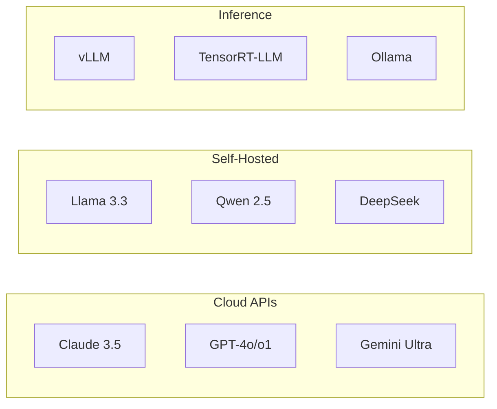
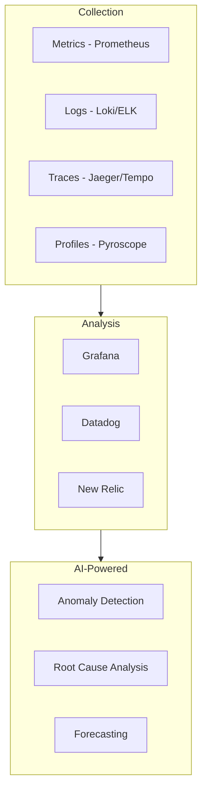
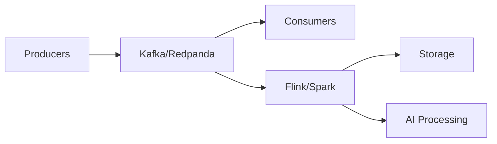

# 🛠️ Technology Stack Guide

Recommended technologies for AI-age system architectures.

---

## Core Infrastructure

| Layer | Recommended | Alternatives |
|-------|-------------|--------------|
| **Cloud** | AWS, GCP, Azure | Cloudflare, Vercel |
| **Kubernetes** | EKS, GKE, AKS | k3s, Rancher |
| **Service Mesh** | Istio, Linkerd | Consul Connect |
| **API Gateway** | Kong, AWS API Gateway | Traefik, Envoy |

---

## Data Layer

### Operational Databases
| Type | Primary | Alternatives |
|------|---------|--------------|
| **Relational** | PostgreSQL | CockroachDB, TiDB |
| **Document** | MongoDB | Couchbase |
| **Key-Value** | Redis | DragonflyDB, Valkey |
| **Time-Series** | TimescaleDB | InfluxDB, QuestDB |

### Analytical Databases
| Type | Primary | Alternatives |
|------|---------|--------------|
| **OLAP** | Snowflake, Databricks | ClickHouse, DuckDB |
| **Data Lake** | Delta Lake | Apache Iceberg, Hudi |
| **Real-time** | Apache Kafka + Flink | Redpanda, RisingWave |

### Vector Databases (AI-Native)
| Purpose | Primary | Alternatives |
|---------|---------|--------------|
| **Embeddings** | Pinecone | Weaviate, Qdrant |
| **Hybrid Search** | Elasticsearch | Meilisearch |
| **Graph + Vector** | Neo4j | TigerGraph |

---

## AI/ML Infrastructure

### Foundation Models

### Agent Frameworks
| Framework | Best For |
|-----------|----------|
| **LangChain** | RAG, chains, general AI apps |
| **LlamaIndex** | Data indexing, retrieval |
| **CrewAI** | Multi-agent collaboration |
| **AutoGen** | Conversational agents |
| **Semantic Kernel** | Enterprise .NET/Python |

### MLOps
| Stage | Tools |
|-------|-------|
| **Experiment** | MLflow, Weights & Biases |
| **Training** | Ray, PyTorch Lightning |
| **Serving** | Triton, BentoML, KServe |
| **Monitoring** | Arize, Whylabs, Evidently |

---

## Observability

---

## Security

| Layer | Tools |
|-------|-------|
| **Identity** | Okta, Auth0, Keycloak |
| **Secrets** | Vault, AWS Secrets Manager |
| **SAST/DAST** | Snyk, Semgrep, Checkmarx |
| **Runtime** | Falco, Sysdig |
| **AI Security** | Prompt injection detection, guardrails |

---

## Event-Driven Architecture

| Component | Options |
|-----------|---------|
| **Message Broker** | Kafka, Redpanda, Pulsar |
| **Stream Processing** | Flink, Spark Streaming, Kafka Streams |
| **Event Store** | EventStoreDB, Kafka + Compact Topics |

---

## Edge & CDN

| Use Case | Options |
|----------|---------|
| **CDN** | Cloudflare, Fastly, AWS CloudFront |
| **Edge Compute** | Cloudflare Workers, Lambda@Edge |
| **Edge AI** | NVIDIA Jetson, AWS Panorama |
