# 📡 TelBits - Next-Gen Autonomous Telecom

> **Self-healing networks powered by AI operations**

TelBits is a telecom platform built for the AI age—where networks manage themselves, customer issues resolve automatically, and capacity scales on demand.

---

## 🎯 Vision

- **Zero-Touch Networks**: AI manages 95% of network operations
- **Predictive Maintenance**: Fix issues before customers notice
- **Instant Provisioning**: New services in minutes, not days
- **AI Customer Care**: Resolve 85% of issues without human intervention

---

## 🏗️ System Architecture

```mermaid
graph TB
    subgraph Access["📱 Access Layer"]
        FG[5G RAN]
        FI[Fiber Network]
        WI[WiFi 7]
        SA[Satellite]
    end

    subgraph Edge["⚡ Edge Layer"]
        MEC[Mobile Edge Compute]
        CDN[Content Delivery]
        IOT[IoT Gateway]
    end

    subgraph Core["🏛️ Core Network"]
        SGW[Service Gateway]
        PCF[Policy Control]
        UDM[User Data Management]
        SMF[Session Management]
        UPF[User Plane Function]
    end

    subgraph BSS["💼 BSS/OSS"]
        BIL[Billing Engine]
        CRM[Customer Platform]
        INV[Inventory System]
        ORD[Order Management]
    end

    subgraph AI["🤖 AI Operations"]
        NOC[Network AI]
        COA[Customer AI]
        RAN[RAN Optimizer]
        PRE[Predictive Engine]
    end

    subgraph Data["📊 Data Platform"]
        TS[(TimescaleDB)]
        KF[Kafka]
        DL[Data Lake]
        VE[(Vector DB)]
    end

    Access --> Edge --> Core
    Core <--> BSS
    Core --> Data
    BSS --> Data
    AI <--> Core & BSS & Data
```

---

## 📡 Network Architecture

---

## 🤖 AI Operations Center (AIOps)

### Autonomous Network Management

### AI Agents

| Agent | Function | Technology |
|-------|----------|------------|
| **Network Healer** | Auto-detect and fix network issues | Flink + Custom ML |
| **Capacity Planner** | Predict and provision capacity | Prophet + LangChain |
| **Customer Resolver** | Automated issue resolution | Claude 3.5 + RAG |
| **Fraud Sentinel** | Detect SIM swap, roaming fraud | Real-time ML |
| **Energy Optimizer** | Minimize power consumption | Reinforcement Learning |

---

## 💻 Technology Stack

### Network Layer
| Component | Technology | Purpose |
|-----------|------------|---------|
| 5G Core | Open5GS, Free5GC | Core network functions |
| RAN | O-RAN Alliance Stack | Radio access |
| SD-WAN | VMware VeloCloud | Enterprise connectivity |
| NFV | Kubernetes + OpenStack | Network virtualization |

### Data Platform
| Component | Technology | Purpose |
|-----------|------------|---------|
| Streaming | Kafka + Flink | Real-time processing |
| Time-Series | TimescaleDB | Network metrics |
| Data Lake | Delta Lake on S3 | Historical analytics |
| Vector Store | Weaviate | Semantic search |

### AI/ML Stack
| Component | Technology | Purpose |
|-----------|------------|---------|
| AIOps | Moogsoft, Custom | Network intelligence |
| Forecasting | Prophet, NeuralProphet | Capacity planning |
| NLP | Claude 3.5 | Customer interactions |
| Agent Framework | CrewAI | Multi-agent orchestration |

---

## 🔒 Security Architecture

---

## 📈 Capacity & Scale

### Traffic Volumes
- **Data Traffic**: 50 Petabytes/day
- **Signaling**: 100M transactions/second
- **IoT Devices**: 500M connected endpoints
- **Voice/Video**: 10M concurrent sessions

### Scaling Architecture

---

## 🚀 Key Innovations

1. **Self-Healing Networks**: AI detects and fixes issues in <60 seconds
2. **Predictive Capacity**: Scale before demand spikes
3. **Voice-Activated Support**: "TelBits AI, why is my internet slow?"
4. **Smart Home Integration**: Unified IoT management
5. **Carbon-Neutral Ops**: AI optimizes for energy efficiency

---

## 📋 Service Catalog

| Service | Description | SLA |
|---------|-------------|-----|
| 5G Network | Mobile connectivity | 99.999% |
| Fiber Broadband | Home/Business internet | 99.99% |
| IoT Platform | Device management | 99.95% |
| Customer AI | Support & self-service | 99.9% |
| Network API | Third-party access | 99.9% |

---

*TelBits - Networks That Think*
